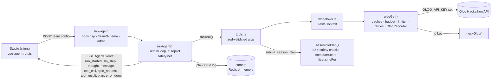

# Contributing to Theme Night GM

Thanks for helping. This guide covers local setup, where the code lives, the conventions the codebase already follows, and how we write commits and pull requests.

- [Dev setup](#dev-setup)
- [Project layout](#project-layout)
- [Coding conventions](#coding-conventions)
- [Adding a Qloo-backed capability](#adding-a-qloo-backed-capability)
- [Commit convention](#commit-convention)
- [Branches and pull requests](#branches-and-pull-requests)

---

## Dev setup

**Requirements:** Node.js `>=20.9.0` (Next.js 16.3.8's engine requirement; CI uses Node 22) and npm.

```bash
npm install                  # postinstall copies the MapLibre worker into public/maplibre/
cp .env.example .env.local   # optional: add QLOO_API_KEY and GEMINI_API_KEY
npm run dev                  # http://localhost:3000 (Turbopack)
```

Before you push, run the same checks CI runs ([.github/workflows/ci.yml](.github/workflows/ci.yml)):

```bash
npm run lint                 # ESLint 9 flat config: eslint-config-next core-web-vitals + typescript
npm run typecheck            # next typegen && tsc --noEmit (strict mode)
npm test                     # Vitest: unit tests + a keyless end-to-end agent run
npm run build                # production build
```

`npm run typecheck` runs `next typegen` first because `next-env.d.ts` and the route types behind `LayoutProps`, `PageProps` and `RouteContext` are generated and gitignored; a bare `tsc` on a fresh clone fails with `Cannot find name 'LayoutProps'`.

**Tests.** [vitest.config.mts](vitest.config.mts) runs `tests/**/*.test.ts` in Node, aliases `@/` to `src/` and stubs `server-only`, so server modules import cleanly. Tests need no keys: [tests/agent.mock.test.ts](tests/agent.mock.test.ts) deletes `QLOO_API_KEY` and `GEMINI_API_KEY` and runs the whole agent on the Durham preset with simulated Qloo and the autopilot. CI runs everything with no secrets, so that keyless path must stay green.

### Environment variables

All variables are read on the server only. See [.env.example](.env.example) for the keys and [docs/DEPLOYMENT.md](docs/DEPLOYMENT.md#3-environment-variables) for the full list.

| Variable | Required | Effect when unset |
|---|---|---|
| `QLOO_API_KEY` | No | Qloo calls are answered by the deterministic simulator in [src/lib/qloo/mock.ts](src/lib/qloo/mock.ts), and every request is flagged `simulated` |
| `GEMINI_API_KEY` | No | `runAutopilot` ([src/lib/agent/autopilot.ts](src/lib/agent/autopilot.ts)) plans deterministically through the same `runTool` path. It calls 6 of the 8 tools and skips `compare_fanbases` and `search_entities`. The LLM-only control (`/api/baseline`) falls back to the fixed `GENERIC_FALLBACK` picks in [src/lib/agent/baseline.ts](src/lib/agent/baseline.ts), and Ask the GM is unavailable |
| `QLOO_BASE_URL` | No | Defaults to `https://hackathon.api.qloo.com` |
| `GEMINI_MODEL` | No | Defaults to `gemini-3.8-flash` |
| `GEMINI_THINKING` | No | Defaults to `low` (`medium` and `high` also accepted) |
| `QLOO_TRENDING_END` | No | Defaults to `2025-09-28`, the end of the 16-week trending window |
| `REDIS_URL`, or `KV_REST_API_URL` + `KV_REST_API_TOKEN` | No | Plans, run logs and featured plans live in server memory, and there is no shared Qloo cache ([src/lib/store.ts](src/lib/store.ts)) |
| `RUNS_PER_10_MIN`, `REVISIONS_PER_10_MIN`, `MAX_CONCURRENT_RUNS` | No | Default to 6 agent runs and 6 control runs per client per 10 minutes, 12 Ask the GM requests, and 4 concurrent runs per instance ([src/lib/rate-limit.ts](src/lib/rate-limit.ts)) |

Leave optional variables unset rather than empty: the code uses `??`, so an empty string replaces the default.

The two keys give four run modes. `GET /api/status` returns the active one as `{ qloo, llm, model?, store }` (`runMode()` in [src/lib/agent/run.ts](src/lib/agent/run.ts)), and the site header shows it as badges.

| `QLOO_API_KEY` | `GEMINI_API_KEY` | `runMode()` `qloo` / `llm` | What runs |
|---|---|---|---|
| unset | unset | `simulated` / `autopilot` | No Qloo or Gemini calls. Good for UI work, and what CI runs |
| set | unset | `live` / `autopilot` | Real Qloo data, deterministic planner |
| unset | set | `simulated` / `gemini` | Real Gemini tool-calling loop on simulated data |
| set | set | `live` / `gemini` | The full agent. If Gemini ends without an accepted plan (or errors), `runAutopilot` finishes the run |

> **Reference numbers:** keyless runs (simulated + autopilot) make 78–91 Qloo requests over 16 tool calls per 6-night preset plan ([breakdown](docs/QLOO_INTEGRATION.md#4-requests-per-tool-call)). Live runs take 93–132 s and 87–103 requests ([measured runs](docs/AGENT.md#13-measured-runs)).

### Handy URLs

- `/studio?preset=durham-baseball&autorun=1` starts a run immediately. The other preset slugs are `la-baseball`, `portland-soccer` and `nashville-hockey` ([src/lib/presets.ts](src/lib/presets.ts)). An unknown or missing slug falls back to `durham-baseball`.
- `/studio?replay=<run id>` replays a stored run at 2× speed; `/studio?replay=1&preset=<slug>` replays that preset's featured live run. Without a recording, the Studio starts a normal run.
- `/plan/<id>` shows a stored plan read-only; `/market-dna?a=<city>&b=<city>` compares two markets.

### Troubleshooting

- **Blank map:** `public/maplibre/` is generated and gitignored. Re-run `node scripts/copy-maplibre-worker.mjs` ([scripts/copy-maplibre-worker.mjs](scripts/copy-maplibre-worker.mjs)).
- **Stale Qloo results:** responses, simulated ones included, are cached in memory for 12 hours per path and normalized query (`CACHE_TTL_MS` in [src/lib/qloo/client.ts](src/lib/qloo/client.ts)); restart `npm run dev` to clear it. Live responses up to 64 KB are also cached in Redis for 12 hours when a Redis variable is set.
- **429 "You've hit the demo limit…":** locally every request comes from the same client (`"local"`), so the demo limits apply to you. Raise `RUNS_PER_10_MIN` (or `REVISIONS_PER_10_MIN`) in `.env.local`.
- **Next.js APIs behave differently than you expect:** this is Next.js 16. Read the bundled guides in `node_modules/next/dist/docs/` before you use a Next API ([AGENTS.md](AGENTS.md)). `next dev` may re-add its block to `AGENTS.md`. Commit that change; don't fight it.

---

## Project layout

```text
src/
  app/
    page.tsx                landing page (server component, rendered per request for featured plans)
    layout.tsx              fonts, global CSS, MapLibre CSS
    studio/page.tsx         Suspense wrapper for the client Studio
    studio/studio.tsx       setup → live run or replay → season board
    plan/[id]/              read-only shared plan page
    market-dna/             Market DNA page (two markets side by side)
    api/agent/route.ts      POST: zod-validated team config, streams AgentEvents over SSE
    api/revise/route.ts     POST: Ask the GM, streams a revision over SSE
    api/baseline/route.ts   POST: LLM-only control plan, fact-checked with Qloo
    api/market-dna/route.ts GET: compare two markets' top lists
    api/plans/[id], api/runs/[id], api/featured   GET: stored plans, run logs, featured plans
    api/geocode/route.ts    GET: city/venue → coordinates via OpenStreetMap Nominatim (rate-limited, cached)
    api/presets/route.ts    GET: demo team presets
    api/status/route.ts     GET: runMode() (live/simulated, gemini/autopilot, redis/memory)
  components/
    ui.tsx, viz.tsx         primitives (Button, Badge, Card, ScoreRing, cn) and small charts (ScoreBars, TrendSpark)
    heat-map.tsx            MapLibre GL heatmap on the CARTO dark-matter basemap
    site-header.tsx         header, nav and run-mode badges
    studio/*                team-setup, agent-trace, live-canvas, season-board, ask-gm, baseline-compare, receipts
  lib/
    agent/                  run (Gemini loop + safety net), tools (8 tools + runTool), assemble (plan validator),
                            autopilot (deterministic planner), revise (Ask the GM), prompt, baseline (LLM-only control)
    qloo/                   client (qlooGet, caches, budget, limiter, retries, recorder), workflows,
                            mock + mock-data (simulated mode)
    types.ts                types shared by server and client
    scoring.ts              Taste Fit Score (SCORE_WEIGHTS, computeScore)
    schedule.ts             schedule generation, weak-date picking, SEGMENTS, SPORTS
    sensitivity.ts          sensitive-topic, identity-night, alcohol-brand and drinking-spot checks
    rate-limit.ts           slots, per-client quotas and body caps for the public demo
    store.ts                key-value store: Redis (REDIS_URL or Upstash REST) or memory
    market-dna.ts           overlap metrics for two markets
    errors.ts, featured.ts, presets.ts, licensing.ts, validation.ts, config.ts
    use-agent-run.ts        client SSE reader, reducer, revise, replay, localStorage plan history
tests/                      Vitest suite (unit tests + keyless end-to-end run)
scripts/copy-maplibre-worker.mjs   postinstall
.github/workflows/ci.yml    lint, typecheck, test, build
```

### Request flow



---

## Coding conventions

These rules describe how the code already works. New code should follow them.

### 1. Keys stay on the server

- Any module that reads a secret (`QLOO_API_KEY`, `GEMINI_API_KEY`, Redis credentials), or calls Qloo, Gemini or the store, starts with `import "server-only";`. Today that covers everything in `src/lib/agent/` except [prompt.ts](src/lib/agent/prompt.ts), plus [src/lib/qloo/client.ts](src/lib/qloo/client.ts), [src/lib/qloo/workflows.ts](src/lib/qloo/workflows.ts), [src/lib/store.ts](src/lib/store.ts), [src/lib/rate-limit.ts](src/lib/rate-limit.ts) and [src/lib/featured.ts](src/lib/featured.ts).
- Never prefix a secret with `NEXT_PUBLIC_`. Next.js would inline it into the client bundle.
- Client components (`"use client"`) never call Qloo, Gemini or Redis directly. They go through the API routes (`/api/agent`, `/api/revise`, `/api/baseline`, `/api/market-dna`, the read routes) and read the run mode from `/api/status`. (`/api/geocode` proxies OpenStreetMap Nominatim, not Qloo.)
- `.env*` is gitignored, except `.env.example`, and [.vercelignore](.vercelignore) keeps it out of Vercel uploads. Don't paste keys into code, issues, PRs, screenshots or recorded runs. `QlooRequestLog` stores endpoint and query params only, never headers, and the copyable curl in [receipts.tsx](src/components/studio/receipts.tsx) uses the `$QLOO_API_KEY` placeholder. Keep both that way.
- Errors shown to visitors go through `publicError` ([src/lib/errors.ts](src/lib/errors.ts)): log the details, return a generic message.

### 2. Validate at every boundary

| Boundary | Schema |
|---|---|
| Request bodies for `/api/agent` and `/api/baseline` | `readJson` caps the body (64 KB), then `TeamSchema` in [src/lib/validation.ts](src/lib/validation.ts) via `safeParse`. Failures return 400 (413 for size). `/api/agent` lists each issue as a `path: message` string. Both routes also return 400 for more than 8 target dates |
| `/api/revise` | `RevisionRequest` in [src/app/api/revise/route.ts](src/app/api/revise/route.ts) (message 3–500 chars, plan shape, 2 MB cap) |
| `/api/market-dna` | `QuerySchema` in [src/app/api/market-dna/route.ts](src/app/api/market-dna/route.ts) |
| Model-supplied tool arguments | Each tool's `schema` in [src/lib/agent/tools.ts](src/lib/agent/tools.ts), checked in `runTool`. Invalid args go back to the model as `{ error }` so it can retry |
| The submitted plan or revision | `PlanSubmission` in [src/lib/agent/assemble.ts](src/lib/agent/assemble.ts) (extended for revisions in [revise.ts](src/lib/agent/revise.ts)) |
| LLM JSON in the control group | `BaselineSchema` in [src/lib/agent/baseline.ts](src/lib/agent/baseline.ts) |

Anything that ends up in a prompt is bounded (and the weekday is re-derived from the date). Each tool describes its arguments twice: `parametersJsonSchema` for Gemini and a zod `schema` for runtime checks. If you change one, change the other in the same commit.

### 3. Every Qloo call goes through `qlooGet`

Call Qloo only through `qlooGet(path, params, recorder, purpose)` in [src/lib/qloo/client.ts](src/lib/qloo/client.ts). Don't call `fetch` on Qloo directly. That one function provides:

- the receipts: each request gets an ID (`Q1`, `Q2`, …) and is pushed to the run's `QlooRecorder`. It is also attributed to the tool call that made it through the `toolCallScope` `AsyncLocalStorage`.
- the run's limits: the recorder carries a budget of uncached requests and the run's abort signal. Give every new kind of run a recorder with both (see `runAgent`, `runRevision`, `runBaseline` and the Market DNA route).
- the limits on live requests: `MAX_CONCURRENT = 10`, `MIN_INTERVAL_MS = 200` and `TIMEOUT_MS = 20_000`, plus a `take` clamp to `MAX_TAKE = 50` on every request. `MAX_RETRIES = 2` covers network errors and 429/5xx responses, `Retry-After` is honoured up to 5 s, and a 429 pauses the shared limiter. Details: [docs/QLOO_INTEGRATION.md §2](docs/QLOO_INTEGRATION.md#2-request-pipeline).
- the caches: 12 hours in memory (`CACHE_TTL_MS`, 2,000 entries) and, in live mode with Redis, 12 hours across instances for responses up to 64 KB (heatmaps stay per-instance).
- simulated mode, which switches to `mockQloo()` when no key is set.

Always pass a plain-English `purpose`. It is shown to users in the receipts panel (e.g. `"Brands whose audiences share this fandom's taste (sponsor prospects)"`).

### 4. The model never invents data or scores

- Entities only enter a plan through `TasteContext`. Workflows call `ctx.remember(cards)` and `ctx.cite(id, ...requestIds)`. `assemblePlan` looks each reference up by ID, or by exact (case-insensitive) name, among the entities Qloo returned during the run. It rejects an `anchor_entity_id` it can't find and drops any other unknown reference with a warning. Don't weaken this check, and route any new way of changing a plan (like `submit_revision`) through it.
- Safety rules live in code as well as the prompt: `assemblePlan` requires a movie, TV show, artist, video game or book as the anchor, rejects anchors `sensitiveTopic()` flags and titles `identityTheme()` flags, drops sensitive partners, and drops `isAlcoholBrand()` brands and `isDrinkingSpot()` places from `families` and `gen_z` nights ([src/lib/sensitivity.ts](src/lib/sensitivity.ts)). The autopilot applies the same rules. Keep the two in step, and add a test when you change a rule.
- Compare Qloo values only inside one query's result set (rank percentiles via `pctAt` / `rankInPool`), because Qloo normalizes affinity per query. Don't compare raw affinities from different requests.
- The Taste Fit Score is always computed by `computeScore` in [src/lib/scoring.ts](src/lib/scoring.ts) and never written by the model. A measurement Qloo couldn't make must reach it as `undefined`, so it scores 0.5 and is listed in `score.estimated`; never substitute a value from another query. If you change `SCORE_WEIGHTS`, update the hard-coded percentages in the Taste Fit Score table in [README.md](README.md). If you change how a component is computed, update its `SCORE_LABELS` help text too. The landing page and `ScoreBars` ([src/components/viz.tsx](src/components/viz.tsx)) read both constants directly.
- In [run.ts](src/lib/agent/run.ts), keep Gemini model turns verbatim (`contents.push(content)`). They carry the thought signatures the next request needs.

### 5. Responsible use of Qloo data

These rules follow the Qloo hackathon kit:

- **No personal data to Qloo.** Requests carry only market-level inputs: city, venue coordinates, entity IDs or names to resolve, sales-category phrases and age/life-stage signals. Never send names, emails, ticket-holder records or other PII. The team name, notes and Ask the GM messages go only to Gemini.
- **No sensitive traits.** Segments are `families`, `gen_z`, `young_pros` and `boomers`. They map to `signal.demographics.age` or a life-stage audience (`SEGMENT_AGE`, `familiesAudienceId()` in [workflows.ts](src/lib/qloo/workflows.ts)). Don't add signals or copy that infer ethnicity, religion, health, politics, sexuality or income.
- **Aggregate language.** Write "fans of X in this market over-index on Y", never claims about an individual. This applies to UI copy, prompts and docs.
- **Show source and limits.** Anything derived from Qloo should link back to its request IDs (`evidence`). The licensing flag (`licensingFor` in [src/lib/licensing.ts](src/lib/licensing.ts)) is rules-based. Keep the "not legal advice" note that [season-board.tsx](src/components/studio/season-board.tsx) shows next to it.

### 6. Simulated data is always labeled

Every `QlooRequestLog` has a `simulated` flag. The receipts panel shows a `simulated` badge, and `ModeBadges` in [site-header.tsx](src/components/site-header.tsx) shows `Qloo live` or `Qloo simulated`. Any new view of Qloo-derived data must keep the run mode visible. Never present mock output, or numbers from simulated runs, as Qloo results.

### 7. TypeScript, React and styling

- TypeScript is `strict`. Import with the `@/*` → `src/*` alias. Shared shapes live in [src/lib/types.ts](src/lib/types.ts), and both server and client import them from there.
- Interactive components are client components (`"use client"`). Pages stay server components where they can (see [src/app/page.tsx](src/app/page.tsx) and [src/app/plan/[id]/page.tsx](src/app/plan/%5Bid%5D/page.tsx)).
- The long-running route handlers declare `maxDuration`: `300` for `/api/agent` and `/api/revise`, `120` for `/api/baseline`, `60` for `/api/market-dna`. Keep the run deadlines inside them: `LLM_DEADLINE_MS = 190_000` and `RUN_DEADLINE_MS = 270_000` in [run.ts](src/lib/agent/run.ts), 110 s for the control. The run deadline is what guarantees the stream ends with `done`.
- For styling, use Tailwind v4 with the theme tokens in [src/app/globals.css](src/app/globals.css) (`bg`, `surface`, `line`, `amber`, `turf`, `violet`, …) rather than raw hex values. Merge classes with `cn()` from [src/components/ui.tsx](src/components/ui.tsx), and take icons from `lucide-react`.

### 8. Tests

- Put tests in `tests/<area>.test.ts`. They run in Node with no keys; anything that touches Qloo uses the simulator.
- Bug fixes come with a test that fails without the fix where practical (scoring, safety rules, the validator, workflow helpers).
- Keep [tests/agent.mock.test.ts](tests/agent.mock.test.ts) passing: it is the end-to-end guarantee that a keyless run produces a valid, fully cited plan.

---

## Adding a Qloo-backed capability

1. **Workflow.** Add a function to [src/lib/qloo/workflows.ts](src/lib/qloo/workflows.ts) that takes a `TasteContext` and calls `qlooGet` (or the module's `insightsEntities` helper) with a `purpose`. Call `ctx.remember(...)` and `ctx.cite(...)` on what comes back. If a failed request should affect a score, record it (as `profileEntities` does with `unavailable`) instead of returning an empty result that looks like "no data".
2. **Simulator.** If you use a new endpoint, `filter.type` or filter, add a branch to `mockQloo()` in [src/lib/qloo/mock.ts](src/lib/qloo/mock.ts) that returns the documented envelope shape. Unknown paths fall through to `{ success: true, results: [] }`, and an unknown `filter.type` on `/v2/insights` returns no entities. Either way the feature goes silently empty offline and in CI.
3. **Tool.** Add a `ToolDef` to [src/lib/agent/tools.ts](src/lib/agent/tools.ts) and add it to the array that builds `TOOLS` (`FUNCTION_DECLARATIONS` is derived from it). A `ToolDef` has a `declaration` (with `parametersJsonSchema`), a zod `schema`, a `label` and an `execute` that returns `{ output, summary, ui? }`. `runTool` handles validation, cancellation, events and attribution. If Ask the GM should use it, add its name to `RESEARCH_TOOLS` in [revise.ts](src/lib/agent/revise.ts).
4. **Agent.** Tell the model when to use the tool in `SYSTEM_PROMPT` ([src/lib/agent/prompt.ts](src/lib/agent/prompt.ts)). If the keyless path should exercise it, call it from `runAutopilot`. Check that a typical run still fits the per-run Qloo budget in [run.ts](src/lib/agent/run.ts).
5. **UI.** If the tool returns `ui`, add a variant to `ToolUIData` in [types.ts](src/lib/types.ts), store it in `RunState` via `applyUi` in [src/lib/use-agent-run.ts](src/lib/use-agent-run.ts), and render it in [live-canvas.tsx](src/components/studio/live-canvas.tsx) (map the new kind in `UI_TO_TAB`).
6. **Tests.** Cover the workflow against the simulator in [tests/workflows.test.ts](tests/workflows.test.ts).
7. **Docs.** Update [README.md](README.md) (the "What it does" table lists the Qloo features used) and the master request table in [docs/QLOO_INTEGRATION.md](docs/QLOO_INTEGRATION.md#3-master-request-table).

---

## Commit convention

We follow [Conventional Commits 1.0.0](https://www.conventionalcommits.org/en/v1.0.0/).

```text
<type>(<optional scope>): <imperative summary>

<optional body: why the change was made>

<optional footers>
```

**Header rules**

- `type` is lower-case and comes from the list below.
- The summary is imperative ("add", not "added" or "adds") with no trailing period. Keep the whole header, type and scope included, at most 72 characters.
- Start the summary lower-case unless the first word is a proper noun or an identifier (`MapLibre`, `qlooGet`).

**Types**

| Type | Use for |
|---|---|
| `feat` | A new capability for users or the agent |
| `fix` | A bug fix |
| `docs` | Documentation only |
| `style` | Formatting or whitespace, with no behavior change |
| `refactor` | A code change that neither fixes a bug nor adds a feature |
| `perf` | A performance improvement (caching, fewer Qloo calls) |
| `test` | Adding or fixing tests |
| `build` | Dependencies, the lockfile, the build pipeline or the postinstall script |
| `ci` | CI configuration ([.github/workflows/](.github/workflows/)) |
| `chore` | Maintenance that doesn't touch `src/` behavior |
| `revert` | Reverting an earlier commit |

**Suggested scopes**

| Scope | Covers |
|---|---|
| `agent` | `src/lib/agent/**`: Gemini loop, tools, validator, autopilot, revisions, prompt, baseline |
| `qloo` | `src/lib/qloo/**`: client, workflows, simulator |
| `api` | `src/app/api/**` |
| `ui` | Shared components: `src/components/*.tsx` |
| `studio` | `src/app/studio/**`, `src/components/studio/**` |
| `export` | Season-board exports (JSON, CSV, one-pager) |
| `market-dna` | `src/app/market-dna/**`, `src/lib/market-dna.ts`, its route |
| `home` | The landing page, `src/app/page.tsx` |
| `docs` | README, this file, `docs/` (with type `docs`, usually omit the scope) |
| `deps` | `package.json`, `package-lock.json` |
| `config` | `next.config.ts`, `tsconfig.json`, ESLint, Vitest, `.gitignore`, `.env.example` |

**Body and footers**

- The body explains **why** the change was made, not just what changed. Wrap it at 72 columns.
- For a breaking change (API route shape, SSE event shape, tool names or arguments, stored plan or run-log format), put `!` before the colon and add a `BREAKING CHANGE:` footer.
- AI-assisted commits keep a `Co-Authored-By:` trailer as the last line, e.g. `Co-Authored-By: Claude Opus 5.5 <noreply@anthropic.com>`. Don't strip it when you amend or squash.

**Examples** (illustrative headers about this codebase, not actual history)

```text
feat(agent): validate submitted plans against Qloo-returned entity IDs
fix(ui): serve the MapLibre worker from public/ so the heatmap loads
docs: add Qloo integration reference
fix(qloo): clamp take to 50 so /v2/insights stops returning 400
perf(qloo): cache Qloo responses for 12 hours keyed by sorted params
fix(api): reject agent runs with more than 8 target dates
feat(studio): export the season plan as JSON and calendar CSV
fix(agent): keep Gemini model turns verbatim for thought signatures
test: cover the drinking-spot rule on families nights
ci: run lint, typecheck, test and build on pull requests
```

A full message with a body and trailer:

```text
feat(agent): fall back to autopilot when Gemini never submits a plan

The live demo must always finish. If the Gemini loop ends (MAX_STEPS,
LLM_DEADLINE_MS or no more tool calls) without an accepted
submit_season_plan, runAutopilot finishes the run on the same
TasteContext and reuses the market scan if one already ran.

Co-Authored-By: Claude Opus 5.5 <noreply@anthropic.com>
```

A breaking change (this one is made up for illustration):

```text
refactor(api)!: rename the SSE plan event to plan_accepted

Separates an accepted plan from future draft events in the stream.

BREAKING CHANGE: /api/agent clients and stored run logs replayed by
/studio?replay= must use plan_accepted instead of plan.
```

A revert:

```text
revert: fix(api): reject agent runs with more than 8 target dates

This reverts commit <sha>.
```

---

## Branches and pull requests

**Branch names** use `<type>/<short-kebab-topic>` and branch off `main`:

- `feat/<topic>`, e.g. `feat/mcp-endpoint`
- `fix/<topic>`, e.g. `fix/heatmap-worker-url`
- `docs/<topic>`, e.g. `docs/qloo-reference`
- `refactor/`, `perf/`, `test/`, `chore/` and `build/` follow the same pattern when they fit better.

Keep each PR focused on one change. If it will be squash-merged, give the PR a Conventional Commit title.

**PR checklist**

- [ ] `npm run lint`, `npm run typecheck`, `npm test` and `npm run build` all pass (CI runs the same four).
- [ ] No secrets: no keys in code, logs, screenshots, recorded runs or the PR text, and `.env.local` is not committed.
- [ ] No personal data is sent to Qloo, and no sensitive-trait targeting is added.
- [ ] Qloo calls go through `qlooGet` with a `purpose` and a recorder that has a budget and the run's signal. New endpoints have a `mockQloo` branch.
- [ ] Safety-rule or scoring changes keep the validator and the autopilot in step, with tests.
- [ ] Simulated data is still labeled wherever Qloo-derived data appears.
- [ ] UI changes include before/after screenshots (desktop and a narrow viewport).
- [ ] The PR description states the run mode you tested in (`Qloo live/simulated`, `gemini/autopilot`).
- [ ] Docs are updated: [README.md](README.md), this file, and any affected page under `docs/`.
- [ ] Commits follow the convention above.

By contributing, you agree that your contributions are licensed under the [MIT License](LICENSE).
