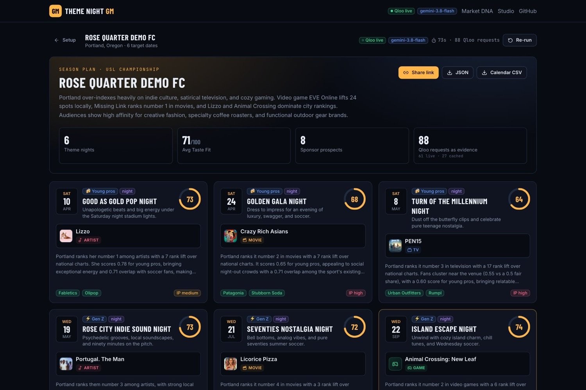
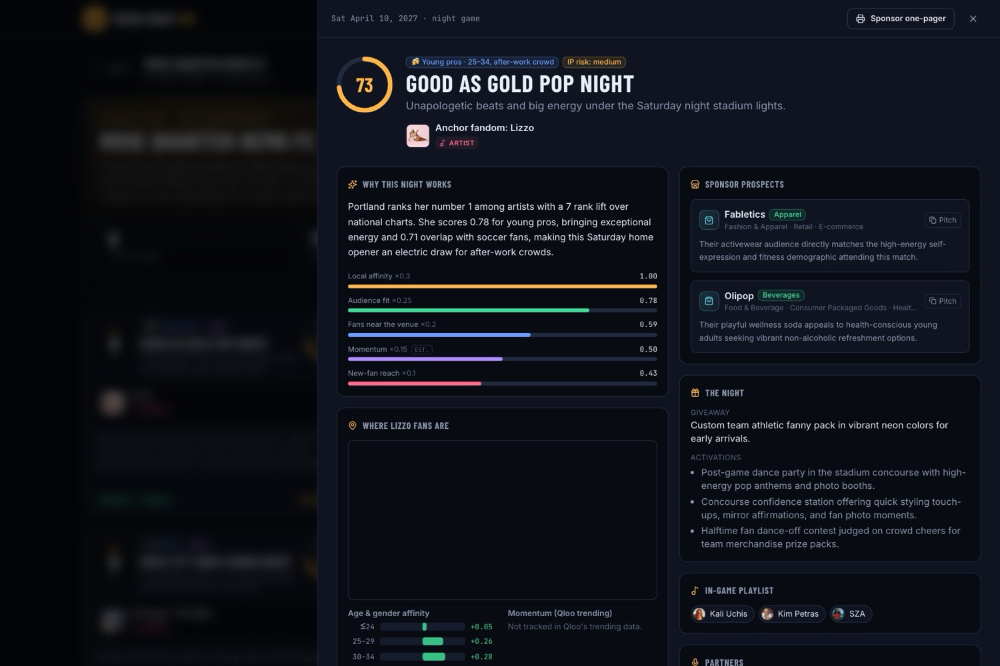
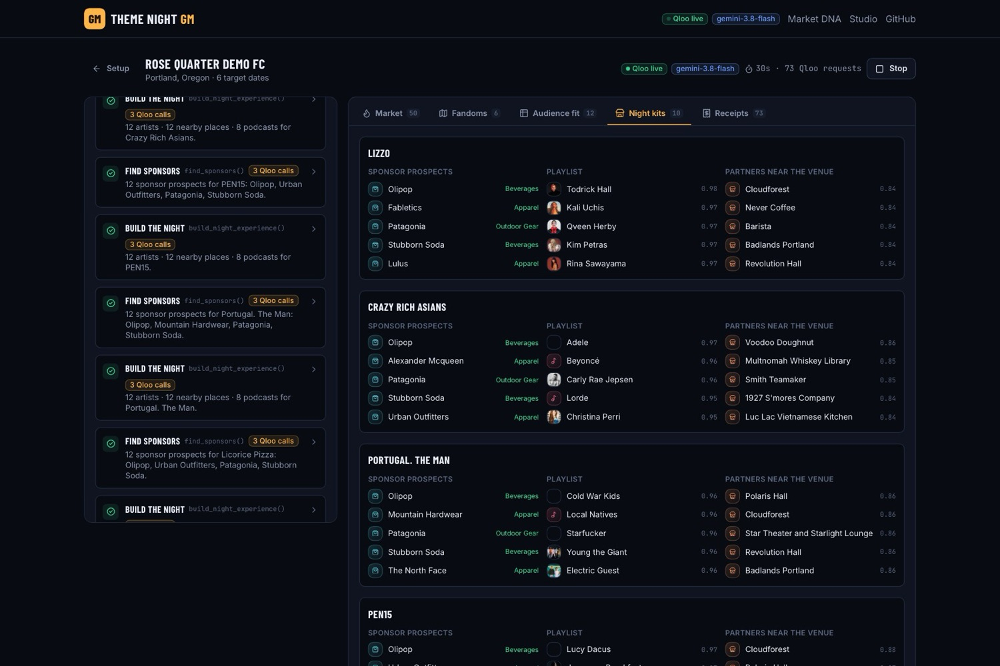
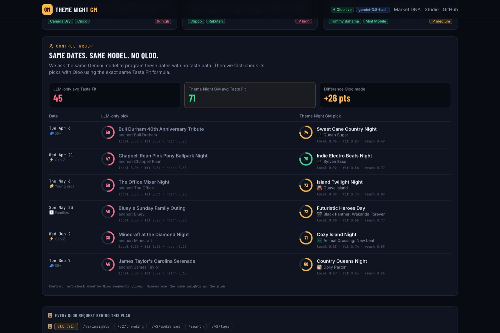
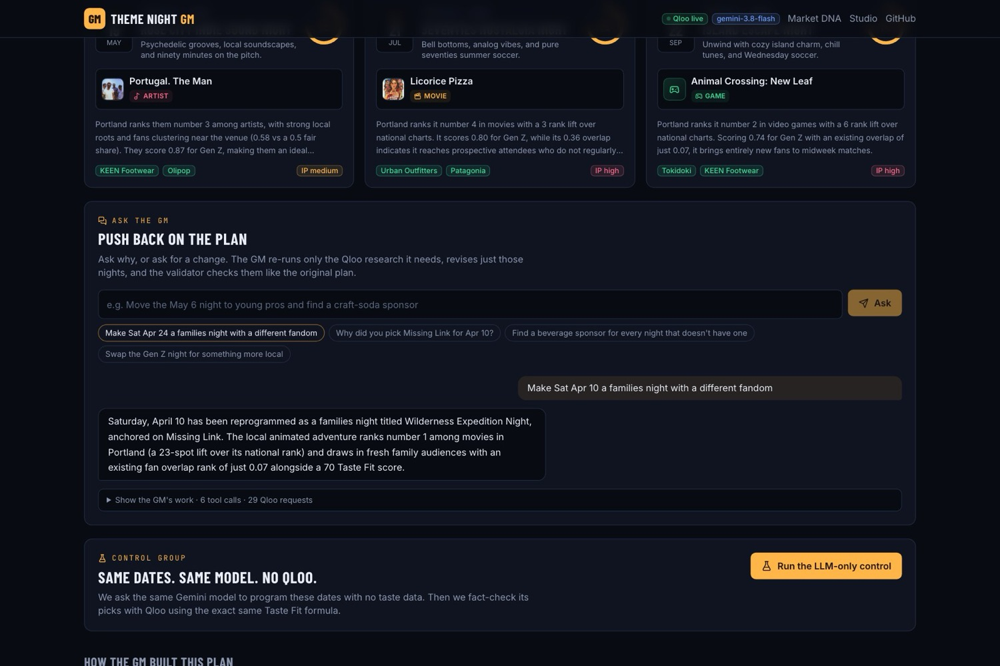
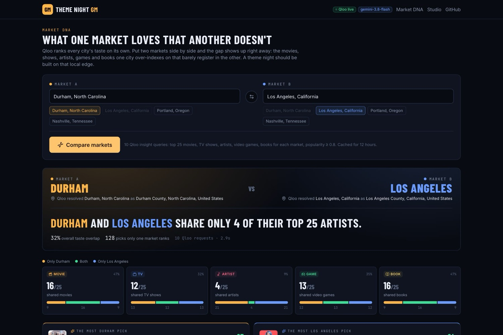
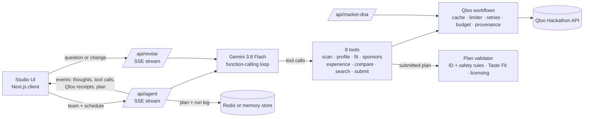

# Theme Night GM 🎟️

**An AI promotions agent for sports teams. It turns a club's weakest home dates into theme nights its own city loves, with Qloo data behind every pick.**

[](https://github.com/ZNLong2203/Theme-Night-GM/actions/workflows/ci.yml)
[](LICENSE)
[](https://theme-night-gm.vercel.app)

> Built for the [Qloo Agentic Hackathon](https://qloo.devpost.com/): *Agents, but with taste.* Gemini 3.8 Flash plans; Qloo's taste graph decides.



## Try it in 60 seconds

No sign-up, no API key.

| | |
|---|---|
| **Open a finished plan** | [Durham's live plan](https://theme-night-gm.vercel.app/plan/0130329f-7420-4d06-80b5-e7266e73c8d7): six nights, every Qloo receipt, and the LLM-only control |
| **Watch the agent work** | [Replay the Durham run](https://theme-night-gm.vercel.app/studio?replay=0130329f-7420-4d06-80b5-e7266e73c8d7): a recorded live run, played back in seconds |
| **Run it live** | [Studio](https://theme-night-gm.vercel.app/studio): pick a market, press **Hire the GM**, and watch it plan in about two minutes |
| **Compare two cities** | [Market DNA](https://theme-night-gm.vercel.app/market-dna): what Durham loves that Los Angeles doesn't, from Qloo |

## The problem

Minor-league and mid-market clubs sell weeknight tickets with theme nights, and their small promotions staffs plan dozens of them each off-season, usually from the same list every other club uses. Nothing in that process answers the questions that decide whether a night sells: does **our** city love this, do those fans live near **our** venue, does it fit **this** date's crowd, is interest rising, and which sponsor would pay to be part of it?

An LLM alone can't answer any of them. It suggests the same Star Wars night for Durham and for Los Angeles.

## Why Theme Night GM is different

- **Qloo is the difference, and we measure it.** Every plan can run an **LLM-only control**: the same Gemini model plans the same dates with no tools, and its picks are fact-checked through Qloo and scored with the same formula. Across four live markets the agent scores **+28 Taste Fit points on average** (Durham 45 → 71, Los Angeles 44 → 73, Portland 44 → 74, Nashville 41 → 68), and every LLM pick was found in Qloo, so it's a fair fight.
- **Deep, combined Qloo use.** Seven Qloo endpoints work together: the city as a location signal to find local over-indexes, age and life-stage signals to fit each date's crowd, `urn:heatmap` around the venue to see where fans live, `/v2/trending` for momentum, `/v2/tags` → `filter.tags` to find sponsors in the club's own sales categories, places within 6 km for pre-game partners, and `feature.explainability` to show what drove each brand.
- **Receipts for every claim.** Every Qloo request is numbered (`Q1`, `Q2`, …), tied to the tool call that made it, listed under the night it supports, and copyable as `curl`. The plan validator rejects any entity Qloo didn't return.
- **A real agent, not a prompt.** Gemini 3.8 Flash drives eight tools with function calling, streams its reasoning and every request live, fixes plans the validator sends back, and answers follow-ups: **Ask the GM** revises only the nights you ask about.
- **Scores you can explain.** The Taste Fit Score is computed in code from Qloo ranks, never written by the model, and anything Qloo couldn't measure is marked **est.** instead of quietly defaulted.
- **Built for the people who fill seats.** Each night is a ready-to-use kit: sponsor pitches to paste into an email, a giveaway and activations, an in-game playlist, nearby partners, promo copy, an IP-licensing flag, a printable sponsor one-pager, and JSON and calendar CSV exports.
- **Responsible by design.** No personal data goes to Qloo, audiences are age and life stage only, and safety rules live in code: no political, religious, crime or tragedy anchors, no identity-framed nights, and no alcohol brands or bars on family and Gen Z nights.
- **Production-grade.** Per-run Qloo budgets and deadlines, retries, rate limits, a deterministic safety net if the model fails, a store that degrades gracefully when Redis is full or down, 107 tests and CI on every push.

## What a night kit looks like



| The agent at work | The control group |
|---|---|
|  |  |
| **Ask the GM** | **Market DNA** |
|  |  |

## How it works

You give the agent your club, market, venue and home schedule. It pre-selects the weak dates (you can change them), gives each a target crowd, and works like a promotions GM:

| Step | What the agent asks Qloo | Qloo features used |
|---|---|---|
| **1. Read the room** | Which movies, TV shows, artists, video games and books does this city over-index on compared with national popularity? | `/v2/insights` + `signal.location.query`, `filter.popularity.min`, `bias.trends` |
| **2. Size the fandom** | Who are these fans, where around the venue do they concentrate, and is interest rising? | `urn:demographics`, `urn:heatmap` + `filter.location`, `/v2/trending`, `urn:tag` |
| **3. Fit the audience** | Which fandom fits each date's crowd, and does it bring **new** fans? | `filter.results.entities` re-ranked with `signal.demographics.age` or a `/v2/audiences` life stage; fan-base overlap via a league proxy found with `/search` |
| **4. Build the night** | Which brands in our sales categories share this taste? What goes on the playlist? Which places within 6 km make good partners? Which podcast is the media buy? | `/v2/tags` → `filter.tags` on `urn:entity:brand` + `feature.explainability`, `urn:entity:artist`, `urn:entity:place` + radius, `urn:entity:podcast`, `/v2/analysis/compare` |
| **5. Ship it with receipts** | The validator checks every entity and safety rule; a rejected plan goes back to the model to fix. | `/search`, `/entities` |

### Taste Fit Score

| Weight | Component | From Qloo |
|---|---|---|
| 30% | Local affinity | Rank within the city's top 25 for the domain |
| 25% | Audience fit | Rank when the same pool is re-ranked for the date's crowd, blended with `urn:demographics` |
| 20% | Fans near the venue | The venue catchment's share of the fandom's heatmap hotspots (0.5 = fair share) |
| 15% | Momentum | Change in `/v2/trending` percentile over 16 weeks |
| 10% | New-fan reach | How little existing sport fans already rank the fandom |

Qloo normalizes affinity per query, so every comparison is a rank inside one result set; raw affinities are never compared across queries. Derivations: [docs/QLOO_INTEGRATION.md](docs/QLOO_INTEGRATION.md#6-derived-metrics).

## Measured on the live deployment

Live Qloo hackathon API with Gemini 3.8 Flash on Vercel, October 2026:

| | Result |
|---|---|
| A 6-night season plan | 65–155 s and 84–138 Qloo requests per run; every run ended with an accepted plan (occasional Qloo 429s were retried) |
| LLM-only control, 4 markets | Agent 68–74 vs LLM-only 41–45 Taste Fit: **+28 on average** |
| Ask the GM, change one night | 36–100 s and 29–53 Qloo requests; only that night changes |
| Market DNA, two cities | ~2–10 s, 10 Qloo requests |
| Self-correction | In a live Portland run the validator rejected the first submission; the model fixed it and resubmitted |

## Architecture



- **Agent loop** ([`run.ts`](src/lib/agent/run.ts)): Gemini 3.8 Flash function calling with thought summaries streamed over Server-Sent Events, up to 12 steps and 10 tool calls per turn, and hard deadlines so every run ends cleanly.
- **Tools** ([`tools.ts`](src/lib/agent/tools.ts), [`workflows.ts`](src/lib/qloo/workflows.ts)): each tool answers one promotions question with several Qloo calls; every call is recorded and attributed to its tool call.
- **Qloo client** ([`client.ts`](src/lib/qloo/client.ts)): server-side key, request limiter, retries with `Retry-After`, per-run budgets, and in-memory plus shared Redis caching.
- **Validator** ([`assemble.ts`](src/lib/agent/assemble.ts)) and **safety rules** ([`sensitivity.ts`](src/lib/sensitivity.ts)): only Qloo-returned entities, safety rules enforced in code, scores computed server-side.
- **Safety net** ([`autopilot.ts`](src/lib/agent/autopilot.ts)): if the model misses its budget or Gemini errors, a deterministic planner finishes the plan with the same tools and the model's research.
- **Store** ([`store.ts`](src/lib/store.ts)): plans and replays in Redis, brotli-compressed; a breaker, cache purging and memory fallback keep the app working when Redis is slow, full or down.

## Run it locally

```bash
git clone https://github.com/ZNLong2203/Theme-Night-GM && cd Theme-Night-GM
npm install                  # also copies the MapLibre worker into public/
cp .env.example .env.local   # add QLOO_API_KEY and GEMINI_API_KEY
npm run dev                  # http://localhost:3000
```

Every key is optional: without `QLOO_API_KEY` the app runs on clearly labelled **simulated** Qloo data, and without `GEMINI_API_KEY` a deterministic **autopilot** drives the same tools. Redis (`REDIS_URL`, or Upstash's REST pair) makes share links and replays survive across serverless instances. Settings and Vercel deployment: [docs/DEPLOYMENT.md](docs/DEPLOYMENT.md).

```bash
npm test             # 107 Vitest tests, including a keyless end-to-end agent run
npm run typecheck
npm run lint
```

[GitHub Actions](.github/workflows/ci.yml) runs lint, typecheck, tests and build on every push, with no secrets.

## Verify the Qloo dependency yourself

1. `GET /api/status` (and the header badges) report whether Qloo is `live` or `simulated` and which planner is running.
2. Every Qloo request behind a night is listed with its purpose and parameters; **Copy as curl** reproduces it with your own `$QLOO_API_KEY`.
3. **Run the LLM-only control** on any plan to see what the same model does without Qloo, scored the same way.

## Limitations

- The Taste Fit Score measures fit with a market's Qloo signals; it is not a ticket-sales forecast.
- Weak dates are picked by a heuristic (weekday, game time, month), not the club's own attendance history yet.
- Trending data ends with the hackathon dataset's latest window (September 2025), and Qloo has no trending for books and video games.
- Safety and licensing checks are rule-based and can miss edge cases; the licensing flag is not legal advice.

## Documentation

| Doc | What it covers |
|---|---|
| [docs/PROBLEM_SPACE.md](docs/PROBLEM_SPACE.md) | Who plans theme nights, why weak dates matter, and the market |
| [docs/ARCHITECTURE.md](docs/ARCHITECTURE.md) | Components, the end-to-end run, module map, event protocol, storage, budgets and security |
| [docs/AGENT.md](docs/AGENT.md) | The Gemini loop, the eight tools, prompt, validator, safety net, Ask the GM, Taste Fit Score and the control group |
| [docs/QLOO_INTEGRATION.md](docs/QLOO_INTEGRATION.md) | Every Qloo request the app makes, how responses become metrics, Market DNA, API notes and simulated mode |
| [docs/DEPLOYMENT.md](docs/DEPLOYMENT.md) | Local setup, environment variables, Vercel deployment, Redis, smoke test and troubleshooting |
| [CONTRIBUTING.md](CONTRIBUTING.md) | Dev setup, tests, conventions, adding a Qloo-backed tool, commits and PRs |

## License

MIT. See [LICENSE](LICENSE).
