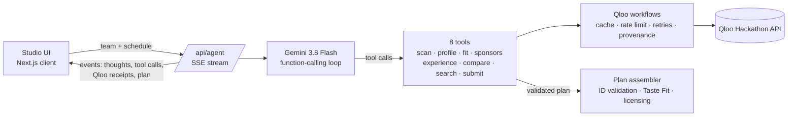

# Theme Night GM 🎟️

**An AI promotions agent for sports teams. It turns weak home dates into theme nights grounded in what the local market actually loves, using Qloo's taste graph.**

> Built for the [Qloo Agentic Hackathon](https://qloo.devpost.com/): *Agents, but with taste.*

- **Live demo:** _coming soon_ (no login; open `/studio` and press **Hire the GM**)
- **Stack:** Next.js 16 · TypeScript · Gemini 3.8 Flash (function calling) · Qloo Insights API · MapLibre
- **License:** MIT

---

## The problem

Minor-league and mid-market clubs rely on promotions to sell weeknight tickets: bobbleheads, fireworks, "Night" after "Night". Each off-season a small promotions staff plans dozens of them, usually from the same list every other club uses.

Nothing in that process answers the questions that decide whether a night sells:

- Does **our** city love this, or does every city?
- Do those fans live near **our** venue?
- Does this fandom fit **this** date's crowd (Sunday families vs Thursday after-work)?
- Is interest rising or fading?
- Which sponsor would pay to be part of it, and what would we tell them?

An LLM on its own can't answer any of these. It suggests the same Star Wars night for Durham and for Los Angeles.

## What it does

You give the agent your club, market, venue and home schedule. It picks the weak dates (or you do) and works like a promotions GM:

| Step | What the agent asks Qloo | Qloo features used |
|---|---|---|
| **1. Read the room** | Which movies, TV shows, artists, games, podcasts and books does this city have the strongest affinity for, and which ones does it over-index on compared with national popularity? | `/v2/insights` + `signal.location.query`, `filter.popularity.min`, `bias.trends` |
| **2. Size the fandom** | Who are these fans, where around the venue do they live, and is interest rising? | `urn:demographics`, `urn:heatmap` (+ `filter.location` WKT point and radius), `/v2/trending`, `urn:tag` |
| **3. Fit the audience** | How well does each fandom fit each date's crowd? Does it bring **new** fans, or ones we already have? | `signal.demographics.age`, `signal.demographics.audiences` (life-stage via `/v2/audiences`), `filter.results.entities` to rank a shortlist, fan-base overlap via a sport proxy entity |
| **4. Build the night** | Which brands share this taste (sponsors)? Which artists go on the in-game playlist? Which places within 6 km make good pre-game partners? Which podcasts are the media buy? | `urn:entity:brand` (+ `feature.explainability`), `urn:entity:artist`, `urn:entity:place` + `filter.location`/radius, `urn:entity:podcast`, `/v2/analysis/compare` |
| **5. Ship it with receipts** | The agent submits a plan. The server rejects any entity ID Qloo didn't return during the run. | `/search`, `/entities` |

For each target date you get a **theme night kit**: a title and tagline; the anchor fandom; a **Taste Fit Score** (0–100) with its breakdown; a heatmap of where those fans live relative to the venue; demographics and a 16-week trend; sponsor prospects with a ready-to-paste pitch; giveaway and activations; the in-game playlist; nearby partners; a media partner; promo copy; an IP-licensing flag; and **every Qloo request behind the night**, each copyable as curl.

### The control group: proving Qloo is the difference

On the season board, **Run the LLM-only control** asks the same Gemini model to plan the same dates with **no Qloo tools**. Its picks are then resolved and fact-checked through Qloo and scored with the **same Taste Fit formula**. The gap between the two plans is measured, not claimed.

## Taste Fit Score

The score is computed by code from Qloo responses, never written by the model, so it is consistent and explainable:

| Weight | Component | Source |
|---|---|---|
| 30% | Local affinity | `/v2/insights` with the city as location signal |
| 25% | Audience fit | Same shortlist re-scored with the date's demographic / life-stage signal |
| 20% | Fans near the venue | Mean `urn:heatmap` affinity inside the venue catchment ÷ metro mean |
| 15% | Momentum | Change in `/v2/trending` percentile over 16 weeks |
| 10% | New-fan reach | 1 − affinity existing sport fans already have for the fandom |

**Local lift** compares a fandom's rank by local affinity with its rank by national popularity in the same result set. Qloo normalizes affinity per query, so ranks are compared within one query and raw scores are never compared across queries.

## Architecture



- **Agent loop** ([`src/lib/agent/run.ts`](src/lib/agent/run.ts)): Gemini 3.8 Flash with function calling and thought summaries streamed to the UI. Model turns are kept verbatim to preserve thought signatures. It is capped at 16 steps and ~4 minutes.
- **Tools** ([`src/lib/agent/tools.ts`](src/lib/agent/tools.ts)): each tool is one product question answered by several Qloo calls. Every call is recorded with an ID (`Q1`, `Q2`, …) and attributed to the tool call that made it, via `AsyncLocalStorage`.
- **Qloo client** ([`src/lib/qloo/client.ts`](src/lib/qloo/client.ts)): API key server-side only, ~4 req/s limiter, bounded retries on 429/5xx with `Retry-After`, in-memory cache.
- **Validator** ([`src/lib/agent/assemble.ts`](src/lib/agent/assemble.ts)): the model can only cite entities Qloo returned during the run. Unknown IDs are rejected so the model fixes and resubmits.
- **Safety net** ([`src/lib/agent/autopilot.ts`](src/lib/agent/autopilot.ts)): a deterministic planner drives the same tools if the model fails to submit a valid plan, so the live demo always finishes.

## Responsible use

- **No personal data is sent to Qloo.** Only team, city and venue. Results are aggregate audience affinities, and the UI and prompts present them that way.
- **No sensitive targeting.** Segments are age and life stage only. The agent is instructed never to infer ethnicity, religion, health, politics or income.
- **Provenance everywhere.** Every night lists the requests behind it. Simulated data (no key configured) is labelled in the UI.
- **IP-aware.** Studio and publisher metadata flags nights that need licensing, and a license-free mode asks the agent to evoke fandoms without trademarked titles. This is a rules-based flag, not legal advice.

## Run it locally

```bash
git clone https://github.com/ZNLong2203/theme-night-gm && cd theme-night-gm
npm install            # also copies the MapLibre worker into public/
cp .env.example .env.local   # add QLOO_API_KEY and GEMINI_API_KEY
npm run dev            # http://localhost:3000
```

Both keys are optional for exploring the app:

- Without `QLOO_API_KEY`, results come from deterministic **simulated** data (labelled in the UI).
- Without `GEMINI_API_KEY`, a deterministic **autopilot** planner drives the same tools.

## Known limitations

- Qloo affinities are relative and aggregate. A high score means "this market's audience over-indexes on X", not a ticket-sales forecast.
- Weak-date detection is a heuristic (weekday, month). Uploading real attendance history is on the roadmap.
- Fan-base overlap uses a sport proxy entity (e.g. a league video game). Teams with their own Qloo entity could use it directly.
- The licensing check is rules-based from Qloo metadata and is not legal advice.

## License

MIT. See [LICENSE](LICENSE).
