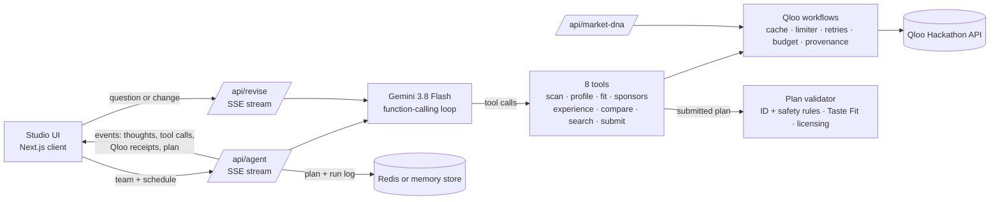

# Theme Night GM 🎟️

**An AI promotions agent for sports teams. It turns weak home dates into theme nights grounded in what the local market actually loves, using Qloo's taste graph.**

> Built for the [Qloo Agentic Hackathon](https://qloo.devpost.com/): *Agents, but with taste.*

- **Live demo:** https://theme-night-gm.vercel.app (no login; open **Studio** and press **Hire the GM**, or try **Market DNA**)
- **Repo:** https://github.com/ZNLong2203/Theme-Night-GM
- **Stack:** Next.js 16 · TypeScript · Gemini 3.8 Flash (function calling) · Qloo Insights API · MapLibre · Redis (optional) · Vitest
- **License:** MIT

---

## The problem

Minor-league and mid-market clubs rely on promotions to sell weeknight tickets: bobbleheads, fireworks, "Night" after "Night". Each off-season a small promotions staff plans dozens of them, usually from the same list every other club uses.

Nothing in that process answers the questions that decide whether a night sells:

- Does **our** city love this, or does every city?
- Do those fans live near **our** venue?
- Does this fandom fit **this** date's crowd (Sunday families vs Thursday after-work)?
- Is interest rising or fading?
- Which sponsor would pay to be part of it, and what would we tell them?

An LLM on its own can't answer any of these. It suggests the same Star Wars night for Durham and for Los Angeles.

## What it does

You give the agent your club, market, venue and home schedule. It picks the weak dates (or you do) and works like a promotions GM:

| Step | What the agent asks Qloo | Qloo features used |
|---|---|---|
| **1. Read the room** | Which movies, TV shows, artists, video games and books does this city have the strongest affinity for, and which ones does it over-index on compared with national popularity? | `/v2/insights` + `signal.location.query`, `filter.popularity.min`, `bias.trends` |
| **2. Size the fandom** | Who are these fans, where around the venue do they concentrate, and is interest rising? | `urn:demographics`, `urn:heatmap` (+ `filter.location` WKT point and radius), `/v2/trending`, `urn:tag` |
| **3. Fit the audience** | How well does each fandom fit each date's crowd? Does it bring **new** fans, or ones we already have? | `filter.results.entities` to re-rank a shortlist inside the city's pool, `signal.demographics.age`, `signal.demographics.audiences` (life-stage via `/v2/audiences`), `urn:demographics`, fan-base overlap via a sport proxy entity found with `/search` |
| **4. Build the night** | Which brands in our sales categories share this taste (sponsors)? Which artists go on the in-game playlist? Which bars, restaurants, breweries and cafés within 6 km make good pre-game partners? Which podcasts are the media buy? | `/v2/tags` → `filter.tags` and `filter.exclude.tags` on `urn:entity:brand` (+ `feature.explainability`), `urn:entity:artist`, `urn:entity:place` + `filter.location`/radius, `urn:entity:podcast`, `/v2/analysis/compare` |
| **5. Ship it with receipts** | The agent submits a plan. The server rejects any anchor Qloo didn't return during the run and any night that breaks the safety rules, and the model fixes and resubmits. | `/search`, `/entities` |

For each target date you get a **theme night kit**: a title and tagline; the anchor fandom; a **Taste Fit Score** (0–100) with its breakdown; a heatmap of where those fans concentrate around the venue; demographics and a 16-week trend; sponsor prospects with a ready-to-paste pitch; giveaway and activations; the in-game playlist; nearby partners; a media partner; promo copy; an IP-licensing flag; and **every Qloo request behind the night**, each copyable as curl. The season exports as JSON or a calendar CSV, and each night prints as a sponsor one-pager.

### Ask the GM: follow-up questions and changes

Under the season board, **Ask the GM** takes a question ("Why did you pick this for May 6?") or a change ("Make the Tuesday night a families night with a different fandom"). The same Gemini agent gets the research tools plus `submit_revision`. It answers questions from the plan's numbers; for a change it re-runs only the Qloo research it needs and resubmits **only the nights it changed**. Those nights pass the same validator, get fresh Taste Fit Scores and are merged into a revised copy of the plan with its own link, so shared links never change ([`src/lib/agent/revise.ts`](src/lib/agent/revise.ts)).

### Share, replay, featured plans

Every finished run saves its plan and its event log for 90 days. **Share link** opens the plan read-only at `/plan/<id>`, and `/studio?replay=<id>` replays how the GM built it in seconds, with no new API spend. The landing page links a recorded live plan for each demo market, shipped with the deployment so it works even if Redis is down. Plans and logs are stored brotli-compressed in Redis when one is configured (any Redis via `REDIS_URL`, which the Vercel Marketplace integration sets, or Upstash's REST API), and in server memory otherwise ([`src/lib/store.ts`](src/lib/store.ts)).

### Market DNA

`/market-dna` compares two cities side by side: each one's top 25 movies, TV shows, artists, video games and books from Qloo, then per domain what both share (Jaccard overlap), what only one market ranks, and which shared picks rank much higher in one city. It compares membership and rank, never raw affinity ([`src/lib/market-dna.ts`](src/lib/market-dna.ts)).

### The control group: proving Qloo is the difference

On the season board, **Run the LLM-only control** asks the same Gemini model to plan the same dates with **no Qloo tools**. Its picks are then resolved through Qloo `/search`, measured with the same workflows and scored with the **same Taste Fit formula**. A pick Qloo can't find scores 0; a pick whose lookup failed is reported as such and left out of the average. The gap between the two plans is measured, not claimed. Method and caveats: [docs/AGENT.md](docs/AGENT.md#10-llm-only-control-group).

## Measured runs

Live Qloo hackathon API with Gemini 3.8 Flash, October 2026:

| Run | Wall clock | Qloo requests | Result |
|---|---|---|---|
| Nashville hockey preset, production on Vercel | 93 s | 98, 0 errors | 6 Gemini steps; 6 nights accepted |
| Portland soccer preset | 132 s | 87, 0 errors | 6 Gemini steps; 6 nights, avg Taste Fit 74. The validator rejected the first submission; the model fixed it and resubmitted |
| Earlier preset runs | LA 110 s · Portland 121 s · Nashville 118 s | 103 · 88 · 97 | Gemini submitted the plan itself each time |
| Control group, 4 markets (production, Oct 6) | | | LLM-only avg Taste Fit vs Theme Night GM: Durham 45 → 71, LA 44 → 73, Portland 44 → 74, Nashville 41 → 68. **+26 to +30 points, +28 on average**; every LLM pick was found in Qloo, so none scored 0 |
| Ask the GM revision | ~100 s | 53 | Changed only the requested night |

Without keys (simulated Qloo + autopilot), a preset run makes 78–91 requests and finishes in a few seconds.

## Taste Fit Score

The score is computed by code from Qloo responses, never written by the model, so it is consistent and explainable:

| Weight | Component | Source |
|---|---|---|
| 30% | Local affinity | Rank percentile within the city's top 25 for the domain (`/v2/insights` with the city as location signal) |
| 25% | Audience fit | Half: rank when the same pool is re-ranked with the date's age or life-stage signal. Half: `urn:demographics` alignment |
| 20% | Fans near the venue | The 16 km catchment's share of the fandom's metro hotspots (top 20% of `urn:heatmap` cells) relative to its share of all cells, mapped to r/(1+r): 0.5 = fair share |
| 15% | Momentum | Change in `/v2/trending` percentile over a 16-week window |
| 10% | New-fan reach | 1 − 0.8 × how highly existing sport fans (a league proxy entity) rank the fandom |

A component Qloo couldn't measure scores a neutral 0.5 and is marked **est.** in the UI; raw affinity from a different query is never used as a stand-in. **Local lift** compares a fandom's rank by local affinity with its rank by national popularity in the same result set. Qloo normalizes affinity per query, so ranks are compared within one query and raw scores are never compared across queries. Derivations: [docs/QLOO_INTEGRATION.md](docs/QLOO_INTEGRATION.md#6-derived-metrics).

## Architecture



- **Agent loop** ([`src/lib/agent/run.ts`](src/lib/agent/run.ts)): Gemini 3.8 Flash with function calling, thought summaries and per-step timing streamed to the UI. Model turns are kept verbatim to preserve thought signatures. Up to 12 steps and 10 tool calls per turn, a 190-second LLM deadline, and a 270-second run deadline after which everything aborts and the stream still ends with `done`.
- **Tools** ([`src/lib/agent/tools.ts`](src/lib/agent/tools.ts)): each tool is one product question answered by several Qloo calls. Every call is recorded with an ID (`Q1`, `Q2`, …) and attributed to the tool call that made it, via `AsyncLocalStorage`.
- **Qloo client** ([`src/lib/qloo/client.ts`](src/lib/qloo/client.ts)): API key server-side only, `take` clamped to 50, up to 10 requests in flight with starts ≥ 200 ms apart, retries on 429/5xx honouring `Retry-After` up to 5 s, a 429 pauses the shared limiter, and a per-run request budget. Responses are cached in memory for 12 hours and, with Redis attached, responses up to 64 KB are shared across instances for 12 hours.
- **Validator** ([`src/lib/agent/assemble.ts`](src/lib/agent/assemble.ts)): the model can only cite entities Qloo returned during the run, and the safety rules are enforced in code. A rejected plan goes back to the model with specific errors.
- **Safety net** ([`src/lib/agent/autopilot.ts`](src/lib/agent/autopilot.ts)): a deterministic planner drives the same tools and reuses the model's research when the model misses its budget or Gemini returns an error (the SDK retries transient errors first). It follows the same rules as the validator.

## Responsible use

- **No personal data is sent to Qloo.** Requests carry only market-level inputs: the city, venue coordinates, entity IDs, search terms, sales-category phrases and age or life-stage signals. The team name and the director's notes go only to Gemini. Results are aggregate audience affinities, and the UI and prompts present them that way.
- **No sensitive targeting.** Segments are age and life stage only. The agent is instructed never to infer ethnicity, religion, health, politics, sexuality or income.
- **Safety rules in code** ([`src/lib/sensitivity.ts`](src/lib/sensitivity.ts), [`assemble.ts`](src/lib/agent/assemble.ts)). Anchors must be a movie, TV show, artist, video game or book. Political, religious, crime or tragedy anchors are rejected, and so are nights framed around identity (pride, heritage or faith nights), judged by the framing rather than single words. On family and Gen Z nights, alcohol brands and bars or breweries are dropped with a warning; sensitive sponsors and podcasts are dropped on any night.
- **Provenance everywhere.** Every night lists the requests behind it. Simulated data (no key configured) is labelled in the UI.
- **IP-aware.** Studio and publisher metadata flags nights that need licensing, and a license-free mode asks the agent to evoke fandoms without trademarked titles. This is a rules-based flag, not legal advice.

## Run it locally

```bash
git clone https://github.com/ZNLong2203/Theme-Night-GM && cd Theme-Night-GM
npm install            # also copies the MapLibre worker into public/
cp .env.example .env.local   # add QLOO_API_KEY and GEMINI_API_KEY
npm run dev            # http://localhost:3000
```

All keys are optional for exploring the app:

- Without `QLOO_API_KEY`, results come from deterministic **simulated** data (labelled in the UI).
- Without `GEMINI_API_KEY`, a deterministic **autopilot** planner drives the same tools. Ask the GM needs Gemini.
- Without Redis (`REDIS_URL`, or Upstash's `KV_REST_API_URL` + `KV_REST_API_TOKEN`), plans, replays and featured plans are kept in server memory.

Optional settings (thinking level, trending window, rate limits, Redis) and Vercel deployment are covered in [docs/DEPLOYMENT.md](docs/DEPLOYMENT.md).

## Tests and CI

```bash
npm test               # Vitest: unit tests + a keyless end-to-end agent run
npm run typecheck      # next typegen && tsc --noEmit
npm run lint
```

The suite in [`tests/`](tests/) covers scoring, the schedule and weak-date picker, the safety rules, licensing, the Qloo workflows, the plan validator and input validation. [`tests/agent.mock.test.ts`](tests/agent.mock.test.ts) runs the whole agent with no keys and checks that the plan covers every date and cites only entities and requests from the run. [GitHub Actions](.github/workflows/ci.yml) runs lint, typecheck, test and build on every push and pull request to `main`, with no secrets.

## Verify the Qloo dependency

1. **Check the mode.** `GET /api/status` (and the header badges) report `qloo: "live"` or `"simulated"`, the planner (`gemini-3.8-flash` or `autopilot`) and the store (`redis` or `memory`).
2. **Re-run any receipt.** Every Qloo request behind a night is listed with its purpose and parameters, and **Copy as curl** reproduces it with your own `$QLOO_API_KEY`.
3. **Remove the key.** Without `QLOO_API_KEY` every receipt is badged `simulated` and the header shows **Qloo simulated**: the app never passes mock data off as Qloo data.
4. **Run the control.** **Run the LLM-only control** shows what the same model plans without Qloo, scored the same way.

The full request reference (18 request shapes across 7 endpoints) is in [docs/QLOO_INTEGRATION.md](docs/QLOO_INTEGRATION.md).

## Known limitations

- Qloo affinities are relative and aggregate. A high score means "this market's audience over-indexes on X", not a ticket-sales forecast.
- Momentum uses the hackathon dataset's latest trending window, which ends 2025-09-28. Qloo has no trending for books and video games, so their momentum is estimated.
- Weak-date detection is a heuristic (weekday, game time, month). Uploading real attendance history is on the roadmap.
- Fan-base overlap uses a sport proxy entity (e.g. a league or league video game). Teams with their own Qloo entity could use it directly.
- The licensing check is rules-based from Qloo metadata and is not legal advice. The safety checks are keyword rules and can miss edge cases.
- The public demo is protected by per-client rate limits and per-run Qloo budgets, not authentication.
- Without Redis, shared links, replays and featured plans live in one server instance's memory and are lost on a cold start.

## Documentation

| Doc | What it covers |
|---|---|
| [docs/PROBLEM_SPACE.md](docs/PROBLEM_SPACE.md) | Who plans theme nights, why weak dates matter, the addressable market, and what we don't claim |
| [docs/ARCHITECTURE.md](docs/ARCHITECTURE.md) | Components, the end-to-end run, module map, SSE event protocol, storage, budgets, security and known limitations |
| [docs/AGENT.md](docs/AGENT.md) | The Gemini loop, the eight tools, prompt, plan validator, autopilot safety net, Ask the GM, Taste Fit Score and the LLM-only control group |
| [docs/QLOO_INTEGRATION.md](docs/QLOO_INTEGRATION.md) | Every Qloo request the app makes, how responses become metrics, Market DNA, API gotchas, receipts, simulated mode and responsible use |
| [docs/DEPLOYMENT.md](docs/DEPLOYMENT.md) | Local setup, tests, environment variables, Vercel deployment, attaching Redis, smoke test and troubleshooting |
| [docs/DEMO_SCRIPT.md](docs/DEMO_SCRIPT.md) | A 3-minute click-by-click demo, talking points per judging criterion, and a fallback plan |
| [docs/DEVPOST_SUBMISSION.md](docs/DEVPOST_SUBMISSION.md) | Paste-ready submission text, testing instructions for judges and a pre-submit checklist |
| [CONTRIBUTING.md](CONTRIBUTING.md) | Dev setup, tests, coding conventions, adding a Qloo-backed tool, commit and PR conventions |

## License

MIT. See [LICENSE](LICENSE).
