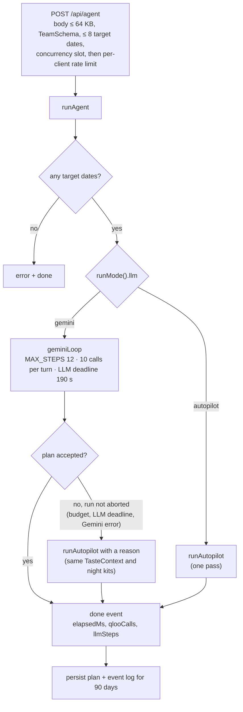

# Agent design

How Theme Night GM plans a season of theme nights: the Gemini tool loop, the eight Qloo-backed tools, the plan validator, the deterministic safety net, the Taste Fit Score, the LLM-only control group, and Ask the GM follow-ups.

**Audience:** hackathon judges reviewing the agentic design, and engineers extending it. Request-level Qloo detail (every parameter, every derived metric) lives in [QLOO_INTEGRATION.md](QLOO_INTEGRATION.md); system-level detail (SSE protocol, module map, storage, budgets) lives in [ARCHITECTURE.md](ARCHITECTURE.md).

> **Measurements.** Live numbers come from runs against the Qloo hackathon API with Gemini 3.8 Flash in October 2026 ([section 13](#13-measured-runs)). Keyless numbers come from simulated Qloo with the autopilot planner, and are labelled as such.

**Contents**

1. [Why an agent and not a single prompt](#1-why-an-agent-and-not-a-single-prompt)
2. [Control flow and run modes](#2-control-flow-and-run-modes)
3. [The Gemini 3.8 Flash loop](#3-the-gemini-38-flash-loop)
4. [The eight tools](#4-the-eight-tools)
5. [System prompt and brief](#5-system-prompt-and-brief)
6. [Plan validator](#6-plan-validator)
7. [Autopilot fallback](#7-autopilot-fallback)
8. [Taste Fit Score](#8-taste-fit-score)
9. [Licensing heuristic](#9-licensing-heuristic)
10. [LLM-only control group](#10-llm-only-control-group)
11. [Ask the GM: follow-up revisions](#11-ask-the-gm-follow-up-revisions)
12. [Responsible-use guardrails](#12-responsible-use-guardrails)
13. [Measured runs](#13-measured-runs)
14. [Limitations and future work](#14-limitations-and-future-work)

---

## 1. Why an agent and not a single prompt

Planning a theme night is a chain of decisions. Each answer changes what the next question should be:

| Decision | What it depends on | Tool |
|---|---|---|
| Which fandoms does *this* city over-index on? | City-signalled ranking compared with national popularity, in one Qloo result set | `scan_market_taste` |
| Which of those fit the crowd on *this* date? Do they bring new fans? | A shortlist picked from the scan, ranked per audience segment and against the sport's existing fans | `score_audience_fit` |
| Do those fans concentrate near the venue? Is interest rising? | Heatmap, trend and demographics for the strongest candidates only | `profile_fandoms` |
| Which fandom goes on which date? | All of the above, plus "use each anchor once, vary domains" | Model reasoning, guided by the provisional Taste Fit Score |
| Who sponsors it, what plays, where is the pre-game? | Brands in the club's sales categories, artists, places and podcasts matched to the chosen anchor | `find_sponsors`, `build_night_experience` |
| Is the plan grounded and safe? | Every ID checked against what Qloo returned in this run, plus the safety rules | `submit_season_plan` and the validator |

A single prompt can't do this, for four reasons:

- **It has no taste data.** Without tools, a model picks from its training-data priors, so nothing stops it suggesting the same "Star Wars Night" for every city. The [control group](#10-llm-only-control-group) measures how big that gap is: on a live Durham run, 45 vs 70.
- **The Qloo calls can't be planned up front.** Which 10–14 candidates to score depends on the scan. Which 6 to profile depends on the scan and the fit scores. Which anchors need sponsor and experience kits depends on the assignment.
- **It can't cite real evidence.** The validator rejects an anchor that Qloo did not return during the run, and drops any other unknown ID. The prompt also tells the model to quote numbers only from tool output, but the code does not check those numbers ([section 6](#6-plan-validator)).
- **It gets no feedback.** The validator rejects bad plans with specific errors, so the model can fix them and resubmit. In the live Portland run, the first submission was rejected and the model fixed and resubmitted it.

**Design principle: the model decides, the code measures.** The model chooses which questions to ask, assigns fandoms to dates and writes the pitch. Code computes everything that should not be up to the model: the Taste Fit Score, entity validation, the safety rules, licensing flags, and the provenance of every Qloo request.

## 2. Control flow and run modes



Two deadlines bound every run ([`run.ts`](../src/lib/agent/run.ts)):

- **LLM deadline** (`LLM_DEADLINE_MS = 190_000`, from the start of `runAgent`) stops only the Gemini loop. The safety net then has the rest of the run to finish.
- **Run deadline** (`RUN_DEADLINE_MS = 270_000`) is combined with the client's abort signal into `run.signal`. It reaches every tool, every Qloo fetch, retry wait and queued request, so the stream always ends with `done` before the route's `maxDuration = 300`.

The safety net runs when the Gemini loop returns without an accepted plan and `run.signal` hasn't fired: the step budget or nudges ran out, the model returned an empty turn, the LLM deadline fired, or Gemini returned an error after the SDK's own retries. It does not run after a client disconnect or the run deadline. If no plan was accepted in the end, the run emits an `error` ("Run stopped.", "The run hit its time limit before a plan was accepted." or "The agent finished without an accepted plan.") before `done`. An unexpected exception becomes a generic `error` message (Qloo failures show only their status); the details stay in the server log ([`errors.ts`](../src/lib/errors.ts)). Tool failures are different: `runTool` catches them and returns them to the model as `{ error }`.

After `done`, `runAgent` saves the plan (`plan:<id>`) and, if it is under 3 MB, the event log (`run:<id>`) for 90 days, so the plan can be shared at `/plan/<id>` and replayed in the Studio. A run for one of the four demo presets with live Qloo also becomes that preset's featured plan on the landing page ([ARCHITECTURE.md §11](ARCHITECTURE.md#11-storage-sharing-and-replay)).

[`runMode()`](../src/lib/agent/run.ts) decides the mode from environment variables, and every plan records which mode produced it:

| Field | Value | Set by |
|---|---|---|
| `qloo` | `"live"` or `"simulated"` | `QLOO_API_KEY` present ([`qlooIsLive`](../src/lib/qloo/client.ts)). Simulated responses come from [`mock.ts`](../src/lib/qloo/mock.ts) and are labelled in the UI. |
| `llm` | `"gemini"` or `"autopilot"` | `GEMINI_API_KEY` present |
| `model` | `GEMINI_MODEL`, default `"gemini-3.8-flash"` | Only set in Gemini mode |
| `store` | `"redis"` or `"memory"` | `REDIS_URL` or Upstash REST credentials present ([`store.ts`](../src/lib/store.ts)) |

[`/api/agent`](../src/app/api/agent/route.ts) streams the run as Server-Sent Events ([event protocol](ARCHITECTURE.md#5-sse-event-protocol)), sends a `: ping` heartbeat every 10 s, and admits a run only if a concurrency slot is free (`MAX_CONCURRENT_RUNS`, default 4 per instance) and the client is under its quota (`RUNS_PER_10_MIN`, default 6 per 10 minutes). The slot is reserved before the quota is charged, so a "busy" answer costs nothing.

## 3. The Gemini 3.8 Flash loop

Source: [`src/lib/agent/run.ts`](../src/lib/agent/run.ts) (`geminiLoop`, shared by the planner and [Ask the GM](#11-ask-the-gm-follow-up-revisions)). The end-to-end sequence diagram is in [ARCHITECTURE.md §2](ARCHITECTURE.md#2-one-agent-run-end-to-end).

| Setting | Value |
|---|---|
| Call | `ai.models.generateContent(...)` from `@google/genai`, one non-streaming call per step. The client is created with `retryOptions: { attempts: 3, initialDelay: 1, maxDelay: 8 }`, so the SDK retries transient errors (429, 503) before they count as a failure. |
| `model` | `GEMINI_MODEL` (env), default `"gemini-3.8-flash"` |
| `systemInstruction` | `SYSTEM_PROMPT` ([prompt.ts](../src/lib/agent/prompt.ts)) |
| First user turn | `buildBrief(team, targets)` |
| `tools` | `[{ functionDeclarations }]`: the 8 tool declarations, each with a JSON Schema in `parametersJsonSchema` |
| `thinkingConfig` | `{ thinkingLevel, includeThoughts: true }`. The level comes from `GEMINI_THINKING` (`low`, `medium` or `high`); the default and any unknown value mean `ThinkingLevel.LOW`. |
| Step budget | `MAX_STEPS = 12` model calls. The prompt asks the model to finish in about 5 turns; the measured live preset runs used 6. |
| Calls per turn | `MAX_CALLS_PER_TURN = 10`. Extra calls in the same turn are not run; each gets `{ error: "Skipped: at most 10 tool calls run per turn. Batch IDs into fewer calls." }` |
| Deadline | `LLM_DEADLINE_MS = 190_000` from the start of the run (`AbortSignal.timeout`) |
| Cancellation | The model call's `abortSignal` combines the client's signal with the LLM deadline. Tools use `run.signal` (client + 270 s run deadline). |

### One step

1. **Abort check.** Stop if the client left or the LLM deadline fired.
2. **Call the model** with the full `contents` history, bracketed by `llm_step` events (`started`, then `finished` with `ms`, `inputTokens` and `outputTokens`). If the call throws because the signal fired, the loop exits quietly. Any other error is logged server-side and turned into a short `failure` ("rate limit or quota (429)", "model unavailable (503)", "API key rejected (401)", …), and the loop exits. **The loop never throws for a Gemini error**; the caller decides what to do.
3. **Empty response.** If the candidate has no parts and `finishReason === FinishReason.MALFORMED_FUNCTION_CALL`, append a user turn, *"Your last function call was malformed. Call the tool again with valid JSON arguments."*, and retry. Any other empty response ends the loop.
4. **Keep the model turn verbatim.** The loop runs `contents.push(content)` without rebuilding or filtering the turn. The code comment gives the reason: *"it carries the thought signatures Gemini 3 needs on the next request."*
5. **Stream narration.** Each non-empty text part is emitted as a `thought` event when `part.thought` is set (a thought summary from `includeThoughts`), and as a `message` event otherwise.
6. **No function calls.** If a plan has already been accepted, stop. Otherwise append the missing-plan nudge: *"You haven't submitted an accepted plan yet. Finish any missing research, then call submit_season_plan with exactly one night per target date using only IDs from tool results."*
7. **Function calls.** The first 10 calls in the turn run **concurrently** with `Promise.all`, through `runTool(name, args, callId, run)`, where ``callId = call.id ?? `s${step}_${i}` ``. Each result becomes a `functionResponse` part `{ id, name, response }`: `{ output }` on success, or the tool's `{ error: "..." }` object as-is, so the model can read and fix it. All response parts go back as **one** user turn, in call order.
8. **Stop on acceptance.** The planner stops once `submit_season_plan` accepts a plan (`run.submitted`). A revision gets one more turn to summarise the change (`replyAfterSubmit`).

**Nudge limits.** Both nudge types share one `nudges` counter. A malformed-call retry is allowed while `nudges < 3`. A missing-plan nudge is allowed while `nudges < 2`.

**Concurrency.** Parallel tool calls all go through `qlooGet`, which applies the shared cache, the per-run request budget and, in live mode, the module-level limiter and retries ([QLOO_INTEGRATION.md §2](QLOO_INTEGRATION.md#2-request-pipeline)). Each request is attributed to its tool call through the `toolCallScope` `AsyncLocalStorage` ([ARCHITECTURE.md §6](ARCHITECTURE.md#6-attributing-qloo-requests-to-tool-calls)).

**After the loop.** If no plan was accepted and the run is still live, `runAgent` hands off to the autopilot, which first emits one of two thoughts: *"Gemini returned an error (<failure>) — finishing with the deterministic planner on the same Qloo evidence."* or *"The model didn't land a valid plan in its step budget — finishing with the deterministic planner on the same Qloo evidence."* The autopilot reuses the run's `TasteContext` and the sponsor and experience kits the model already built (`run.kits`), so a late or unreachable model gets its research turned into a plan instead of a restart.

## 4. The eight tools

Source: [`src/lib/agent/tools.ts`](../src/lib/agent/tools.ts). The tools call Qloo through [`src/lib/qloo/workflows.ts`](../src/lib/qloo/workflows.ts). Request IDs below (R1–R18) refer to the [master request table](QLOO_INTEGRATION.md#3-master-request-table).

### Shared contract (`runTool`)

- **Unknown tool name.** Returns `{ error: "Unknown tool <name>" }` and emits no events.
- **Stopped run.** If `run.signal` has fired (client gone, or the 270 s run deadline), returns `{ error: "Run stopped" }` without running anything.
- **Argument validation.** Each tool has a zod `schema`. Invalid arguments emit a `tool_call` labelled `<name> (invalid arguments)` and a failed `tool_result`, then return `{ error: "Invalid arguments: <path>: <message>; …" }` so the model can correct itself.
- **Execution.** Emits `tool_call` with a human-readable `label`, runs the tool inside `toolCallScope.run(callId, …)`, then emits `tool_result` with `summary` and `ui`. A thrown exception becomes a failed `tool_result` plus `{ error }` carrying the exception's message. After `find_sponsors` or `build_night_experience` succeeds, the output is stored in `run.kits` under the first anchor, for the autopilot to reuse.
- **Entity references.** `resolveId` accepts a Qloo ID, or as a fallback the exact entity name (case-insensitive) of an entity already seen in this run. Strings it can't resolve are passed through unchanged.
- **Three outputs per tool.** `output` is compact JSON that goes back to the model; `summary` is one line for the trace; `ui` is the full payload for the live canvas (heatmap points, trend series, full lists). This keeps the model's context small while the UI renders everything.
- **`compact()` entity shape sent to the model.** `id`, `name`, `kind`, plus these when present: `local_pct` (or raw `affinity` when no percentile exists), `popularity`, `local_lift` / `local_rank` / `national_rank` (scan results), `sponsor_category`, `sensitive_topic`, `driven_by_anchor`, `year`, `industries`, and the first 4 `tags`. Qloo normalizes affinity per query, so the model is given rank-based numbers wherever they exist.

### Overview

| Tool | Question it answers | Qloo requests | Returned to the model | `ui.kind` |
|---|---|---|---|---|
| `scan_market_taste` | What does this city over-index on? | R1, one per domain | Top 10 per domain with local rank, percentile and lift | `market_scan` |
| `score_audience_fit` | Which fandom fits which crowd? Does it bring new fans? | R1 (missing pools), R2, R6–R11 | `local_pct`, `segment_fit`, `existing_fan_overlap`, provisional Taste Fit per segment | `fit_matrix` |
| `profile_fandoms` | Who are the fans, where do they concentrate, is interest rising? | R2–R6 | Top age skews, gender, trend, `near_venue_index`, tags, `unavailable`, evidence IDs | `profiles` |
| `find_sponsors` | Which brands in our sales categories share this taste? | R13, R14 | Up to 12 brands with `sponsor_category`, plus any `unresolved_categories` | `sponsors` |
| `build_night_experience` | Playlist, nearby partners, media partner? | R15–R17 | ≤ 10 artists, ≤ 8 places, ≤ 6 podcasts | `experience` |
| `compare_fanbases` | What taste bridges two audiences? | R12 | ≤ 12 tags + request ID | `crossover` |
| `search_entities` | What is the Qloo ID for this name? | R18 | ≤ 5 entities | `search` |
| `submit_season_plan` | Is this plan valid? | Only for anchors not yet scored or profiled | `accepted`, `errors` or `warnings`, scores | none; a `plan` event on acceptance |

Per-call request counts are in [QLOO_INTEGRATION.md §4](QLOO_INTEGRATION.md#4-requests-per-tool-call).

### `scan_market_taste`

- **Inputs:** `kinds` (required): any of `movie`, `tv_show`, `artist`, `videogame`, `book`. The declaration says "Scan all five". `min_popularity`: 0–1, default `0.8` ("lower it only if a domain comes back thin"). Podcasts are not scanned; they are media partners.
- **Qloo:** R1 per kind, in parallel, each returning up to 25 entities (`POOL_SIZE`) that become the domain's ranking pool. A domain that fails is reported as `unavailable_domains` instead of failing the tool. A rescan replaces a domain's ranks together, so a card never mixes ranks from two result sets.
- **Derived:** `local_rank` (Qloo's order under the city signal), `national_rank` (the same results sorted by `popularity`), `local_lift = national_rank − local_rank`, and `local_pct` (rank percentile). Ranks are compared inside one query, never raw affinities across queries ([QLOO_INTEGRATION.md §6.1](QLOO_INTEGRATION.md#61-local-lift-and-local-percentile)).
- **To the model:** `{ city, qloo_resolved_market, domains: [{ kind, evidence, entities }], unavailable_domains? }` with the **top 10** per domain. (The declaration text says "top 25"; the full 25 stay server-side as the ranking pool.)
- **Summary line:** the number of fandoms ranked and the three biggest local over-indexes.

### `score_audience_fit`

- **Inputs:** `entity_ids` (required; first 14 used) and `segments` (required): any of `families`, `gen_z`, `young_pros`, `boomers`.
- **Qloo:** candidates are grouped by kind (brands and places are skipped). Per kind, the candidates plus the top 15 of the domain's scan pool are re-ranked under each segment's signal plus the city signal (R9), and under the sport's fan-base proxy (R11). `urn:demographics` (R2) supplies age affinity. Candidates the scan missed get a local rank too (R8). The families audience (R7) and the fan-base proxy (R10) are resolved once per run; the proxy lookup is a shared promise, so parallel `score_audience_fit` calls in one turn all get it.
- **Derived:** `segment_fit = 0.5 × pool-rank percentile under the segment signal + 0.5 × demographic alignment` (either alone if the other is missing); `existing_fan_overlap` = rank percentile under the proxy signal ([QLOO_INTEGRATION.md §6.3–6.4](QLOO_INTEGRATION.md#63-segment-fit)).
- **To the model:** `{ fanbase_proxy, rows: [{ id, name, local_pct, segment_fit, existing_fan_overlap, taste_fit_score: { <segment>: 0–100 } }] }`. The score is **provisional**: near-venue and momentum score the neutral 0.5 until the entity has been profiled.

### `profile_fandoms`

- **Inputs:** `entity_ids` (required). Only the first 6 are used.
- **Qloo:** `/entities` for unseen IDs (R6), `urn:demographics` for IDs without it (R2), and per entity a heatmap within 40 km of the venue (R4), taste tags (R5) and, for movies, TV shows, artists and podcasts, a 16-week `/v2/trending` window ending `2025-09-28` (R3). Each enrichment request may fail without failing the profile.
- **Derived:** trend direction and `changePct` (first third vs last third of the points); `nearVenueIndex`, the catchment's share of the fandom's metro hotspots relative to its share of all heatmap cells, mapped to r/(1+r) so **0.5 = fair share**. Formulas: [QLOO_INTEGRATION.md §6.2](QLOO_INTEGRATION.md#62-near-venue-index), [§6.5](QLOO_INTEGRATION.md#65-trend-direction-changepct-and-momentum).
- **Failures are named, not hidden.** The profile's `unavailable` list records "Trend: Qloo request failed (429)", "Heatmap: Qloo request failed (…)", "Heatmap: too few cells to measure" (fewer than 10 cells) or "Demographics: Qloo request failed", so the UI and the model can tell a failed request from Qloo having no data.
- **To the model:** per entity `id`, `name`, `strongest_age_affinity` (top two age buckets, signed), `gender_skew`, `trend` (`"<direction> (<±changePct>% in Qloo trending <start> → <end>)"`, `"no trending data"`, or `"Qloo doesn't track trending for this domain"`), `near_venue_index` (`null` when not measured), `taste_tags` (≤ 6), `unavailable` (when any), `evidence` (request IDs).

### `find_sponsors`

- **Inputs:** `anchor_entity_ids` (required): the anchor plus up to 2 supporting IDs; only the first 3 are used. `categories`: optional, defaults to the team's `sponsorCategories`; up to 6 are queried (`MAX_SPONSOR_CATEGORIES`).
- **Qloo:** each category is resolved to a Qloo brand tag through `/v2/tags` (R13). A resolved tag is memoized for the server process; a miss is retried on the next run. Then one brand query per resolved category with `filter.tags` and the anchors as `signal.interests.entities` (R14), 6 brands each (4 when more than 4 categories resolve). Leagues, teams and sports media are excluded with `filter.exclude.tags`. If no category resolves, one unfiltered brand query (12 brands) runs instead.
- **Post-processing:** groups are merged round-robin so every category gets a prospect, de-duplicated, up to 12 kept.
- **To the model:** compact brands with `sponsor_category`, `industries` and `driven_by_anchor` (explainability score). When some categories have no Qloo brand tag, the output is `{ brands, unresolved_categories }` and the trace summary says "No Qloo brand tag for: …".

### `build_night_experience`

- **Inputs:** `anchor_entity_ids` (required). Only the first 3 are used.
- **Qloo:** three requests in parallel, each allowed to fail on its own: artists with the city signal (R15, the playlist); bars, restaurants, breweries and cafés within 6 km of the venue (R16, local partners); podcasts (R17, media partner).
- **To the model:** `playlist_artists` (≤ 10), `nearby_places` (≤ 8, with `address`), `podcasts` (≤ 6).

### `compare_fanbases`

- **Inputs:** `a_entity_ids`, `b_entity_ids` (both required; up to 5 each are used).
- **Qloo:** `/v2/analysis/compare` (R12).
- **To the model:** `{ tags: [{ name, score }] (≤ 12), evidence: <request id> }`. Optional: hooks for activations and copy that feel native to both audiences. The Night kits tab shows the result as a "Shared taste" block.

### `search_entities`

- **Inputs:** `query` (required); `kinds` optional (the declaration lists the five scan kinds plus `brand` and `place`; the zod schema accepts any string).
- **Qloo:** `/search` with `take=5` (R18).
- **Use:** optional. It tests an idea that wasn't in the scan. Entities it resolves become valid IDs for the plan.

### `submit_season_plan`

- **Inputs:** the plan schema described in [section 6](#6-plan-validator).
- **Qloo:** before validating, it runs `scoreCandidates` for anchors with no segment fit and `profileEntities` for anchors with no profile, so every night (and the control group) is measured the same way. Zero requests when the model already measured every anchor.
- **To the model:** rejected: `{ accepted: false, errors }`; accepted: `{ accepted: true, warnings, scores: [{ date, title, score }] }`.
- **On acceptance:** sets `run.submitted = true` and emits the `plan` event.

## 5. System prompt and brief

Source: [`src/lib/agent/prompt.ts`](../src/lib/agent/prompt.ts). `SYSTEM_PROMPT` and the revision prompt share one `RULES` block.

`SYSTEM_PROMPT` casts the model as *"Theme Night GM, a promotions strategist agent working for a professional sports team's ticketing and marketing staff"*. It gives a working method that *"aim[s] for 5 turns — every turn costs the user time, so batch tool calls"*:

1. **Read the room.** Call `scan_market_taste` once with all five domains. Prefer high `local_pct` **and** positive `local_lift`: *"Megahits every city loves are weaker picks than ones this city specifically over-indexes on."*
2. **In one turn,** call `score_audience_fit` on a shortlist of 10–14 candidates across several domains (with every segment in the target dates) **and** `profile_fandoms` on the 6 strongest.
3. **Assign exactly one anchor per date.** Match the segment, prefer rising momentum and high new-fan reach (*"theme nights exist to bring people who aren't coming yet"*), use each anchor once, and vary domains.
4. **In one turn,** call `find_sponsors` and `build_night_experience` for every chosen night (parallel function calls). `compare_fanbases` and `search_entities` are optional.
5. **Submit** with `submit_season_plan`; *"If it returns errors, fix them and resubmit."*

**Key rules, quoted or closely paraphrased:**

- *"Ground every claim in tool output. Never invent numbers."* The "why" for each night should weave in 2–3 concrete Qloo numbers in plain English and never raw field names like `local_pct`.
- *"Qloo normalizes affinity per query, so the tools give rank-based values (local_rank, local_pct, segment_fit): compare those, not raw affinities across different calls."*
- Trend data: say *"in Qloo's latest trending window"*, never "this month".
- *"Only reference entity IDs that tools returned. Never make up IDs."*
- *"Qloo results are aggregate audience affinities, not facts about individuals."*
- *"Do not target or infer sensitive traits (ethnicity, religion, health, politics, sexuality, income) — use only the provided age/life-stage segments."* Describe audiences only by their tastes, never by race or ethnicity, even when a fandom is culturally specific.
- *"Never pair alcohol brands with family or Gen Z nights (Gen Z includes minors); pick a non-alcohol sponsor for those."*
- No pride, heritage, faith or other identity nights: *"those are partnerships a club builds with a community, not something to infer from taste data."*
- Never anchor a night on a political, religious, crime or tragedy-centered title (tool output marks these with `sensitive_topic`).
- Under `ip_light`, evoke the fandom without trademarked titles, logos or characters (e.g. *"Upside-Down 80s Night"*), and don't name the policy in customer-facing copy.
- *"Spread sponsor asks: don't pitch the same brand on more than two nights."* Sponsor angles explain the taste overlap in one sentence a seller could say on a call. Promo copy is playful, specific and local, with at most 2 hashtags.
- Keep between-step narration to one or two sentences, and refer to the team only by the name in the brief.

Several of these rules are also enforced in code ([section 6](#6-plan-validator)); the rest are prompt-only.

**The brief.** `buildBrief(team, targets)` is the first user turn: team, sport and league; venue name, city and lat/lon; the number of home dates; one line per target date (date, weekday, day or night, opponent, target segment and its short label); the sponsor categories (or "any"); the IP policy with a one-line explanation; optional notes from the promotions director; and today's date. The weekday is re-derived on the server from the date ([`validation.ts`](../src/lib/validation.ts)), so a client can't put arbitrary text there. The brief goes only to Gemini, never into Qloo parameters.

## 6. Plan validator

Source: [`assemblePlan`](../src/lib/agent/assemble.ts), called by `submit_season_plan` and by Ask the GM's `submit_revision`. Safety helpers: [`src/lib/sensitivity.ts`](../src/lib/sensitivity.ts).

**Submission schema (`PlanSubmission`, zod).** It requires `market_summary` and at least one night. Each night has `date`, `anchor_entity_id`, `title`, `why` and `promo { headline, social, email_subject }`; `tagline` and `giveaway` default to `""`; `sponsor_picks: [{ brand_id, angle }]` and `activations` default to `[]`; `supporting_entity_ids`, `playlist_artist_ids`, `local_partner_picks: [{ place_id, idea }]` and `media_partner { podcast_id, idea }` are optional.

**Lookups** go against `TasteContext.cards`, the entities Qloo returned during *this* run, by ID or by exact case-insensitive name.

| Check | Outcome |
|---|---|
| `date` is not one of the target dates | **Error**; lists the valid dates |
| Same `date` appears twice | **Error** |
| `anchor_entity_id` not returned by any Qloo call in this run | **Error** |
| Anchor is not a movie, TV show, artist, video game or book (a brand, place or podcast) | **Error** ("anchor each night on a movie, TV show, artist, video game or book") |
| Anchor flagged by `sensitiveTopic()` (politics, religion, crime, tragedy keywords in its name or description, or a strict tag list) | **Error** ("touches a sensitive topic … pick a different anchor") |
| Title or tagline framed as an identity night by `identityTheme()` | **Error** (rename it around the fandom) |
| A target date has no night | **Error** ("Missing nights for target dates: …") |
| Unknown supporting entity, sponsor brand, playlist artist, place or podcast | **Warning**; the reference is dropped and the night is kept |
| Supporting entity, sponsor, local partner or media partner flagged by `sensitiveTopic()` | **Warning**; removed, on any night |
| On a `families` or `gen_z` night: an alcohol brand (`isAlcoholBrand()` on name, category, industries and tags, ignoring "non-alcoholic") among the supporting entities, sponsors or partners | **Warning**; removed |
| On a `families` or `gen_z` night: a local partner that is a drinking spot (`isDrinkingSpot()`: bars, pubs, taverns, taprooms, breweries, wineries, cocktail bars, nightclubs, in its name or tags) | **Warning**; removed |
| More than 3 sponsors on a night (after filtering) | Silently capped to the first 3 |
| The same anchor is used on more than one night | **Warning** ("Some anchors repeat — consider more variety.") |

**Identity nights are judged by framing, not single words.** `identityTheme()` matches phrases such as "<pride, heritage, faith, cultural, …> night/month/day/weekend/celebration/festival/community", "celebrate our heritage/culture/faith/pride/roots", LGBTQ terms, and "<community> heritage/history/night". "Pride Night" or "Celebrate our heritage" is rejected; a tagline about "artisanal pride", a "Faith Hill Night" or a "Pride and Prejudice Night" is not. (A live Portland plan was once rejected for "Artisanal pride, eccentric spirit…", which is why the rule changed.)

**Errors versus warnings.** Errors block the plan: the model receives `{ accepted: false, errors }` and is expected to fix and resubmit. Each resubmission uses a step, so `MAX_STEPS` and the deadlines bound the loop. Warnings let the plan through without the references that could not be verified or were not allowed.

**What the server attaches to an accepted night** (never written by the model): `score` (`computeScore(...)` for the anchor and the date's segment, including `estimated` for unmeasured components), `licensing` (`licensingFor(anchor, team.ipPolicy)`), and `evidence` (the union of Qloo request IDs cited for the anchor, its sponsors, playlist artists, local partners and media partner, sorted numerically). At plan level: the plan ID (the run ID, so `/plan/<id>` and the replay line up), the anchors' profiles (with segment fit), every recorded request, and the run mode.

**Not checked in code:** the numbers the model writes in `why` and `market_summary`, the two-nights-per-brand rule, word limits, and whether the model's `ip_light` titles avoid trademarks. These are prompt rules only. (The autopilot handles the last two itself.)

## 7. Autopilot fallback

Source: [`src/lib/agent/autopilot.ts`](../src/lib/agent/autopilot.ts). The autopilot is a deterministic planner that calls **the same tools through the same `runTool`**, with call IDs `auto_<pass>_<n>` that stay unique across passes. It produces the same events, receipts and validation as the Gemini loop (but no `llm_step` events), and it follows the same rules as the validator.

**When it runs:**

1. When no `GEMINI_API_KEY` is set (local development, CI, or demos without keys). One pass: it is deterministic, so a retry would pick the same nights.
2. As the safety net when the Gemini loop returns without an accepted plan: the step budget or nudges ran out, the model returned an empty turn, the LLM deadline fired, or Gemini returned an error. It does not run after a client disconnect or the 270 s run deadline.

**How it mirrors the prompt's method, reusing everything already measured:**

| Prompt step | Autopilot |
|---|---|
| 1. Read the room | `scan_market_taste` on any of the five domains that has no pool yet |
| 2. Shortlist and score fit | Anchors the model already built kits for come first. Then, per domain, the top `ceil(#dates / #domains) + 1` by `localPct + popularity + 0.02 × lift`, skipping `sensitiveTopic()` hits and anything that can't anchor a night. If the model's researched anchors already cover every date, fresh candidates are skipped. Up to `max(14, #dates)` candidates; `score_audience_fit` runs on those missing a fit for any target segment. |
| 3. Profile the strongest | Finalists are the top `max(6, #dates)`: candidates with kits first, then by best provisional score across segments. `profile_fandoms` runs on up to 6 unprofiled finalists. |
| 4. One anchor per date | Greedy, in date order: each date gets the unused finalist with the highest `scoreIn` for its segment. If unused finalists run out, the best one is reused (the validator warns) so **no date is dropped**. |
| 5. Build each night | `find_sponsors` and/or `build_night_experience` only for anchors missing a kit, all in parallel |
| 6. Submit | `submit_season_plan` through the same validator. A rejection is reported in a thought with the validator's errors. |
| Optional tools | `compare_fanbases` and `search_entities` are not used |

**Copy is templated, not written by a model:**

- **Title:** `"<name> Night"` under `licensed_ok`, and for artists under either policy. Otherwise (under `ip_light`), `"<segment label> <kind word> Night"`, for example "55+ Movie Buffs Night" or "Gen Z Gamers Night", with alternates ("Silver Screen", "Level Up", "Page Turners", …) so titles stay unique across the season. Missing owner metadata is not treated as license-free. A title that `identityTheme()` would flag falls back to the generic form, and titles are never built from raw Qloo tags.
- **`why`:** *"<anchor> ranks #<local rank> by local affinity in <city> vs #<national rank> by national popularity in the same Qloo result set. Audience fit for <segment>: <fit>; interest is <trend>; near-venue index <index>."* The trend reads "rising (+12% in Qloo's latest trending window)", "unknown (Qloo request failed (429))" or "not tracked in Qloo trending".
- **Sponsors:** two per night, skipping sensitive brands and, on `families` and `gen_z` nights, alcohol brands; brands not yet pitched on an earlier night come first.
- **Partners and media:** the first 2 nearby places (no bars or breweries on `families` and `gen_z` nights), the first podcast that isn't a sensitive topic, and the first 6 playlist artists.
- **Sport-aware activations:** a costume contest or listening party, "<Between-innings | Timeout | Intermission | Halftime> trivia for the fandom", and a segment ticket bundle. Social copy names the venue type (the ballpark, the arena, the stadium). The giveaway depends on the anchor's kind.
- **Market summary:** the top 3 entities with positive lift, quoted as "#local vs #national", under Qloo's resolved market name.

## 8. Taste Fit Score

Source: [`src/lib/scoring.ts`](../src/lib/scoring.ts) (`SCORE_WEIGHTS`, `SCORE_LABELS`, `computeScore`), fed by `scoreIn()` in [workflows.ts](../src/lib/qloo/workflows.ts). The score is computed by code from Qloo responses and never written by the model.

```
total = round(100 × (0.30·localAffinity + 0.25·segmentFit + 0.20·nearVenue + 0.15·momentum + 0.10·newFanReach))
```

Every component is clamped to `[0, 1]` and reported rounded to 3 decimals.

| Component | Weight | Input | When Qloo couldn't measure it |
|---|---|---|---|
| `localAffinity` | 0.30 | Rank percentile inside the city's top-25 pool for the domain (scan, or a pool re-rank for candidates the scan missed) | 0.5, flagged |
| `segmentFit` | 0.25 | 50% pool rank under the segment's age or life-stage signal + 50% `urn:demographics` alignment | 0.5, flagged |
| `nearVenue` | 0.20 | `nearVenueIndex` from the heatmap (0.5 = fair share of the fandom's hotspots); needs at least 10 cells | 0.5, flagged |
| `momentum` | 0.15 | `clamp(0.5 + changePct / 40)` when the 16-week trending window returned at least 3 points | 0.5, flagged (books, video games, thin or failed trend) |
| `newFanReach` | 0.10 | `clamp(1 − 0.8 × overlap)`, where overlap is the rank percentile under the sport fan-base proxy | 0.5, flagged |

**Estimated components are flagged, never back-filled.** Each component Qloo couldn't measure is listed in `score.estimated`, and the score bars show an **est.** tag on it. Raw affinity from a different query (for example the playlist query) is never used as a stand-in, because Qloo normalizes affinity per query. An entity with no Qloo signals at all scores exactly **50**, with all five components flagged.

Derivations are in [QLOO_INTEGRATION.md §6](QLOO_INTEGRATION.md#6-derived-metrics). Reading the components:

- **Momentum:** a +20% trend maps to 1.0, a −20% trend to 0.0, and a flat trend to 0.5.
- **New-fan reach:** never drops below 0.2. The candidate existing fans rank last in the pool gets 1.0.

**Worked example** (illustrative inputs, not a result from a run): local affinity 0.90, segment fit 0.70, near-venue 0.60, `changePct` +10 (momentum 0.75), overlap 0.40 (reach 0.68).

```
100 × (0.27 + 0.175 + 0.12 + 0.1125 + 0.068) = 74.55 → 75
```

**Where the score is used:** in `score_audience_fit` as the provisional per-segment score shown to the model; in the autopilot to pick finalists and for the greedy assignment; in `assemblePlan` as the final score of each accepted or revised night; in `runBaseline` to score the control group's picks.

## 9. Licensing heuristic

Source: [`src/lib/licensing.ts`](../src/lib/licensing.ts). The heuristic looks at the anchor's `owners`, which [`toCard`](../src/lib/qloo/workflows.ts) builds from Qloo's `production_companies`, `publisher` and `developer` properties. It tests each owner against `MAJOR_IP_HOLDERS`, a case-insensitive regex of major rights holders: Disney, Pixar, Marvel, Lucasfilm, Warner, DC Studios, Universal, Nintendo, Pokémon, Hasbro, Mattel, Netflix, HBO, the US networks, and others.

Rules apply in this order:

| Condition | Risk | Note shown to staff |
|---|---|---|
| Anchor is an `artist` | medium | The venue's performance licenses usually cover playing the music. Using the name, likeness or logos needs approval. The note suggests a `"<artist>-inspired"` night or pitching the artist's team. |
| An owner matches `MAJOR_IP_HOLDERS` | high | Under `ip_light`: run an "inspired-by" night (no logos, characters or titles) or request a license through the league's partnership desk. Under `licensed_ok`: request a license before using titles, logos or characters. |
| Anchor is a `brand` | medium | Needs the brand's sign-off. (The validator no longer accepts brand anchors, so plans don't reach this rule.) |
| Otherwise | low | No major studio or publisher found in Qloo's metadata; still confirm with the rights holder. |

This is a rules-based flag, not legal advice. The code comment and the UI both say so.

## 10. LLM-only control group

Source: [`src/lib/agent/baseline.ts`](../src/lib/agent/baseline.ts), [`/api/baseline`](../src/app/api/baseline/route.ts), and [`baseline-compare.tsx`](../src/components/studio/baseline-compare.tsx).

The question it answers: *how much does Qloo change the plan, compared with asking the same model with no data?*

### Method

1. **Same inputs.** The UI posts the plan's own `TeamConfig` to `/api/baseline?planId=<id>`, so the control uses the same target dates, segments, city and venue.
2. **Proposal without tools.**
   - **Gemini mode:** one `generateContent` call to the same `GEMINI_MODEL`, with no tools and `thinkingLevel: LOW`. The prompt asks for *"one real, specific movie, TV show, music artist, video game, podcast or book that you believe fans in <city> love"* for each date. Output is constrained JSON (`responseMimeType: "application/json"` plus `responseJsonSchema`, dates restricted to the targets), parsed with `BaselineSchema`: `date`, `title`, `anchor_name`, `anchor_kind`, `why`. The code then keeps **one pick per target date**, whatever the model returned: picks with an unknown date fill the remaining dates in order.
   - **Without a key:** the fixed 8-entry `GENERIC_FALLBACK` list (Star Wars, Harry Potter, Deadpool & Wolverine, Taylor Swift, Stranger Things, Fortnite, Jimmy Buffett, The Office), cycled across the dates. The UI then calls it "a generic planner".
3. **Fact-check with Qloo.** A fresh `QlooRecorder` (budget 100 requests) and `TasteContext` are created. Each `anchor_name` goes to `/search`, restricted to its `anchor_kind` with `take=1`, and the first match is used. A lookup that fails is retried once.
4. **Measure with the agent's own workflows.** `scoreCandidates` builds each domain's city pool (the same R1 scan the agent runs), ranks the matches per segment and against the fan-base proxy, and fetches demographics; `profileEntities` adds heatmap, trend and tags for every match.
5. **Score** each night with `scoreIn` for the date's segment, the same `computeScore` the agent's plan uses.
6. **Missing entities.** A pick `/search` can't resolve is marked `found: false`, shown with a **not in Qloo** badge, and counted as **0** in the control's average. A pick whose lookup *failed* twice is marked `lookupFailed`, shown as **lookup failed**, and left out of the average, because it says nothing about the pick. The UI reports both counts.
7. **Saved with the plan.** The result is attached to the in-memory plan (so it survives switching views and is in the JSON export), saved in the browser, and written to the stored plan when the `planId` matches a stored plan for the same city, so shared links show the comparison too.

The control runs inside a 110 s deadline (the route's `maxDuration` is 120). The UI shows the LLM-only average, the Theme Night GM average, the point difference ("Difference Qloo made"), a per-date comparison, and how many Qloo requests the control used, with its Qloo mode.

### Why the comparison is fair

| Held equal | Differs by design |
|---|---|
| Target dates, segments, city and venue | The control has **no tools**; this is the variable under test |
| Scoring function and weights (`computeScore`, `SCORE_WEIGHTS`) | The control proposes names; the agent proposes Qloo IDs |
| Measurement: the same workflows, pools, signals, heatmap and trend calls, and sport proxy | |
| Model (`GEMINI_MODEL`) and, by default, thinking level (`LOW`) | |
| Provenance: every fact-check request is recorded and returned | |

### Caveats

These are known asymmetries, stated here so readers can weigh the result:

- **Optimising the yardstick.** The agent sees provisional Taste Fit Scores, and the autopilot maximises them. The control shows how far unaided LLM intuition lands from Qloo's evidence on this metric. It is not an attendance forecast.
- **Thinking level.** Equal by default. Setting `GEMINI_THINKING` to `medium` or `high` raises the agent's level only.
- **Pool parameters.** The model may lower `min_popularity` in its scan; the control's pools always use the default 0.8, so percentiles can come from different pools.
- **Domains.** The control may pick a podcast; the agent's anchors cannot be podcasts.
- **Name resolution.** The first `/search` hit may be the wrong entity, and "not found = 0" also penalises name mismatches, not only picks Qloo has no data for. The control table shows the LLM's name, not the resolved Qloo entity.

### Results

- **Live, all four presets on production (Oct 6):** LLM-only vs Theme Night GM average Taste Fit: Durham 45 → 71, LA 44 → 73, Portland 44 → 74, Nashville 41 → 68. That is **+26 to +30 points (+28 on average)**, and every LLM pick resolved in Qloo, so no night was scored 0 for being missing. An earlier Durham run measured 45 vs 70 (+25).
- **Keyless:** with simulated Qloo and the generic fallback list, the Durham control used 54 Qloo requests and resolved 5 of its 6 picks. The score gap from that run is not meaningful (mock data, fixed list), so it is not quoted.

## 11. Ask the GM: follow-up revisions

Source: [`src/lib/agent/revise.ts`](../src/lib/agent/revise.ts), [`/api/revise`](../src/app/api/revise/route.ts), [`ask-gm.tsx`](../src/components/studio/ask-gm.tsx).

A finished plan is not a dead end. Under the season board, the director can ask a question ("Why did you pick … for May 6?") or request a change ("Make the Tuesday night a families night with a different fandom", "Find a beverage sponsor for every night that doesn't have one"). Suggested prompts are generated from the plan.

**How a revision runs:**

1. **Request.** The browser posts `{ plan, message }` to `/api/revise` (message 3–500 characters, plan shape checked with zod, body ≤ 2 MB). If the plan is in the store, the **stored copy is trusted** over the client's. Only revisions of a stored plan are saved, and always under a new id. Admission: `REVISIONS_PER_10_MIN` (default 12) per client and a `MAX_CONCURRENT_RUNS` slot. The response is an SSE stream with the same event types as a planning run.
2. **Seeded context.** A new `TasteContext` is loaded with everything the original run measured: every entity in the plan (anchors, supporting entities, sponsors, artists, places, podcasts), the anchors' profiles, demographics and segment fits, and their local percentile, fan overlap and evidence. Plan entities therefore stay valid IDs. Receipt numbering continues from the plan's last `Q` number.
3. **Same loop, different registry.** `geminiLoop` runs with `REVISION_PROMPT` (the same `RULES` as the planner), a brief listing the current plan (each night's date, segment, title, Taste Fit, and the IDs of its anchor, sponsors, playlist, partners and media partner) and the director's request. The tools are the seven research tools plus `submit_revision`; `submit_season_plan` is not offered.
4. **Question or change.** For a question, the prompt asks for a 2–4 sentence answer from the plan's numbers without calling tools; the run ends without a plan, which the UI treats as success. For a change, the model changes **only** what was asked, reuses plan IDs where they fit and researches the rest with the tools.
5. **`submit_revision`** takes `{ summary, nights }` with **only the changed nights**, as full night objects; an optional `segment` moves a date to a different audience. Dates not in the plan are rejected. Unmeasured anchors are scored and profiled first, then the nights go through **the same `assemblePlan`** (known IDs, anchor kinds, sensitive topics, identity framing, alcohol and drinking-spot rules) with fresh Taste Fit Scores.
6. **Merge.** Accepted nights replace the old ones on those dates. Profiles are kept for anchors still in use, the revision's requests are appended to the plan's receipts, and a revision record `{ at, request, summary, changedDates }` is added. The merged plan gets a **new id** with `revisedFrom` (the plan it came from) and `runId` (the original run, so "Replay" still works). It is emitted as a `plan` event, saved in the browser, and stored under its new id when the original was stored. The original plan and its share link never change.
7. **Closing line.** The model gets one more turn to say what changed and why, citing a Qloo number. If it doesn't, the GM falls back to its own `summary`.

**Budgets:** 120 uncached Qloo requests (`REVISION_QLOO_BUDGET`), a 150 s LLM deadline and the same 270 s run deadline. In the UI, revised nights get a **revised** badge, and "Show the GM's work" expands the revision's own trace and receipts.

**Without Gemini** there is no revision planner: the run answers "Revisions need the Gemini agent, and no GEMINI_API_KEY is configured on this server." If Gemini fails before a revision is accepted, the error says so ("The GM couldn't reach Gemini (…)"); the plan is unchanged.

**Measured live:** a single-night change took about 100 s and 53 Qloo requests, and only the requested night changed.

## 12. Responsible-use guardrails

- **No personal data goes to Qloo.** Requests carry the city name, venue coordinates, entity IDs, entity or category names for search, and the age or life-stage segment signals. The team name, the director's notes and Ask the GM messages go only to Gemini. Nothing about individual fans is sent.
- **Aggregate framing.** The prompt requires "fans of X in this market over-index on Y" phrasing and forbids inferring or targeting sensitive traits. The only segments are four age and life-stage groups ([`SEGMENTS`](../src/lib/schedule.ts)).
- **Enforced in code, not just prompted.** Non-fandom anchors, sensitive anchors and identity-framed nights are rejected; sensitive partners are removed on any night; alcohol brands and bars or breweries are removed from family and Gen Z nights ([section 6](#6-plan-validator)). The autopilot applies the same rules, and revisions go through the same validator.
- **Provenance.** Each night carries the request IDs behind it. Every request is shown in the receipts panel with its purpose, parameters, status and a `curl` command, and simulated or cached responses are labelled. Unmeasured score components are flagged **est.**
- **Grounded IDs.** The validator turns "never invent entities" from an instruction into a rule the server enforces.
- **Bounded spend.** Per-run Qloo budgets (plan 220, revision 120, control 100, Market DNA 15 per city), at most 10 tool calls per model turn, and per-client rate limits protect the shared key from a runaway or prompt-injected run.

The rule-by-rule mapping to the Qloo hackathon kit is in [QLOO_INTEGRATION.md §11](QLOO_INTEGRATION.md#11-responsible-use).

## 13. Measured runs

Live Qloo hackathon API with Gemini 3.8 Flash, October 2026:

| Run | Wall clock | Qloo requests | Gemini steps | Outcome |
|---|---|---|---|---|
| Nashville hockey preset, production on Vercel | 93 s | 98, 0 errors | 6 | 6 nights accepted |
| Portland soccer preset | 132 s | 87, 0 errors | 6 | 6 nights, avg Taste Fit 74. The validator rejected the first submission; the model fixed and resubmitted it. |
| LA baseball preset (earlier run) | 110 s | 103 | | Gemini submitted the plan itself |
| Portland soccer preset (earlier run) | 121 s | 88 | | Gemini submitted the plan itself |
| Nashville hockey preset (earlier run) | 118 s | 97 | | Gemini submitted the plan itself |
| Control group, 4 presets (production) | | | | LLM-only 41–45 vs Theme Night GM 68–74 (+28 on average) |
| Ask the GM, one-night change | ~100 s | 53 | | Only the requested night changed |

Keyless (simulated Qloo + autopilot, cold cache, one process per preset): 78–91 Qloo requests over 16 tool calls per 6-night preset plan, in a few seconds. [`tests/agent.mock.test.ts`](../tests/agent.mock.test.ts) runs this path in CI on every push.

## 14. Limitations and future work

### Limitations

- **Prose isn't fact-checked.** The validator enforces IDs, dates, anchor kinds and the safety rules. It does not check the numbers quoted in `why` or `market_summary`, sponsor repetition across nights, word limits or the model's `ip_light` naming.
- **Keyword safety checks.** `sensitiveTopic()`, `identityTheme()`, `isAlcoholBrand()` and `isDrinkingSpot()` are regexes, so they can miss or over-flag.
- **Estimated components still count.** An unmeasured component is flagged **est.**, but it still enters the total at 0.5. Books and video games never get a measured momentum, because Qloo has no trending for them.
- **Tool errors carry upstream text.** A failed Qloo call inside a tool returns the Qloo status and up to 200 characters of the response body to the model and the trace. Run-level errors, control and Market DNA failures show only the status.
- **Tool-description drift.** `scan_market_taste` says it returns the city's top 25 per domain; the model receives the top 10.
- **Revisions need Gemini and the store.** There is no autopilot for Ask the GM. A plan that isn't in the store (expired, or held in another instance's memory) can still be revised from the browser's copy, but the result is saved only in the browser.
- **Proxies and heuristics.** Fan-base overlap uses a proxy entity per sport (a league or league video game), not the team's own audience. Weak dates come from a weekday, game-time and month heuristic (`weaknessScore` in [`schedule.ts`](../src/lib/schedule.ts)). Licensing is a regex match on Qloo ownership metadata.
- **Run size.** At most 8 target dates per run. If Qloo returns no usable fandoms for a market, the autopilot has nothing to plan with and the run ends without a plan.

### Future work

- **Attendance history upload**, to replace the weak-date heuristic with the club's own data.
- **An MCP server** that exposes the tools or the whole planner, so other agents (for example Claude Desktop) can call Theme Night GM.
- **Stronger validation.** Cross-check numbers in `why` against the run's Qloo data, enforce the sponsor-repeat rule, and lint `ip_light` titles.
- **An evaluation harness:** agent vs control across the four presets with repeated runs, reported with the caveats above.
- **The team's own Qloo entity** for fan-base overlap, where one exists.
