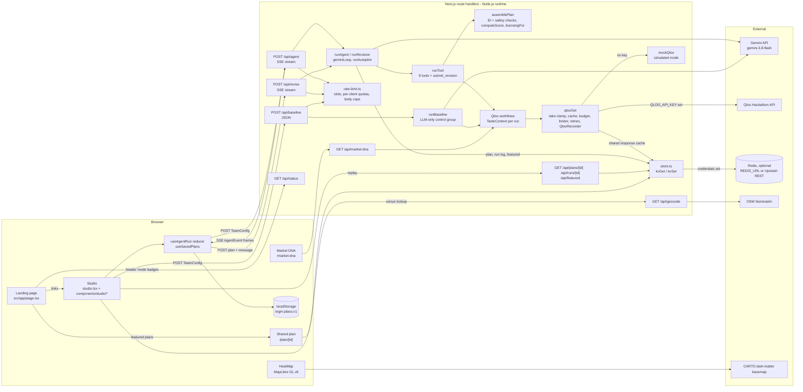
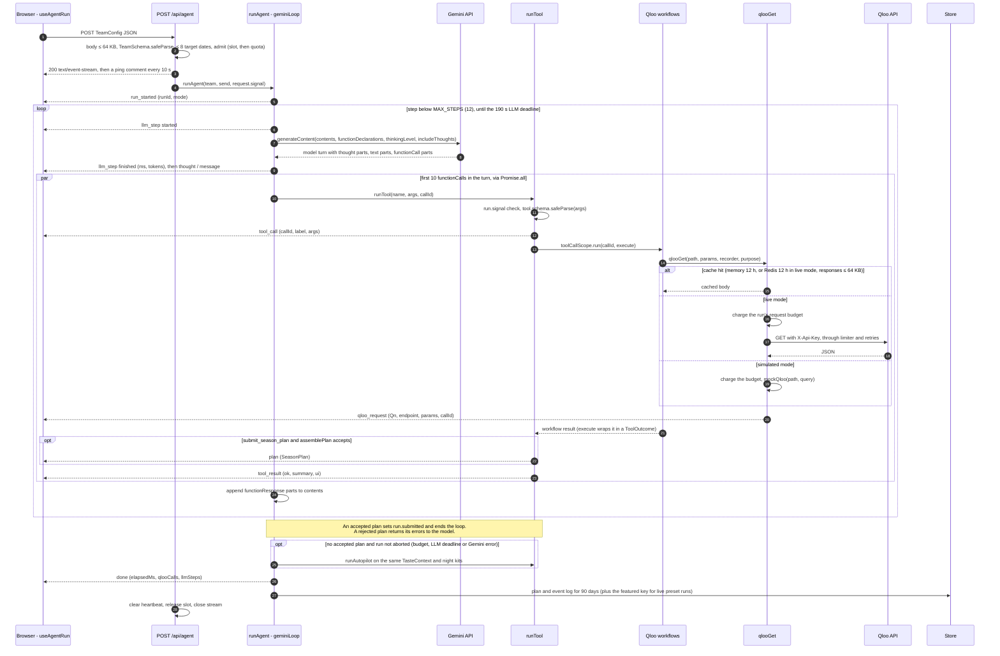

# Architecture

Theme Night GM is a single Next.js 16 app (App Router, TypeScript). The browser sends a team brief to one streaming route. On the server, a Gemini function-calling agent (or a deterministic planner) drives eight tools. All eight can call the Qloo Hackathon API; `submit_season_plan` does so only to measure anchors nobody measured yet, then validates and scores the plan. Every Qloo request in a run is recorded, numbered (`Q1`, `Q2`, …), linked to the tool call that made it, and streamed to the UI as a receipt. Finished plans and their event logs are stored for sharing and replay, and follow-up questions reuse the same loop.

- **Live demo:** https://theme-night-gm.vercel.app
- **Repo:** https://github.com/ZNLong2203/Theme-Night-GM
- **Related docs:** [AGENT.md](AGENT.md) (loop, tools, validator, autopilot, control group, Ask the GM) · [QLOO_INTEGRATION.md](QLOO_INTEGRATION.md) (every Qloo request, metric and client setting) · [DEPLOYMENT.md](DEPLOYMENT.md) (env vars, Vercel, Redis)

> **Measured.** Live preset runs (Qloo hackathon API + Gemini 3.8 Flash, October 2026) took 93–132 s and 87–103 Qloo requests each; the production smoke run on Vercel took 93 s, 98 requests (0 errors) and 6 Gemini steps. Keyless runs (simulated Qloo + autopilot) make 78–91 requests over 16 tool calls. Details: [AGENT.md §13](AGENT.md#13-measured-runs).

---

## 1. Components



`GET /api/presets` is not called by the bundled UI, because the Studio imports `PRESETS` directly; it returns the preset slugs, or a full `TeamConfig` for `?slug=`. The site header fetches `/api/status` whenever it has no run mode yet; once a run starts, the badges come from its `run_started` event.

## 2. One agent run, end to end

All server→browser arrows below are `data:` frames on the same SSE response.



Everything runs under a **270 s run deadline** combined with the client's abort signal (`run.signal`). It reaches every tool, Qloo fetch, retry wait and queued request, so the stream always ends with `done` before `maxDuration = 300`. The loop's step-by-step behaviour (nudges, exits, safety net) is specified in [AGENT.md §3](AGENT.md#3-the-gemini-38-flash-loop).

An Ask the GM revision (`POST /api/revise`) follows the same sequence with `runRevision`: the tool registry is the seven research tools plus `submit_revision`, there is no autopilot, and the merged plan is written back to the store only if the original plan was stored ([AGENT.md §11](AGENT.md#11-ask-the-gm-follow-up-revisions)).

## 3. Module map

| Path | Responsibility |
|---|---|
| [src/app/api/agent/route.ts](../src/app/api/agent/route.ts) | Caps the body at 64 KB, validates the `TeamConfig`, enforces ≤ 8 target dates, admits the run (`MAX_CONCURRENT_RUNS` slot, then `RUNS_PER_10_MIN` quota), opens the SSE `ReadableStream`, sends a heartbeat every 10 s, calls `runAgent`. `maxDuration = 300`. |
| [src/app/api/revise/route.ts](../src/app/api/revise/route.ts) | Ask the GM. Validates `{ message, plan }` (2 MB cap), admits the run (`REVISIONS_PER_10_MIN`, `MAX_CONCURRENT_RUNS`), prefers the stored plan over the client's copy, streams `runRevision` over SSE. `maxDuration = 300`. |
| [src/app/api/baseline/route.ts](../src/app/api/baseline/route.ts) | Control-group endpoint. Same `TeamSchema` and body cap, requires 1–8 targets, admitted like a run, returns `BaselineResult` JSON (502 with a generic message on failure), and attaches the result to the stored plan when `?planId=` matches. `maxDuration = 120`. |
| [src/app/api/market-dna/route.ts](../src/app/api/market-dna/route.ts) | `GET ?a=&b=`: scans both markets in parallel (one recorder each, budget 15) and returns the per-domain overlap. 20 comparisons per client per 10 minutes. `maxDuration = 60`. |
| [src/app/api/plans/%5Bid%5D/route.ts](../src/app/api/plans/%5Bid%5D/route.ts), [runs/%5Bid%5D](../src/app/api/runs/%5Bid%5D/route.ts), [featured](../src/app/api/featured/route.ts) | Read a stored plan, a stored run's event log (for replay), and the latest live plan per demo preset. Plan and run IDs must be UUIDs. |
| [src/app/api/geocode/route.ts](../src/app/api/geocode/route.ts) | City/venue → coordinates through OpenStreetMap Nominatim: same-origin requests only, 30 lookups per client per 10 minutes, at most one Nominatim request per second per instance, 8 s timeout, bounded 24 h cache. |
| [src/app/api/status/route.ts](../src/app/api/status/route.ts) | Returns `runMode()` (`qloo`, `llm`, `model`, `store`). No secrets. |
| [src/app/api/presets/route.ts](../src/app/api/presets/route.ts) | Preset slugs, or a generated `TeamConfig` for `?slug=`. |
| [src/lib/rate-limit.ts](../src/lib/rate-limit.ts) | `clientKey` (first `x-forwarded-for` entry, else `x-real-ip`, else `"local"`), `checkRate` (sliding 10-minute window), `acquireSlot`, `admit` (slot first, then quota), `readJson` (body cap), `tooMany` (429 + `Retry-After`). In-memory, per instance. |
| [src/lib/store.ts](../src/lib/store.ts) | `kvGet` / `kvSet` with TTL. Three backends: Upstash over REST (`KV_REST_API_URL` + `KV_REST_API_TOKEN`, or the `UPSTASH_REDIS_REST_*` pair), any Redis over TCP (`REDIS_URL`, via `node-redis`, one connection per instance), otherwise a per-process map (500 keys max). Remote values are gzipped. A store outage returns `null`/`false` and never breaks a run. |
| [src/lib/errors.ts](../src/lib/errors.ts) | `publicError`: logs the full error server-side and returns a visitor-safe message (Qloo failures show only their status). |
| [src/lib/agent/run.ts](../src/lib/agent/run.ts) | `runAgent` (orchestration, safety net, persistence), `geminiLoop` (shared with revisions), `runDeadline`, `runMode`, `GEMINI_MODEL`, `MAX_STEPS`, `LLM_DEADLINE_MS`, `RUN_DEADLINE_MS`, the planning-run Qloo budget and calls-per-turn cap. |
| [src/lib/agent/revise.ts](../src/lib/agent/revise.ts) | `runRevision`: seeds a `TasteContext` from the plan, runs the loop with the research tools plus `submit_revision`, validates and merges changed nights, records the revision. |
| [src/lib/agent/tools.ts](../src/lib/agent/tools.ts) | The 8 tool definitions (Gemini `FunctionDeclaration` + zod schema + label + `execute`), `compact`, `runTool`, `resolveId`, `missingFit`. `runTool` also stores each anchor's sponsor and experience output in `run.kits`. |
| [src/lib/agent/prompt.ts](../src/lib/agent/prompt.ts) | `SYSTEM_PROMPT`, `REVISION_PROMPT` (shared rules), `buildBrief(team, targets)` and `buildRevisionBrief(plan, request)`. |
| [src/lib/agent/assemble.ts](../src/lib/agent/assemble.ts) | `PlanSubmission` zod schema and `assemblePlan`, which turns a submission into a `SeasonPlan`: rejects unknown, non-fandom or sensitive anchors and identity-framed titles, drops unknown references, sensitive partners, and alcohol brands and drinking spots on young-crowd nights, and computes scores server-side. |
| [src/lib/agent/autopilot.ts](../src/lib/agent/autopilot.ts) | `runAutopilot`: a deterministic planner that drives the **same** tools through `runTool`, reuses whatever the run already measured, and follows the validator's rules. |
| [src/lib/agent/baseline.ts](../src/lib/agent/baseline.ts) | `runBaseline`: Gemini plans the dates with no tools, then Qloo fact-checks the picks with the same scoring. |
| [src/lib/sensitivity.ts](../src/lib/sensitivity.ts) | `sensitiveTopic` (political, religious, crime and tragedy anchors), `isAlcoholBrand`, `isDrinkingSpot`, `isYoungCrowd`, `identityTheme` (identity-night framing). Regexes. |
| [src/lib/qloo/client.ts](../src/lib/qloo/client.ts) | `qlooGet`, `take` clamp, in-memory and Redis response caches, concurrency/interval limiter with a shared 429 pause, `fetchWithRetry`, `QlooError`, `QlooRecorder` (IDs, budget, cancellation), `toolCallScope`. |
| [src/lib/qloo/workflows.ts](../src/lib/qloo/workflows.ts) | `TasteContext` (per-run memory) and the Qloo workflows: `scanMarket`, `profileEntities`, `scoreCandidates`, `scoreIn`, `nearVenueIndex`, `crossoverTags`, `findSponsors`, `buildExperience`, `searchEntities`, plus `toCard`, `summarizeTrend` and `km`. The only module that calls `qlooGet`. |
| [src/lib/qloo/mock.ts](../src/lib/qloo/mock.ts), [mock-data.ts](../src/lib/qloo/mock-data.ts) | Deterministic, hash-seeded stand-in for the endpoints above, used only when `QLOO_API_KEY` is unset ([QLOO_INTEGRATION.md §10](QLOO_INTEGRATION.md#10-simulated-mode)). |
| [src/lib/market-dna.ts](../src/lib/market-dna.ts) | `compareMarkets` / `compareDomain`: shared picks, Jaccard, unique picks and leans for two markets' top lists. Pure functions shared by the route and the page. |
| [src/lib/featured.ts](../src/lib/featured.ts) | `featuredPlans`: the latest live plan per demo preset, from the store. |
| [src/lib/types.ts](../src/lib/types.ts) | Shared server/client types: `TeamConfig`, `EntityCard`, `Night`, `SeasonPlan`, `ScoreBreakdown`, `QlooRequestLog`, `AgentEvent`, `ToolUIData`, `BaselineResult`, `RunMode`. |
| [src/lib/scoring.ts](../src/lib/scoring.ts) | `SCORE_WEIGHTS`, `SCORE_LABELS`, `computeScore` (Taste Fit Score, with `estimated` components). |
| [src/lib/schedule.ts](../src/lib/schedule.ts) | `SEGMENTS`, `SPORTS`, `generateSchedule` (synthetic home schedules), `weekdayOf`, `weaknessScore`, `pickWeakDates`, `defaultSegment`. |
| [src/lib/presets.ts](../src/lib/presets.ts) | Four demo clubs (fictional names, real cities and coordinates) and `teamFromPreset`. |
| [src/lib/licensing.ts](../src/lib/licensing.ts) | `licensingFor`: a rules-based IP risk flag from Qloo owner metadata. |
| [src/lib/validation.ts](../src/lib/validation.ts) | `TeamSchema` (zod): real calendar dates, weekday re-derived from the date, bounded strings and lists. |
| [src/lib/config.ts](../src/lib/config.ts) | `REPO_URL` for the header and landing page. |
| [src/lib/use-agent-run.ts](../src/lib/use-agent-run.ts) | Client: SSE reader, `RunState` reducer, `start`, `revise`, `replay`, `stop`, `load`, `setPlan`, `useSavedPlans` / `savePlan` (localStorage). |
| [src/app/page.tsx](../src/app/page.tsx) | Landing page, rendered per request so the featured plans stay fresh. |
| [src/app/studio/studio.tsx](../src/app/studio/studio.tsx) | Studio shell: setup ↔ run views, `?preset=`, `?autorun=1`, `?replay=`, recent plans. |
| [src/app/plan/%5Bid%5D/](../src/app/plan/%5Bid%5D/page.tsx) | Read-only shared plan: season board, control group, receipts, a replay link. |
| [src/app/market-dna/](../src/app/market-dna/market-dna.tsx) | Market DNA page: two markets side by side, shareable `?a=&b=` links. |
| [src/components/studio/](../src/components/studio/) | `TeamSetup`, `AgentTrace` (timeline with Gemini steps and per-call Qloo requests), `LiveCanvas` (Market / Fandoms / Audience fit / Night kits / Receipts tabs), `SeasonBoard` + `NightDetail` (share link, JSON/CSV export, sponsor one-pager), `AskTheGm`, `BaselineCompare`, `Receipts` (copy-as-curl). |
| [src/components/heat-map.tsx](../src/components/heat-map.tsx) | MapLibre heatmap of `urn:heatmap` cells, the 16 km catchment ring and partner places, on CARTO dark-matter. |
| [scripts/copy-maplibre-worker.mjs](../scripts/copy-maplibre-worker.mjs) | `postinstall`: copies the MapLibre v6 ES-module worker (`maplibre-gl-worker.mjs`) and the shared chunk it imports (`maplibre-gl-shared.mjs`) into `public/maplibre/`, so `setWorkerUrl` can load them. |
| [tests/](../tests/), [vitest.config.mts](../vitest.config.mts), [.github/workflows/ci.yml](../.github/workflows/ci.yml) | Vitest suite and CI ([§14](#14-testing-and-ci)). |

## 4. Tools at a glance

Each tool answers one promotions question. Exact request parameters and per-call counts are in [QLOO_INTEGRATION.md §3–4](QLOO_INTEGRATION.md#3-master-request-table); tool inputs and outputs are in [AGENT.md §4](AGENT.md#4-the-eight-tools).

| Tool | Workflow | Qloo endpoints |
|---|---|---|
| `scan_market_taste` | `scanMarket` | `/v2/insights` (one per domain, city signal) |
| `score_audience_fit` | `scoreCandidates` | `/v2/insights` (pool ranks per segment and fan-base proxy, `urn:demographics`), `/v2/audiences`, `/search`, `/entities` |
| `profile_fandoms` | `profileEntities` | `/v2/insights` (`urn:demographics`, `urn:heatmap`, `urn:tag`), `/v2/trending`, `/entities` |
| `find_sponsors` | `findSponsors` | `/v2/tags`, `/v2/insights` (`urn:entity:brand`) |
| `build_night_experience` | `buildExperience` | `/v2/insights` (artists, places, podcasts) |
| `compare_fanbases` | `crossoverTags` | `/v2/analysis/compare` |
| `search_entities` | `searchEntities` | `/search` |
| `submit_season_plan` | `assemblePlan` (after `scoreCandidates` / `profileEntities` for unmeasured anchors) | none when every anchor is already measured |
| `submit_revision` (Ask the GM only) | `assemblePlan` on the changed nights, then a merge | as above |

`resolveId` accepts a Qloo ID or, as a fallback, an exact (case-insensitive) entity name already seen in the run. An unresolved reference is passed to Qloo unchanged.

## 5. SSE event protocol

**Wire format.** `POST /api/agent` and `POST /api/revise` respond with `Content-Type: text/event-stream; charset=utf-8`, `Cache-Control: no-cache, no-transform` and `X-Accel-Buffering: no` (the agent route also sends `Connection: keep-alive`). Each event is one frame: `data: <JSON AgentEvent>\n\n`. A comment frame `: ping\n\n` is sent every 10 000 ms so proxies don't close the connection while the model thinks. There are no `event:` or `id:` fields, so the stream is not resumable; a finished run can be replayed from the store instead. Because the request is a POST, the client reads it with `fetch` + `TextDecoderStream` instead of `EventSource`. It splits on `\n\n` and parses lines that start with `data: `.

`AgentEvent` variants ([src/lib/types.ts](../src/lib/types.ts)):

| `type` | Fields | Emitted when |
|---|---|---|
| `run_started` | `runId` (UUID; also the plan ID), `mode: RunMode`, `at` (ISO) | First event of every run. A revision uses the plan's ID. |
| `llm_step` | `step`, `status: started \| finished`, `ms?`, `inputTokens?`, `outputTokens?` (candidates + thoughts) | Around each Gemini `generateContent` call, including one that fails. The trace shows "Gemini is deciding the next step…" and then "Gemini step N · Xs · N tokens", or "interrupted" when no `finished` arrived. Never emitted by the autopilot. |
| `thought` | `text` | A Gemini part with `thought: true` (thought summary). Also autopilot narration and the safety-net reason. |
| `message` | `text` | A non-thought Gemini text part (between-step narration, or Ask the GM's answer). |
| `tool_call` | `callId`, `name`, `label`, `args` | `runTool` after zod validation, before execution. On invalid args it is emitted with label `"<name> (invalid arguments)"` and the raw args. An unknown tool name or a stopped run emits nothing and returns `{ error }` to the model. |
| `qloo_request` | `request: QlooRequestLog` (`id`, `endpoint`, `params`, `status`, `ms`, `resultCount`, `cached`, `simulated`, `purpose`, `callId?`) | Every `qlooGet` that is served or attempted: success, cache hit (`cached: true`, `ms: 0`), or failure (error `status`, `resultCount: 0`). Requests refused by the run's budget or after cancellation are not logged. These stream while the tool is still running. |
| `tool_result` | `callId`, `name`, `ok`, `summary`, `ui?: ToolUIData` | After `execute` resolves (`ok: true`) or throws (`ok: false`), or right after invalid args. `ok` reports whether execution succeeded, not whether the plan was accepted: a rejected `submit_season_plan` is `ok: true` with summary `Plan rejected: …`. |
| `plan` | `plan: SeasonPlan` | Inside `submit_season_plan` (or `submit_revision`, with the merged plan) when `assemblePlan` accepts, so before that call's `tool_result`. |
| `error` | `message` | No target dates; no accepted plan at the end of the run; an uncaught exception (visitor-safe message only). |
| `done` | `elapsedMs`, `qlooCalls` (= `recorder.logs.length`, cached and failed included), `llmSteps` (Gemini steps; 0 for autopilot) | Always the last event. |

`ToolUIData` payloads let the canvas render evidence without a second request:

| `ui.kind` | From tool | Client reducer target |
|---|---|---|
| `market_scan` | `scan_market_taste` | `state.scan` (domains merged by kind) |
| `profiles` | `profile_fandoms` | `state.profiles` (merged by entity ID) |
| `fit_matrix` | `score_audience_fit` | `state.fit` (merged by entity ID) |
| `sponsors` | `find_sponsors` | `state.sponsors` (merged by anchor) |
| `experience` | `build_night_experience` | `state.experiences` (merged by anchor) |
| `crossover` | `compare_fanbases` | `state.crossovers` (appended; shown as "Shared taste" in Night kits) |
| `search` | `search_entities` | not stored, only sets `lastUi` |

## 6. Attributing Qloo requests to tool calls

Gemini can issue several tool calls in one turn, and each workflow fans out into parallel Qloo requests. The code needs to know which call caused which request without passing a call ID through every function signature. It uses Node's `AsyncLocalStorage`:

```ts
// src/lib/qloo/client.ts
export const toolCallScope = new AsyncLocalStorage<string>();
// QlooRecorder.push(log)
log.callId ??= toolCallScope.getStore();

// src/lib/agent/tools.ts — runTool
const outcome = await toolCallScope.run(callId, () => tool.execute(parsed.data as never, run));
```

Every `await` inside `execute` (workflows → `qlooGet` → `recorder.push`) inherits the async context of its own tool call, so attribution stays correct even when calls run concurrently under `Promise.all`. The UI uses `callId` to show the Qloo requests under each step in the [agent trace](../src/components/studio/agent-trace.tsx). Memoized lookups (the families audience, the fan-base proxy, a domain's pool scan) are attributed to whichever tool call triggered them first. Resolved sponsor-category tags are memoized per server process, so a later run reuses them without a request. Control-group and Market DNA requests run outside any scope and have no `callId`.

Request IDs (`Q1`, `Q2`, …) come from `QlooRecorder.nextId()`, one recorder per run. A revision's recorder starts after the plan's last ID, so merged receipts stay unique; Market DNA shifts the second city's IDs past the first's. Workflows call `TasteContext.cite(entityId, requestId)`, and `assemblePlan` gathers, for each night, the request IDs cited for the anchor, sponsors, playlist artists, places and podcast into `Night.evidence`. The [Receipts](../src/components/studio/receipts.tsx) panel highlights those IDs and offers "copy as curl" with a `$QLOO_API_KEY` placeholder ([QLOO_INTEGRATION.md §9](QLOO_INTEGRATION.md#9-provenance-receipts-and-copy-as-curl)).

## 7. Qloo client

[src/lib/qloo/client.ts](../src/lib/qloo/client.ts) normalizes params (sorted keys, empty values dropped, `take` clamped to 1–50), caches successful responses in memory for 12 h (2,000 entries max) and, in live mode with Redis attached, responses up to 64 KB in Redis for 12 h so every instance shares them (heatmaps stay per-instance to keep a 30 MB free tier for plans). In live mode it allows 10 requests in flight with starts at least 200 ms apart, a 20 s timeout per attempt and 2 retries on network errors, 429 and 5xx. `Retry-After` is honoured up to 5 s (a longer pause fails fast), and a 429 pauses the whole instance's limiter. The full table and retry policy are in [QLOO_INTEGRATION.md §2](QLOO_INTEGRATION.md#2-request-pipeline).

Architecture-relevant consequences:

- **Per-run limits.** Each `QlooRecorder` carries a budget of uncached requests (plan 220, revision 120, control 100, Market DNA 15 per city) and the run's abort signal. A cache hit costs nothing. Over budget, `qlooGet` throws `QlooError(429)`; after cancellation it throws `QlooError(499)`, and queued requests, in-flight fetches and retry waits all stop.
- **Shared state.** The in-memory cache and limiter are module-level, so they are shared by all runs on a warm instance and not across serverless instances. The Redis cache is shared across instances. A cache hit skips the limiter but is still logged as a receipt (`cached: true`).
- **Fair queueing.** A finished request hands its slot straight to the oldest waiter, so one busy run can't starve another. A slot is released when `fetch` resolves (headers received), before the body is parsed. Each retry acquires a slot again.
- **Failure propagation.** `scanMarket` reports a failed domain as `unavailable` instead of throwing; `crossoverTags`, `searchEntities` and `ensureCards` throw, and `runTool` turns that into `tool_result` `ok: false` plus `{ error }` for the model; enrichment sub-requests `.catch()` to empty results, and failed trend, heatmap or demographics requests are recorded on the profile's `unavailable` list.

## 8. Plan validation and scoring

`submit_season_plan` first runs `scoreCandidates` and `profileEntities` for any anchor that has no segment fit or profile yet, so every night (and the control group) is measured the same way. Then [`assemblePlan`](../src/lib/agent/assemble.ts) validates:

- **Errors** (plan rejected; the model sees them and can resubmit): a date that isn't a target, a duplicate date, an anchor Qloo didn't return in this run, an anchor that isn't a movie, TV show, artist, video game or book, an anchor `sensitiveTopic()` flags, a title or tagline `identityTheme()` flags, target dates with no night.
- **Warnings** (plan accepted): unknown supporting/sponsor/artist/place/podcast references are dropped; sensitive supporting entities, sponsors, partners and podcasts are removed on any night; on `families` and `gen_z` nights alcohol brands and drinking spots are removed; repeated anchors are flagged. Sponsors are capped at 3 per night.
- **Server-computed fields:** `score` (`computeScore`, with `estimated` components), `licensing` (`licensingFor(anchor, ipPolicy)`), `evidence`, anchor `profiles`, the full `requests` log and `mode`. The plan ID is the run ID.

The full check table is in [AGENT.md §6](AGENT.md#6-plan-validator). The Taste Fit Score is `round(100 × (0.30·localAffinity + 0.25·segmentFit + 0.20·nearVenue + 0.15·momentum + 0.10·newFanReach))`, each component clamped to 0..1; a component Qloo couldn't measure scores 0.5 and is listed in `score.estimated`. How each input is derived from Qloo responses is in [QLOO_INTEGRATION.md §6](QLOO_INTEGRATION.md#6-derived-metrics). The same function scores the agent's plan, the autopilot's choices, revised nights and the LLM-only control group, so all of them are compared on one scale.

## 9. Budgets and limits

| Limit | Value | Where |
|---|---|---|
| Gemini steps per run | `MAX_STEPS = 12` | [run.ts](../src/lib/agent/run.ts) |
| Tool calls per model turn | 10; extra calls get an error | [run.ts](../src/lib/agent/run.ts) |
| LLM deadline | 190 s from the start of the run (revisions: 150 s). Stops the model loop only. | [run.ts](../src/lib/agent/run.ts), [revise.ts](../src/lib/agent/revise.ts) |
| Run deadline | 270 s for planning runs and revisions; 110 s for the control. Stops everything. | [run.ts](../src/lib/agent/run.ts), [baseline.ts](../src/lib/agent/baseline.ts) |
| Qloo requests per run (uncached) | Plan 220, revision 120, control 100, Market DNA 15 per city | [run.ts](../src/lib/agent/run.ts), [revise.ts](../src/lib/agent/revise.ts), [baseline.ts](../src/lib/agent/baseline.ts), [market-dna/route.ts](../src/app/api/market-dna/route.ts) |
| Thinking level | `GEMINI_THINKING` = `low` (default), `medium` or `high` | [run.ts](../src/lib/agent/run.ts) |
| Function duration | `maxDuration`: `/api/agent` 300 s, `/api/revise` 300 s, `/api/baseline` 120 s, `/api/market-dna` 60 s | route files |
| Concurrent runs | `MAX_CONCURRENT_RUNS` (default 4) slots per instance for agent, revision and control runs. A slot is reserved before the quota is charged, so "busy" costs nothing. | [rate-limit.ts](../src/lib/rate-limit.ts) |
| Per-client quotas (10-minute sliding window) | Agent runs `RUNS_PER_10_MIN` (6); control runs `RUNS_PER_10_MIN` (6, counted separately); revisions `REVISIONS_PER_10_MIN` (12); Market DNA 20; geocode 30. 429 with `Retry-After`. | route files |
| Request body | `/api/agent` and `/api/baseline` 64 KB; `/api/revise` 2 MB | route files |
| SSE heartbeat | 10 000 ms | [agent/route.ts](../src/app/api/agent/route.ts), [revise/route.ts](../src/app/api/revise/route.ts) |
| Target dates per run | 1–8. `/api/agent` returns 400 for > 8 and emits an `error` event for 0. `/api/baseline` returns 400 for 0 or > 8 | routes + [run.ts](../src/lib/agent/run.ts) |
| Schedule size | ≤ 120 dates; ≤ 6 sponsor categories of ≤ 40 chars, all queried | [validation.ts](../src/lib/validation.ts), [workflows.ts](../src/lib/qloo/workflows.ts) |
| Entities per tool | profile ≤ 6, fit ≤ 14, sponsors/experience anchors ≤ 3, compare ≤ 5 per side (extra IDs are silently sliced off), search `take` 5; the scan sends the top 10 per domain to the model | [tools.ts](../src/lib/agent/tools.ts) |
| Qloo per request | `take` ≤ 50, 20 s per attempt, ≤ 3 attempts, `Retry-After` honoured up to 5 s, 10 in flight, 200 ms between starts | [client.ts](../src/lib/qloo/client.ts) |
| Geocode | Same-origin only; ≤ 1 Nominatim request per second per instance (a queue longer than 5 s gets 429); 8 s timeout; query 2–120 chars | [geocode/route.ts](../src/app/api/geocode/route.ts) |
| Storage | Plans and run logs kept 90 days; run logs over 3 MB (before compression) aren't stored; remote values gzipped; memory store ≤ 500 keys; Redis connects and commands time out after 5 s | [run.ts](../src/lib/agent/run.ts), [store.ts](../src/lib/store.ts) |
| Heatmap cells | The index uses every cell Qloo returns; the strongest 300 are sent to the UI | [workflows.ts](../src/lib/qloo/workflows.ts) |
| Saved plans per browser | 12 | [use-agent-run.ts](../src/lib/use-agent-run.ts) |

## 10. Run modes, fallbacks and other runs

`runMode()` is evaluated per request from environment variables. It drives the UI mode badges, every receipt carries `simulated`, and every saved plan stores its `mode`.

| `QLOO_API_KEY` | `GEMINI_API_KEY` | Qloo | Planner |
|---|---|---|---|
| set | set | live | Gemini loop. The autopilot finishes if no plan is accepted (including after a Gemini error) |
| set | unset | live | Autopilot |
| unset | set | simulated | Gemini loop, same safety net |
| unset | unset | simulated | Autopilot (the mode CI runs) |

- **Autopilot** ([autopilot.ts](../src/lib/agent/autopilot.ts)) calls the same `runTool` with `callId = auto_<pass>_<n>`, so its trace, receipts and validation go through the same code path as the agent's. It reuses the run's scans, scores, profiles and the night kits the model already built. Its steps are in [AGENT.md §7](AGENT.md#7-autopilot-fallback).
- **Safety-net trigger:** after the Gemini loop returns, `runAgent` runs the autopilot with an explanatory `thought` if `!run.submitted && !run.signal.aborted`. The LLM deadline does not set `run.signal` (only a client disconnect or the 270 s run deadline do), so a deadline hit or a Gemini error falls through to the autopilot. In autopilot-only mode there is one pass and no retry.
- **Simulated Qloo** ([mock.ts](../src/lib/qloo/mock.ts)) answers every endpoint the app uses, including `/v2/tags`, `filter.tags`, `filter.exclude.tags`, the popularity floor and resolved localities, deterministically from a hash of the query; its numbers are synthetic. Labelling and gaps: [QLOO_INTEGRATION.md §10](QLOO_INTEGRATION.md#10-simulated-mode).

### Control group (`/api/baseline`)

[`runBaseline`](../src/lib/agent/baseline.ts) asks Gemini, with no tools, for one named anchor per target date (or cycles the 8-entry `GENERIC_FALLBACK` list without a key), resolves each pick with `/search` (`take=1`, retried once on failure), then measures the matches with the same `scoreCandidates` and `profileEntities` workflows and scores them with `scoreIn`. It uses its own `QlooRecorder` and `TasteContext`, so requests come back in the JSON response instead of being streamed (the response caches are still shared). The client saves the result onto the plan (`plan.baseline`), and the route writes it to the stored plan when `?planId=` matches. Method and caveats: [AGENT.md §10](AGENT.md#10-llm-only-control-group).

### Ask the GM (`/api/revise`)

[`runRevision`](../src/lib/agent/revise.ts) runs `geminiLoop` with the revision prompt, the research tools and `submit_revision`, on a `TasteContext` seeded from the plan. Only changed nights are submitted; they pass `assemblePlan` and are merged with a revision record. Details: [AGENT.md §11](AGENT.md#11-ask-the-gm-follow-up-revisions).

### Market DNA (`/api/market-dna`)

The route runs `scanMarket` for both cities in parallel (five domains, top 25 each, popularity ≥ 0.8; the city is the only location input) and returns per-domain overlap from [`compareMarkets`](../src/lib/market-dna.ts) plus every request. If Qloo returns no domain at all for a city, it answers 502. Metric definitions: [QLOO_INTEGRATION.md §7](QLOO_INTEGRATION.md#7-market-dna).

## 11. Storage, sharing and replay

[`store.ts`](../src/lib/store.ts) is a tiny key-value layer with three backends, picked from the environment: Upstash over its REST API (`KV_REST_API_URL` + `KV_REST_API_TOKEN`, or `UPSTASH_REDIS_REST_URL` + `UPSTASH_REDIS_REST_TOKEN`), any Redis over TCP (`REDIS_URL`, which the Vercel Marketplace Redis integration sets; production uses this), or a map on `globalThis` (so pages and route handlers in one process share it). The REST pair wins if both are set. Remote values are gzipped JSON, so a 563 KB run log is stored as about 133 KB and a 30 MB free Redis tier holds a full demo season. `RunMode.store` reports `redis` or `memory`, and the Share button says "Share (temporary)" without Redis.

| Key | Written by | Read by | TTL |
|---|---|---|---|
| `plan:<id>` | `runAgent` after `done`; `runRevision` (stored plans only); `/api/baseline?planId=` (adds `baseline`) | `/plan/<id>`, `/api/plans/<id>`, `/api/revise` | 90 days |
| `run:<id>` | `runAgent`, when the event log is ≤ 3 MB | `/api/runs/<id>` → Studio replay | 90 days |
| `featured:<slug>` | `runAgent`, when the team matches a demo preset (name and city) and Qloo was live | `/api/featured`, landing page | 90 days |
| `qloo:v1:<sha256>` | `qlooGet`, live mode only | `qlooGet` on any instance | 24 h |

- **Shared plan** (`/plan/<id>`): a server page that renders the season board read-only (night drawers, exports, control group; no Ask the GM), every receipt, and a link to replay the run.
- **Replay** (`/studio?replay=<run id>`, or `/studio?replay=1&preset=<slug>` for that preset's featured run): fetches the stored event log and replays it at 2× with paced delays. If no recording is found, the Studio starts a fresh run instead.
- **Featured plans:** the landing page is rendered per request and lists the latest live plan per demo market ("Open plan" / "Replay the run"); **Watch it plan Durham** replays the featured Durham run when there is one, and otherwise starts a live Durham run.

Without Redis these keys live in one instance's memory: links and replays work only while that instance stays warm, and other serverless instances don't see them.

## 12. Client state

[`useAgentRun`](../src/lib/use-agent-run.ts) is a `useReducer` over `RunState` with actions `reset | event | fail | stopped | load | replace_plan`:

- `event` folds every `AgentEvent` into `timeline` (thoughts, messages, Gemini steps, tool calls), `requests`, the evidence slots above, `plan`, `error` and the timing fields. It also appends the raw event to `state.events`.
- `done` without a plan becomes `status: "error"` ("The agent finished without a plan." unless an earlier `error` explains it). Ask the GM runs set `planOptional`, so an answer without a revision ends as success. When a run ends, spinning tool rows and Gemini steps are closed ("interrupted").
- A stream that closes without `done` (a proxy, or `maxDuration`) fails with "The connection closed before the GM finished. Try again."
- `stopped` (the **Stop** button) settles the run immediately: done if a plan already landed, otherwise "Stopped before the GM finished."
- `load` restores a saved `SeasonPlan` (with its requests and profiles) and aborts any run still streaming. `replace_plan` swaps in a revised plan or one with a control result, only if it is the plan on screen.
- `start`, `revise` and `replay` abort any previous run first. A non-2xx response (400, 413, 429) surfaces its `error` strings. Leaving the Studio aborts the run, which frees the server's slot.

**URL parameters.** `/studio?autorun=1` starts a new run immediately, then removes `autorun` from the URL so a reload doesn't start (and pay for) another one. `?preset=<slug>` picks the demo club. `?replay=` is described in [§11](#11-storage-sharing-and-replay).

**Browser persistence.** Plans are saved to `localStorage["tngm:plans:v1"]` (newest first, max 12) when a `plan` event arrives, after a revision and after a control run. `useSavedPlans` reads them through `useSyncExternalStore`, subscribes to the cross-tab `storage` event and a same-tab `tngm:plans` event, caches the parsed snapshot by raw string, returns an empty server snapshot, and wraps all storage access in `try/catch`.

## 13. Security and responsible use

- **Keys stay on the server.** `QLOO_API_KEY` and `GEMINI_API_KEY` are read only in [qloo/client.ts](../src/lib/qloo/client.ts), [agent/run.ts](../src/lib/agent/run.ts) and [agent/baseline.ts](../src/lib/agent/baseline.ts); the Redis credentials only in [store.ts](../src/lib/store.ts). These modules, and the workflow, tool, assembler, autopilot, revision, featured and rate-limit modules, `import "server-only"`. `/api/status` exposes only mode names, the model ID and the store kind. "Copy as curl" emits `$QLOO_API_KEY`, never the value. `.env*` is git-ignored (except `.env.example`) and excluded from Vercel uploads by `.vercelignore`.
- **Input validation.** Request bodies are size-capped before parsing and parsed with zod: [`TeamSchema`](../src/lib/validation.ts) (bounded strings: `teamName` ≤ 80, `league` ≤ 80, venue name ≤ 120, city 2–120, `opponent` ≤ 60, `notes` ≤ 600; lat/lon ranges; real calendar dates; the weekday re-derived from the date because it goes into prompts; enums for sport, segment, time and `ipPolicy`; ≤ 120 dates; ≤ 6 sponsor categories of ≤ 40 chars), the revision request schema, and the Market DNA query schema. Plan and run IDs must be UUIDs.
- **Abuse limits.** Per-client quotas, concurrency slots, body caps and per-run Qloo budgets ([§9](#9-budgets-and-limits)). This is a demo guard, not authentication.
- **Validated tool calls.** Every tool argument is zod-parsed before execution, and at most 10 calls run per model turn. The plan must pass `PlanSubmission` and `assemblePlan`, so the model can only cite entities Qloo returned in this run. Every Qloo call is a read-only GET. Free text in `notes` and Ask the GM messages can steer the plan, but the model has no tool that writes data other than its own plan, or reads secrets.
- **Error hygiene.** Run-level errors, control failures and Market DNA failures show a generic message and, for Qloo, only the status; details stay in the server log ([`errors.ts`](../src/lib/errors.ts)).
- **Safe exports.** The calendar CSV prefixes cells that start with `=`, `+`, `-`, `@`, tab or CR with `'`, so spreadsheets don't run titles or entity names as formulas.
- **Qloo kit rules.** No fan or customer data is sent to Qloo; segments are age/life-stage only; non-fandom and sensitive anchors and identity-framed nights are rejected, and alcohol brands and drinking spots are removed from young-crowd nights, in code; results are presented as aggregate affinities with the source request and a `simulated` flag on every receipt. The rule-by-rule mapping is in [QLOO_INTEGRATION.md §11](QLOO_INTEGRATION.md#11-responsible-use).

## 14. Testing and CI

- **Vitest** ([vitest.config.mts](../vitest.config.mts)) runs `tests/**/*.test.ts` in Node, aliasing `@/` to `src/` and stubbing `server-only`. Unit tests cover `computeScore` and the weights, the schedule generator and weak-date picker, the sensitivity rules, licensing, workflow helpers (`summarizeTrend`, `km`, `toCard`, `nearVenueIndex`, simulated scans, run budgets and cancellation, the shared fan-base proxy, sponsor-category resolution), `assemblePlan` and `TeamSchema`.
- **Keyless end-to-end test.** [`tests/agent.mock.test.ts`](../tests/agent.mock.test.ts) runs `runAgent` on the Durham preset with no keys (simulated Qloo + autopilot) and asserts: no errors; every tool call has a successful result; one plan with a night on each of the 4 target dates and unique anchors; every anchor, sponsor, artist, place and podcast came from a tool result; every evidence ID is a recorded request; the content rules hold; `ip_light` titles and social copy don't use franchise names; sponsors come from the team's categories.
- **CI** ([.github/workflows/ci.yml](../.github/workflows/ci.yml)) runs on pushes and pull requests to `main`: `npm ci`, `npm run lint`, `npm run typecheck` (`next typegen && tsc --noEmit`), `npm test` and `next build` on Node 22, with **no secrets**, so it proves the keyless demo path end to end.

## 15. Known limitations

- **Per-instance state.** Each serverless instance has its own in-memory Qloo cache, Qloo limiter, per-client quotas and concurrency slots. Concurrent instances can together exceed the intended Qloo request rate or a client's quota. With Redis attached, plans, run logs, featured plans and Qloo responses are shared; without it they are per instance too ([§11](#11-storage-sharing-and-replay)).
- **No authentication.** The quotas key on `x-forwarded-for`, so they slow casual abuse but do not stop a determined caller from spending the operator's Qloo and Gemini quota. Plan IDs are unguessable UUIDs and act as read capabilities: anyone with a plan's ID can view it. A stored plan can't be changed through its link: a revision is saved under a new id (`revisedFrom` points back), and only the first control result is attached to a stored plan.
- **Tool errors carry upstream text.** A Qloo failure inside a tool reaches the model and the trace with Qloo's status and up to 200 characters of its response body; a failed scan domain's reason (up to 160 characters of the same message) also goes to the model and the UI payload, including Market DNA's.
- **Estimated components.** A component Qloo couldn't measure is flagged **est.** but still contributes 0.5 to the total. Failed experience sub-requests become empty lists and show only as non-200 receipts.
- **Qloo-side gaps** (first-anchor-only explainability, percentile denominators, hard-coded curl host, the "live" wording of the season-board KPI hint) are tracked in [QLOO_INTEGRATION.md §13](QLOO_INTEGRATION.md#13-known-gaps).
- **Heuristics.** Preset schedules come from `generateSchedule` (synthetic), and weak dates come from `weaknessScore` (weekday, Sunday night, month), not attendance data. Score weights are hand-set and not validated against ticket sales. Fan-base overlap uses a proxy entity (a league or league video game). Qloo pacing is based on rates other teams reported; the live runs where errors were counted (87 and 98 requests) had none at that pace.
