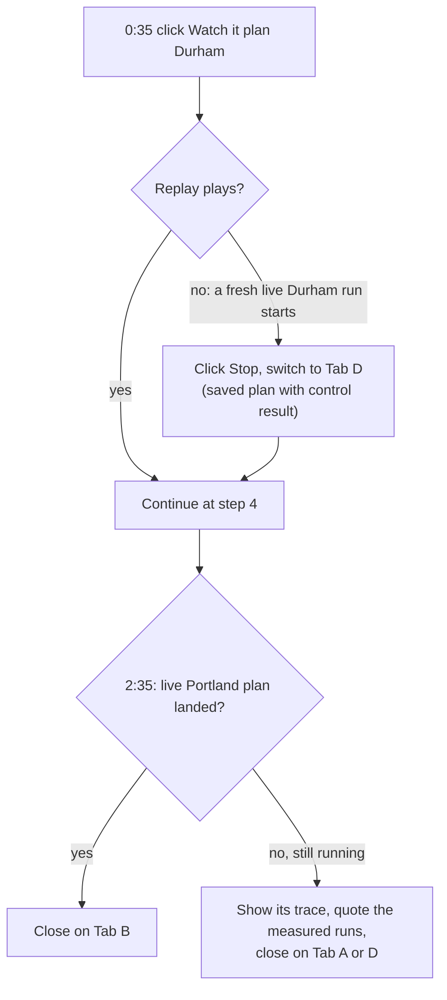

# Theme Night GM: 3-minute demo script

A click-by-click walkthrough of the app as built, for whoever presents it or for a judge exploring it alone.

- **Live demo URL:** https://theme-night-gm.vercel.app
- **Repo:** https://github.com/ZNLong2203/Theme-Night-GM (must be public before submission)
- **Timing reality:** a live 6-night run takes about **1.5–2 minutes** (measured 93–132 s, 87–103 Qloo requests). That doesn't fit between "Hire the GM" and the rest of a 3-minute demo, so this script **starts a live run early, presents a recorded live run while it works, and comes back to the live one at the end.**

---

## 30-second elevator pitch

> Clubs fill weak dates with theme nights picked on gut feel, usually from the same list every other club uses. **Theme Night GM** is an AI promotions agent that reads what *your* city loves through Qloo's taste graph: fandoms your market over-indexes on, whether those fans concentrate near the ballpark, which crowd they fit, and which brands share the taste. It turns weak dates into sellable theme nights with sponsors, a playlist, partners and promo copy, every pick backed by its Qloo requests.

(About 80 words: 30–35 seconds read aloud.)

---

## Run of show (3:00)

| Time | Tab · screen | Click | Main point | Criterion |
|---|---|---|---|---|
| 0:00–0:20 | **B** · Studio setup (Portland) | **Hire the GM — plan 6 theme nights** | A promotions director's brief in one screen; a live run starts now | Design, Impact |
| 0:20–0:35 | **B** · live run | Point at the first trace rows and Gemini steps | A real agent with 8 tools; every Qloo call is visible | Tech |
| 0:35–0:50 | **A** · Landing → Studio | **Watch it plan Durham** (replays a recorded live run in seconds) | Same agent, recorded live run, no new API spend | Tech |
| 0:50–0:55 | **A** · Season board | Scroll to **Run the LLM-only control** and click it | Start the control early so it runs while you talk | Idea |
| 0:55–1:25 | **A** · Night drawer | Open the highest-scoring night | Score computed by code; every pick traces to a Qloo request | Tech, Design |
| 1:25–1:50 | **A** · Ask the GM | Click the **"Why did you pick …"** suggestion | Follow-ups without re-running the season | Idea, Design |
| 1:50–2:10 | **A** · Control group | Read the three tiles | The gap Qloo makes is measured, not claimed | Idea, Tech |
| 2:10–2:35 | **C** · Market DNA | (pre-loaded) Durham vs Los Angeles | The local edge every plan is built on | Idea, Tech |
| 2:35–2:50 | **B** · the live Portland run | Point at the timer, request count and board | It ran live, end to end, while we talked | Tech |
| 2:50–3:00 | **B** · Season board | **Share link**, **JSON**, **Calendar CSV** | Work a club can use tomorrow | Impact |

If anything stalls, use the [fallback plan](#fallback-plan).

---

## Before you go on (pre-flight)

- [ ] https://theme-night-gm.vercel.app loads. The **header badges** read **Qloo live** and **gemini-3.8-flash**, and `curl -s https://theme-night-gm.vercel.app/api/status` includes `"store":"redis"`. (Badges come from [`/api/status`](../src/app/api/status/route.ts) → `runMode()`; they are hidden below 640 px width.)
- [ ] The landing page shows **Durham** under **Finished plans from live runs**. The four featured runs ship inside the deployment (`data/featured/`), so they don't depend on Redis. Without those files, a live preset run (`/studio?preset=durham-baseball&autorun=1`) becomes that market's featured plan ([AGENT.md §2](AGENT.md#2-control-flow-and-run-modes)).
- [ ] Open the tabs:
  - **Tab A:** the landing page `/`.
  - **Tab B:** `/studio?preset=portland-soccer` (setup, not started).
  - **Tab C:** `/market-dna?a=Durham%2C+North+Carolina&b=Los+Angeles%2C+California`. A link with both markets loads the comparison immediately, so it is ready on stage.
  - **Tab D (backup):** a finished plan of your own from rehearsal, opened from **Recent plans:** in the Studio, with its control result already run.
- [ ] Rehearse **Ask the GM** once. A *change* is saved as a new plan with its own link, so the featured Durham plan never changes; on stage, a *question* is faster (it calls no tools).
- [ ] Test **Sponsor one-pager** once: the print preview should contain only the night's kit. Test one **Copy** button; the clipboard needs HTTPS or localhost.
- [ ] Make the window wide enough (≥ 1024 px, Tailwind `lg`) that **Agent trace** and the live canvas sit side by side.
- [ ] Count your runs. Per client IP and 10 minutes: 6 agent runs, 6 control runs, 12 Ask the GM requests, 20 Market DNA comparisons ([DEPLOYMENT.md](DEPLOYMENT.md#demo-rate-limits)). Rehearsals count, and a team presenting from one network shares one IP.

---

## Click-by-click script

### 1. Studio setup, then start the live run (0:00–0:20): [src/components/studio/team-setup.tsx](../src/components/studio/team-setup.tsx)

**Tab B** shows the Portland soccer preset with 6 weak dates already picked: ranked by `weaknessScore`, rotated across audience segments and at least 9 days apart ([src/lib/presets.ts](../src/lib/presets.ts) `teamFromPreset`, [src/lib/schedule.ts](../src/lib/schedule.ts) `pickWeakDates`). Deliver the pitch while pointing, left to right:

| UI element (exact label) | What to say |
|---|---|
| **Start from a demo market**: ⚾ Durham · ⚾ Los Angeles · ⚽ Portland · 🏒 Nashville | "Four demo markets. The team names are fictional; the cities and venue coordinates are real." |
| **Market (city Qloo should read)** | "This string goes to Qloo as `signal.location.query`." |
| **Venue** + **Locate** | "Locate geocodes the venue with OpenStreetMap. The coordinates drive the heatmap and the 6 km partner search." (Presets already have coordinates; skip the click.) |
| **Sponsor categories your sales team needs to fill** | "Each category becomes a Qloo brand tag, and the GM pulls prospects per category." (Up to 6, all queried.) |
| **Licensed IP**: **Keep it license-free** / **Licensed IP is OK** | "License-free asks the agent to evoke a fandom without trademarked titles. Either way, each night gets a licensing flag." |
| **Home schedule** + **Auto-pick weakest** | "Highlighted dates are the weak ones, picked by weekday and month. Each date gets a crowd: families, Gen Z, young pros or 55+, never sensitive traits." *(Responsible use)* |

**Click:** **Hire the GM — plan 6 theme nights**. Say: "That's a live run against Qloo and Gemini. It takes about two minutes, so we'll come back to it."

### 2. The live run starting (0:20–0:35): [src/components/studio/agent-trace.tsx](../src/components/studio/agent-trace.tsx)

- **Top bar:** the team, "Portland, Oregon · 6 target dates", the **mode badges** (**Qloo live**, **gemini-3.8-flash**), and the timer "`Ns · N Qloo requests`".
- **Agent trace:** small mono lines mark each model call ("Gemini is deciding the next step…", then "Gemini step N · Xs · N tokens"); italic lines are Gemini's thought summaries; tool rows use friendly titles (**Read the room**, **Fit the audience**, **Size the fandoms**, **Find sponsors**, **Build the night**, **Submit plan**) with an amber "**N Qloo calls**" badge.
- Say: "Each tool answers one question a promotions director would ask, and fans out into several Qloo requests. Every request gets an ID and is attributed to the tool call that made it." *(Tech: `toolCallScope` in [src/lib/qloo/client.ts](../src/lib/qloo/client.ts))*

Leave Tab B running.

### 3. A recorded live run (0:35–0:50): [src/app/page.tsx](../src/app/page.tsx), [src/app/studio/studio.tsx](../src/app/studio/studio.tsx)

**Tab A**, the landing page: point at **Finished plans from live runs**, then click **Watch it plan Durham**. With a featured Durham plan, this opens `/studio?replay=<run id>` and replays the stored event log at 2× speed: the trace, the canvas tabs and the receipts fill in a few seconds, with no Qloo or Gemini calls.

**Say it out loud:** "This is a replay of a live run recorded earlier, the same events the server streamed." Nothing in the UI marks a replay as a replay.

**Live canvas** tabs, if there is time to point: **Market** (bars = rank within the city's top 25; green ↑ = ranks higher locally than by national popularity; "Qloo resolved the market to …"), **Fandoms** (heatmap, **near-venue index**, age & gender bars, 16-week trend), **Audience fit**, **Night kits** (sponsor prospects with their sales category, playlist, partners), **Receipts**.

### 4. Start the control (0:50–0:55): [src/components/studio/baseline-compare.tsx](../src/components/studio/baseline-compare.tsx)

On the replayed season board, scroll past the night cards and Ask the GM to **Control group** → **Run the LLM-only control** → scroll back up. It keeps running while the drawer is open.

### 5. Night detail drawer (0:55–1:25): [src/components/studio/season-board.tsx](../src/components/studio/season-board.tsx)

**Season board:** the market summary and four KPIs (**Theme nights**, **Avg Taste Fit** `/100`, **Sponsor prospects**, **Qloo requests as evidence**). Night cards carry a **Taste Fit ring** (green ≥ 75, amber ≥ 60, rose below), the anchor fandom, sponsor badges and an **IP low / medium / high** badge.

**Click** the card with the highest ring. Close with **Esc** or **X**.

| Panel (exact title) | What to show | Line |
|---|---|---|
| **Why this night works** | Five score bars: Local affinity ×0.3, Audience fit ×0.25, Fans near the venue ×0.2, Momentum ×0.15, New-fan reach ×0.1. An **est.** tag marks a component Qloo couldn't measure (scored a neutral 0.5). | "The score is computed by code from Qloo responses, never written by the model. When Qloo can't measure something, it says so instead of guessing." *(Tech: [src/lib/scoring.ts](../src/lib/scoring.ts))* |
| **Where *{anchor}* fans are** | Heatmap with the dashed 16 km ring, **Age & gender affinity**, **Momentum (Qloo trending)** | "Fans near the venue is the catchment's share of the fandom's hotspots versus its share of the map: 0.5 is a fair share. Aggregate affinities, not individuals." |
| **Sponsor prospects** | Brand, sales-category badge, the angle, **Pitch** (copies a ready-to-paste pitch) | "A seller can paste this into an email right now." *(Impact)* |
| **Evidence · N Qloo requests behind this night** | **cited here (N)** filter → expand a row → **Copy as curl (your key stays in $QLOO_API_KEY)** | "Every entity on this night has a receipt you can rerun yourself." *(Tech)* |
| **Sponsor one-pager** (header button) | Opens the print dialog with just this night's kit | *(Design, Impact)* |

### 6. Ask the GM (1:25–1:50): [src/components/studio/ask-gm.tsx](../src/components/studio/ask-gm.tsx)

Under the night cards, **Ask the GM** ("Push back on the plan"). **Click** the suggestion **"Why did you pick … for …?"** The GM answers from the plan's numbers in a chat bubble; **Show the GM's work** expands its own trace.

**Say:** "A director can ask why, or ask for a change: 'make Tuesday a families night', 'find a beverage sponsor for every night'. For a change, the GM re-runs only the Qloo research it needs, resubmits only the nights it changed, and the same validator checks them. A one-night change took about 100 seconds live, and only that night changed; it shows up with a **revised** badge." *(Idea, Design: [src/lib/agent/revise.ts](../src/lib/agent/revise.ts))*

A change is saved as a new plan with its own link; the featured plan and its share link stay as they were. To show a revised night without waiting, switch to Tab D.

### 7. Control group (1:50–2:10)

**On screen:** "Same dates. Same model. No Qloo." Three tiles: **LLM-only avg Taste Fit**, **Theme Night GM avg Taste Fit**, **Difference Qloo made** ("+N pts"), and a per-date table (**LLM-only pick** vs **Theme Night GM pick**) with **not in Qloo** (scored 0) or **lookup failed** (left out of the average) badges.

**Say:** "We ask the same model to plan the same dates with no tools, then fact-check its picks through Qloo with the exact same formula. On the live Durham plan that's 45 versus 71, and across all four markets the GM wins by 26 to 30 points." *(Idea, Tech: [src/lib/agent/baseline.ts](../src/lib/agent/baseline.ts))*

If the tiles haven't appeared, switch to Tab D, where the rehearsal plan shows its saved control result, and present that as the earlier run.

### 8. Market DNA (2:10–2:35): [src/app/market-dna/market-dna.tsx](../src/app/market-dna/market-dna.tsx)

**Tab C**, already loaded: Durham vs Los Angeles.

- **Headline** and **overall taste overlap**: how much of the two cities' top-25 lists they share, and how many **picks only one market ranks**.
- **The most Durham pick** / **The most Los Angeles pick**: each city's biggest local over-index that the other doesn't rank, with its ↑ lift.
- Per-domain cards (shared count, Jaccard %), then three columns per domain: **only Durham**, **both**, **only Los Angeles**, with ranks in each market.

**Say:** "Ask an LLM and Durham and LA get the same nights. Qloo says they share only part of their taste, and this is the part every plan is built on. We compare ranks and membership, not raw affinity, because Qloo normalizes affinity per query." Point at **Receipts**: 10 requests. *(Idea, Tech: [src/lib/market-dna.ts](../src/lib/market-dna.ts))*

### 9. Back to the live run, and close (2:35–3:00)

**Tab B:** the live Portland plan should have landed (it started about two minutes ago). Point at the timer and request count ("about 90 requests, live, while we talked") and the board.

Point at **Share link** (a read-only `/plan/<id>` page with every receipt and a replay link), **JSON** and **Calendar CSV**.

> "Weak dates in, sellable theme nights out. Each one is grounded in what this city loves, pitchable to a sponsor, and backed by the Qloo requests behind it."

---

## Talking points by judging criterion

| Criterion | Show | Say | Code |
|---|---|---|---|
| **Technological Implementation** | Expanded trace row; Receipts → Copy as curl | "Eight tools wrap `/v2/insights` (location, demographic and audience signals, `filter.results.entities`, `bias.trends`), `urn:demographics`, `urn:heatmap` with a WKT `filter.location`, `/v2/trending`, `urn:tag`, `/v2/audiences`, `/v2/tags` to turn sales categories into brand tags, `urn:entity:brand` with `filter.tags` and `feature.explainability`, `/v2/analysis/compare`, `/search` and `/entities`: 7 endpoints, 18 request shapes." | [tools.ts](../src/lib/agent/tools.ts), [workflows.ts](../src/lib/qloo/workflows.ts) |
| | Plan accepted only after validation | "If an anchor isn't an entity Qloo returned during the run, isn't a fandom, or breaks a safety rule, the server rejects the plan and the model fixes and resubmits. That happened in our live Portland run." | [assemble.ts](../src/lib/agent/assemble.ts) |
| | If asked about rate limits | "10 concurrent requests, ≥ 200 ms between starts, `take` clamped to 50, retries on 429 and 5xx honouring `Retry-After` up to 5 s, and a 429 pauses the shared limiter. Each run has a Qloo budget: 220 requests for a plan. Responses are cached and shared across instances through Redis." | [client.ts](../src/lib/qloo/client.ts) |
| | Safety net | "Gemini gets 12 steps, 10 tool calls per turn and a 190-second deadline; the whole run stops at 270 seconds and always ends cleanly. If the model misses its budget or Gemini errors out, a deterministic planner finishes on the same Qloo evidence, reusing the model's research." | [run.ts](../src/lib/agent/run.ts), [autopilot.ts](../src/lib/agent/autopilot.ts) |
| | Engineering hygiene | "A Vitest suite, including a keyless end-to-end agent run, and CI on every push with no secrets." | [tests/](../tests/), [ci.yml](../.github/workflows/ci.yml) |
| **Design** | Brief → live trace → board → drawer → Ask the GM → share | "A complete product loop: brief, watch, inspect, push back, sell, share." | [studio.tsx](../src/app/studio/studio.tsx) |
| **Potential Impact** | **Pitch** copy, one-pager, Calendar CSV, Share link | "The output matches the off-season work a promotions staff already does, and it gives sponsorship sellers numbers to quote." | [season-board.tsx](../src/components/studio/season-board.tsx) |
| **Quality of Idea** | Market tab ↑ lift; New-fan reach bar; control group; Market DNA | "Local lift compares local rank with national rank inside one query; new-fan reach uses a sport proxy's audience; the control group and Market DNA show what Qloo adds." | [workflows.ts](../src/lib/qloo/workflows.ts), [market-dna.ts](../src/lib/market-dna.ts) |

### Likely judge questions

| Question | Answer (grounded in code) |
|---|---|
| What stops the LLM from making things up? | `assemblePlan` looks up every anchor, supporting entity, sponsor, artist, place and podcast among the entities Qloo returned during the run (by ID, or by exact name). An unknown anchor makes the server reject the plan; other unknown picks are dropped with a warning. The free text (why, angles, promo copy) is model-written: the prompt requires citing tool numbers, but the server doesn't check them. |
| What stops a tasteless or unsafe night? | Anchors must be a movie, TV show, artist, video game or book. The validator rejects political, religious, crime or tragedy anchors and nights framed around identity (pride, heritage, faith nights), and on family and Gen Z nights drops alcohol brands and bars or breweries ([sensitivity.ts](../src/lib/sensitivity.ts)). These are keyword rules, so they can miss edge cases. |
| Is the Taste Fit Score an attendance forecast? | No. It is a weighted sum of five components computed from Qloo responses (30/25/20/15/10); a component Qloo couldn't measure scores 0.5 and is marked **est.** It means "this market's audience over-indexes on X", not a ticket forecast ([README, Known limitations](../README.md#known-limitations)). |
| What goes to Qloo? | The market city, venue coordinates, age or life-stage signals, entity IDs, search terms and sales-category phrases. No personal data; the team name, notes and Ask the GM messages go only to Gemini. |
| How is "fans near the venue" computed? | `urn:heatmap` cells within 40 km of the venue. Take the top 20% of cells by affinity (the fandom's hotspots); compare the share of them inside the 16 km catchment with the catchment's share of all cells; map that ratio r to r/(1+r). 0.5 = a fair share. |
| How do you know the fandom brings *new* fans? | `scoreCandidates` resolves a sport proxy entity with `/search` (for baseball: "Major League Baseball", then "Minor League Baseball", then "MLB The Show") and re-ranks the shortlist under that audience; overlap is the rank percentile and new-fan reach = 1 − 0.8 × overlap. It's a proxy, not the club's own fans. |
| What happens if Gemini fails mid-run? | The SDK retries transient errors; if a call still fails, the loop returns the failure and the autopilot finishes the plan on the same Qloo evidence. The trace says so ("Gemini returned an error (…) — finishing with the deterministic planner"). |

---

## Fallback plan

**Ladder, from least to most disruptive:**

1. **The live run is slow:** it is in Tab B and nobody is waiting on it. If it hasn't landed by 2:35, show how far its trace got, quote the measured numbers below, and close on the replayed plan. Whatever happens, the run ends within 270 s, and if the model misses its budget, the autopilot finishes it (an italic trace line says so).
2. **No replay:** with no featured Durham plan (or no stored run log), **Watch it plan Durham** and `?replay=` start a fresh live run instead. Click **Stop** and switch to Tab D.
3. **Saved plan (instant):** **Setup** → **Recent plans:** → your plan. Loading a plan stops any run streaming in that tab. It restores the board, night drawers, Receipts and Fandoms (anchor profiles); the trace stays empty, because the browser keeps only the plan. Say "this is the plan from a run earlier today".
4. **Shared plan page:** `/plan/<id>` (from **Share link**, or **Open plan** on the landing page) shows a stored plan read-only, with its control result and every receipt.
5. **Last resort (local laptop):** `npm run dev` without keys runs in **Qloo simulated + autopilot** mode, clearly labelled by the badges and by `simulated` tags on every receipt. Say so out loud. Locally every request counts as the same client (`"local"`); raise `RUNS_PER_10_MIN` in `.env.local` for rehearsals.

### Preset slugs ([src/lib/presets.ts](../src/lib/presets.ts))

| Slug | Team (fictional) | Sport · league | Market | IP policy | Sponsor categories |
|---|---|---|---|---|---|
| `durham-baseball` | Bull City Ballclub | Baseball · Triple-A (MiLB) | Durham, North Carolina | `ip_light` | Beverages, Restaurants, Telecommunications |
| `la-baseball` | Chavez Ravine Nine | Baseball · MLB | Los Angeles, California | `licensed_ok` | Beverages, Automotive, Telecommunications |
| `portland-soccer` | Rose City Rovers | Soccer · USL Championship | Portland, Oregon | `ip_light` | Beverages, Apparel, Outdoor Gear |
| `nashville-hockey` | Music City Mudcats | Hockey · AHL | Nashville, Tennessee | `licensed_ok` | Beer, Automotive, Restaurants |

In the Studio, an unknown or missing `preset` falls back to `durham-baseball` (the first entry). `GET /api/presets` lists the slugs, and `GET /api/presets?slug=<slug>` returns the full team config with 6 target dates.

### URL cheat sheet

| URL | Behavior |
|---|---|
| `/` | Landing, with featured live plans per demo market |
| `/studio` | Setup with Durham loaded |
| `/studio?preset=la-baseball` | Setup with LA loaded (no run) |
| `/studio?preset=<slug>&autorun=1` | Skips setup and starts a live run (the `autorun` flag is then removed from the URL) |
| `/studio?replay=<run id>` | Replays a stored run at 2× |
| `/studio?replay=1&preset=<slug>` | Replays that preset's featured run; starts a live run if there is none |
| `/plan/<id>` | Read-only shared plan with receipts and a replay link |
| `/market-dna?a=<city>&b=<city>` | Market DNA comparison, loaded immediately |
| `/api/status` | `{ qloo, llm, model?, store }` (`model` only when a Gemini key is set) |

---

## Numbers you may quote (and ones you may not)

| Metric | Value | Source |
|---|---|---|
| Live 6-night preset run | 93–132 s; 87–103 Qloo requests; 6 Gemini steps on the two latest runs | Nashville on Vercel (93 s, 98 requests, 0 errors); Portland (132 s, 87, 0 errors); earlier LA 110 s / 103, Portland 121 s / 88, Nashville 118 s / 97 |
| Validator in action | Portland's first submission was rejected; the model fixed and resubmitted it | Live Portland run |
| GM vs LLM-only Taste Fit | 71 vs 45 in Durham; +28 on average across 4 markets | Live controls on the featured plans |
| Ask the GM, one-night change | ~100 s, 53 Qloo requests, only that night changed | Live revision |
| Keyless run (simulated + autopilot) | 78–91 Qloo requests, 16 tool calls, a few seconds | CI path; synthetic data |

**Do not say:**

- Any attendance lift, revenue figure or "teams use this". There is no such data.
- That a replay is a live run. Say it is a recording of one.
- That a high Taste Fit means individuals like something. These are aggregate audience affinities.
- Simulated numbers as Qloo results. They come from deterministic mock data ([src/lib/qloo/mock.ts](../src/lib/qloo/mock.ts)).

**Small gotchas:**

- The **Qloo requests as evidence** hint says "N live · N cached". In simulated mode, "live" only means "not served from cache".
- Identical Qloo requests are served from cache (12 h in memory; 12 h across instances with Redis for responses up to 64 KB): they show **cached** badges and the run goes faster. A rehearsal warms the cache for the same preset, which is honest, but say so if a judge asks why a run was quick.
- Ask the GM changes and control results on a stored plan are written back to it, so anyone with its link sees them.
