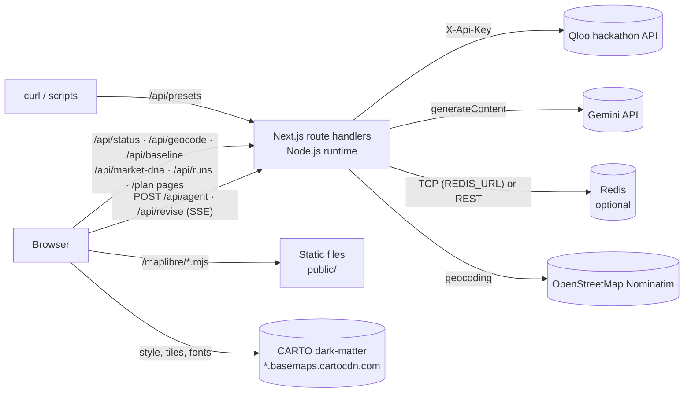

# Deployment guide

How to run Theme Night GM on a clean machine, test it, and deploy it to Vercel.

- **Repository:** https://github.com/ZNLong2203/Theme-Night-GM
- **Live demo:** https://theme-night-gm.vercel.app
- **Production smoke run** (Nashville hockey preset, live Qloo + Gemini on Vercel): 93 s, 98 Qloo requests, 0 errors, 6 Gemini steps, 6 nights accepted.

Contents: [Prerequisites](#1-prerequisites) · [Run locally](#2-run-locally) · [Environment variables](#3-environment-variables) · [Deploy with the Vercel CLI](#4-deploy-with-the-vercel-cli) · [Deploy with the Vercel dashboard](#5-deploy-with-the-vercel-dashboard) · [Attach Redis](#6-attach-redis-for-shareable-links-and-replays) · [Smoke test](#7-post-deploy-smoke-test) · [Operational notes](#8-operational-notes) · [Troubleshooting](#9-troubleshooting)

---

## 1. Prerequisites

| Requirement | Details |
|---|---|
| Node.js | **20.9 or newer.** [package.json](../package.json) has no `engines` field, but Next.js 16.3.8 requires `node >=20.9.0` (and `@google/genai` requires `>=20.0.0`). CI uses Node 22. |
| npm | `package-lock.json` is committed, so use npm (`npm ci` in CI). |
| Network at build time | [src/app/layout.tsx](../src/app/layout.tsx) loads its fonts through `next/font/google`, which downloads them during `next build`. |
| Qloo API key (optional) | Hackathon key for `https://hackathon.api.qloo.com`. See the [Qloo developer guide](https://docs.qloo.com/reference/qloo-llm-hackathon-developer-guide). |
| Gemini API key (optional) | From [Google AI Studio](https://aistudio.google.com/apikey). Needed for the LLM agent and Ask the GM. |
| Redis (optional) | Any Redis over `REDIS_URL` (production uses the Vercel Marketplace Redis, free 30 MB tier), or Upstash over REST. For shareable plan links, replays and featured plans that survive across serverless instances, and a shared Qloo response cache ([section 6](#6-attach-redis-for-shareable-links-and-replays)). |
| Vercel account (to deploy) | The CLI path works from any machine; the dashboard import needs Vercel connected to the GitHub account that owns the repo. |

All of these are optional for running the app. Without keys it runs end to end in clearly labelled simulated and autopilot modes (see [section 3](#3-environment-variables)).

## 2. Run locally

```bash
git clone https://github.com/ZNLong2203/Theme-Night-GM.git
cd Theme-Night-GM
npm install                  # postinstall copies the MapLibre worker into public/maplibre/
cp .env.example .env.local   # then fill in QLOO_API_KEY and GEMINI_API_KEY
npm run dev                  # http://localhost:3000
```

About `npm install`:

- The `postinstall` script runs [scripts/copy-maplibre-worker.mjs](../scripts/copy-maplibre-worker.mjs). It copies `maplibre-gl-worker.mjs` and `maplibre-gl-shared.mjs` from `node_modules/maplibre-gl/dist/` into `public/maplibre/` and prints `maplibre worker copied to public/maplibre`.
- `public/maplibre/` is gitignored, so it only exists after an install. The heat map in [src/components/heat-map.tsx](../src/components/heat-map.tsx) calls `setWorkerUrl("/maplibre/maplibre-gl-worker.mjs")` and needs these files at runtime.
- Don't install with `--ignore-scripts`. If you do, run `node scripts/copy-maplibre-worker.mjs` by hand.

Checks (the same ones CI runs, see [.github/workflows/ci.yml](../.github/workflows/ci.yml)):

```bash
npm run lint                     # ESLint (eslint-config-next)
npm run typecheck                # next typegen && tsc --noEmit
npm test                         # Vitest: unit tests + a keyless end-to-end agent run
npm run build && npm run start   # production build, served on http://localhost:3000
```

`npm test` needs no keys: the end-to-end test deletes `QLOO_API_KEY` and `GEMINI_API_KEY` for its run and plans the Durham preset with simulated Qloo and the autopilot.

`.env.local` is ignored by the `.env*` rule in [.gitignore](../.gitignore). Only `.env.example` is committed, through the `!.env.example` exception.

## 3. Environment variables

All variables are read **on the server only** (see [section 8](#keeping-keys-out-of-the-client-bundle)). [.env.example](../.env.example) lists every one of them (only the two keys uncommented); the defaults come from [src/lib/qloo/client.ts](../src/lib/qloo/client.ts), [src/lib/qloo/workflows.ts](../src/lib/qloo/workflows.ts), [src/lib/agent/run.ts](../src/lib/agent/run.ts), [src/lib/store.ts](../src/lib/store.ts) and the route handlers.

| Variable | Required | Default | Behavior when unset |
|---|---|---|---|
| `QLOO_API_KEY` | For live data | none | `qlooIsLive()` returns `false`. Every Qloo request goes to the deterministic stand-in in [src/lib/qloo/mock.ts](../src/lib/qloo/mock.ts), receipts get a **simulated** badge, and the header shows **Qloo simulated**. |
| `QLOO_BASE_URL` | No | `https://hackathon.api.qloo.com` | Uses the default. |
| `GEMINI_API_KEY` | For the LLM agent | none | `runMode().llm` is `"autopilot"`. The deterministic planner in [src/lib/agent/autopilot.ts](../src/lib/agent/autopilot.ts) drives the same Qloo tools, the LLM-only control uses a fixed generic list (`GENERIC_FALLBACK`), and Ask the GM replies that it needs a Gemini key. |
| `GEMINI_MODEL` | No | `gemini-3.8-flash` | Uses the default. |
| `GEMINI_THINKING` | No | `low` | Agent thinking level: `low`, `medium` or `high`. Any other value means `low`. The control group always uses `LOW`. |
| `QLOO_TRENDING_END` | No | `2025-09-28` | End date (`YYYY-MM-DD`) of the 16-week `/v2/trending` window. Per the code comment, the hackathon dataset's trending series stop in late September 2025; set this only if the dataset is refreshed. |
| `REDIS_URL` | No | none | Any Redis over TCP (`redis://` or `rediss://`), as set by the Vercel Marketplace Redis integration. Used through `node-redis`, one connection per instance. |
| `KV_REST_API_URL` + `KV_REST_API_TOKEN` | No | none | Upstash over its REST API (`UPSTASH_REDIS_REST_URL` + `UPSTASH_REDIS_REST_TOKEN` also work). Takes precedence over `REDIS_URL` if both are set. Without any Redis variable, plans, run logs and featured plans live in server memory and there is no shared Qloo cache ([section 6](#6-attach-redis-for-shareable-links-and-replays)). |
| `RUNS_PER_10_MIN` | No | `6` | Agent runs, and separately control runs, allowed per client in a sliding 10-minute window ([src/lib/rate-limit.ts](../src/lib/rate-limit.ts)). |
| `REVISIONS_PER_10_MIN` | No | `12` | Ask the GM requests allowed per client in a sliding 10-minute window. |
| `MAX_CONCURRENT_RUNS` | No | `4` | Concurrent agent, control and revision runs per server instance. |

Leave optional variables **unset** rather than empty. The code uses `??`, so an empty string replaces the default: an empty `QLOO_BASE_URL` or `GEMINI_MODEL` breaks every request, an empty `QLOO_TRENDING_END` makes trend lookups fail, and an empty `RUNS_PER_10_MIN`, `REVISIONS_PER_10_MIN` or `MAX_CONCURRENT_RUNS` becomes `0`, which rejects every run with 429.

What `GET /api/status` ([route](../src/app/api/status/route.ts) → `runMode()`) returns:

| `QLOO_API_KEY` | `GEMINI_API_KEY` | Redis | `/api/status` response |
|---|---|---|---|
| set | set | set | `{"qloo":"live","llm":"gemini","model":"gemini-3.8-flash","store":"redis"}` |
| set | set | unset | `{"qloo":"live","llm":"gemini","model":"gemini-3.8-flash","store":"memory"}` |
| set | unset | unset | `{"qloo":"live","llm":"autopilot","store":"memory"}` |
| unset | unset | unset | `{"qloo":"simulated","llm":"autopilot","store":"memory"}` |

`model` shows the value of `GEMINI_MODEL` when you override it.

## 4. Deploy with the Vercel CLI

This is how the production demo is deployed.

```bash
npx vercel login
npx vercel link                              # links the folder to a Vercel project; writes .vercel/ (gitignored)
npx vercel env add QLOO_API_KEY production   # prompts for the value, so it stays out of shell history
npx vercel env add GEMINI_API_KEY production
# optional overrides:
# npx vercel env add GEMINI_MODEL production
# npx vercel env add RUNS_PER_10_MIN production
npx vercel deploy            # preview deployment
npx vercel deploy --prod     # production deployment
```

- The repo's [.vercelignore](../.vercelignore) keeps `.env*` (except `.env.example`), `.next`, `node_modules`, `coverage` and `.claude` out of the upload. Secrets live only in the project's environment variables.
- The build runs on Vercel, so `postinstall` copies the MapLibre worker there exactly as it does locally. Look for `maplibre worker copied to public/maplibre` in the build log.
- To use the same keys in previews, run `npx vercel env add <NAME> preview` as well.
- Never add a `NEXT_PUBLIC_` prefix. The code reads only the unprefixed names, and Next.js can inline `NEXT_PUBLIC_` values into browser JavaScript.
- Environment variable changes apply only to new deployments, so redeploy after adding or changing one.

## 5. Deploy with the Vercel dashboard

1. **Push the repo to GitHub.** The hackathon requires a public repo with an OSS license (MIT, see [LICENSE](../LICENSE)).
2. **Import it.** In Vercel, choose **Add New → Project** and import `ZNLong2203/Theme-Night-GM`.
3. **Keep the defaults.** Framework preset: **Next.js** (auto-detected). Root directory: the repo root. Build command: default (`npm run build`, which runs `next build`). Install command: default. There is no `vercel.json`, and [next.config.ts](../next.config.ts) is empty. Don't add `--ignore-scripts` to the install command, because `postinstall` has to run.
4. **Add environment variables** under *Settings → Environment Variables*: `QLOO_API_KEY` and `GEMINI_API_KEY` for **Production** (and **Preview** if previews should call the live APIs), plus any optional overrides from [section 3](#3-environment-variables).
5. **Deploy**, then attach Redis ([section 6](#6-attach-redis-for-shareable-links-and-replays)) and redeploy.

**Function duration limits.** These routes declare a `maxDuration`:

| Route | `maxDuration` | Why |
|---|---|---|
| `POST /api/agent` ([route](../src/app/api/agent/route.ts)) | `300` s | Streams the whole agent run over SSE. The Gemini loop stops at 190 s and the whole run, safety net included, stops at 270 s, so the stream ends with `done` inside the limit. |
| `POST /api/revise` ([route](../src/app/api/revise/route.ts)) | `300` s | Ask the GM over SSE: a 150 s LLM deadline inside the same 270 s run deadline. |
| `POST /api/baseline` ([route](../src/app/api/baseline/route.ts)) | `120` s | One Gemini call, then a Qloo fact-check, inside a 110 s deadline. |
| `GET /api/market-dna` ([route](../src/app/api/market-dna/route.ts)) | `60` s | Ten parallel Qloo scans. |
| Other routes | not set | Short requests. |

Vercel's limits depend on the plan and on fluid compute (on by default); check [Vercel's function duration docs](https://vercel.com/docs/functions/configuring-functions/duration) before you deploy. Vercel terminates a function that runs past its limit, and the Studio then reports "The connection closed before the GM finished."

## 6. Attach Redis for shareable links and replays

**Why it matters.** Every finished run saves its plan (`/plan/<id>`), its event log (`/studio?replay=<id>`) and, for live demo-preset runs, the landing page's featured plan, for 90 days. Live Qloo responses up to 64 KB are also cached for 12 h so every instance can reuse them. Without Redis all of this lives in **one serverless instance's memory**: a shared link or replay works only while that instance is warm and only when the request reaches it, the landing page lists only featured plans made on the instance that serves it, revisions are saved server-side only on that instance, and the Share button reads **Share (temporary)**. With Redis, every instance sees the same plans and cache.

[src/lib/store.ts](../src/lib/store.ts) supports any Redis over TCP (`REDIS_URL`) and Upstash over REST (`KV_REST_API_URL` + `KV_REST_API_TOKEN`). Values are brotli-compressed before they are stored, so a 647 KB run log takes about 85 KB, and a 30 MB free tier holds a full demo season. If Redis fails or hangs (2.5 s timeouts), a breaker skips it for 30 s and memory serves; if it is full, the Qloo cache and then old run logs are purged and the write retried; anything Redis can't take stays in the instance's memory. Plans and featured pointers are never purged. `/api/status` reports `storeHealthy: false` while the breaker is open.

**Featured runs survive any store problem.** The landing page's four demo plans, with their control results and replays, are recorded in `data/featured/<slug>.json` and traced into the routes that read them (`outputFileTracingIncludes` in [next.config.ts](../next.config.ts)). The files hold Qloo API data, so they are gitignored and only uploaded by `vercel deploy`; a deployment without them falls back to the store.

> **Production:** https://theme-night-gm.vercel.app uses the Vercel Marketplace Redis (free 30 MB) connected to the project through `REDIS_URL`; `/api/status` reports `"store":"redis"`.

**Attach Redis through the Vercel Marketplace (the production setup):**

1. In the Vercel dashboard, open the project → **Storage** (or the **Marketplace**) → **Redis** → create a database on the free plan.
2. **Connect** it to this project for the environments you want (at least Production). The integration sets `REDIS_URL`, which [src/lib/store.ts](../src/lib/store.ts) reads.
3. **Redeploy** (`npx vercel deploy --prod`, or *Redeploy* in the dashboard): environment variables only reach new deployments.
4. Check that `curl -s https://theme-night-gm.vercel.app/api/status` reports `"store":"redis"`. After the next live preset run, the season board's button reads **Share link**, and the plan shows up on the landing page.

**Alternatives.** Any other Redis works the same way: set `REDIS_URL` to its connection string. For Upstash, either connect the Upstash integration from the Marketplace or create a database in the Upstash console, and set `KV_REST_API_URL` + `KV_REST_API_TOKEN` (or `UPSTASH_REDIS_REST_URL` + `UPSTASH_REDIS_REST_TOKEN`); the REST pair takes precedence if `REDIS_URL` is also set.

Locally, `npx vercel env pull .env.local` copies the project's variables, Redis included. A Redis outage never breaks a run: connections and commands time out after 2.5 s, then a 30 s breaker skips Redis entirely, reads fall back to memory (and to the recorded featured runs) and writes go to memory (and are logged).

## 7. Post-deploy smoke test

**API checks:**

```bash
BASE=https://theme-night-gm.vercel.app

curl -s "$BASE/api/status"
# {"qloo":"live","llm":"gemini","model":"gemini-3.8-flash","store":"redis"}

curl -s "$BASE/api/presets"
# {"presets":["durham-baseball","la-baseball","portland-soccer","nashville-hockey"]}
```

If `/api/status` reports `simulated` or `autopilot`, the keys are missing from that deployment's environment, or you haven't redeployed since adding them.

**UI checks:**

1. Open `$BASE/` in a window at least 640 px wide (the header hides the badges below Tailwind's `sm` breakpoint). The header should show the **Qloo live** badge and a **gemini-3.8-flash** badge.
2. Open `$BASE/studio?preset=nashville-hockey&autorun=1`, or open `/studio` and press **Hire the GM — plan 6 theme nights**.
3. While it runs, check that:
   - the agent trace (thoughts, tool calls) streams in step by step, not all at once at the end;
   - "Gemini step N · Xs · N tokens" lines appear between tool rows;
   - Qloo receipts pile up with **no** `simulated` badge. A red badge shows a non-200 status; a few are tolerated, because enrichment calls fall back and the affected score components show **est.** Red `401` or `403` on every request means a key problem;
   - the heat map draws over the dark basemap;
   - the run ends with a season plan (the production smoke run took 93 s and 98 requests).
4. On the season board, press **Run the LLM-only control**. This calls `/api/baseline`, which should return a scored comparison.
5. In **Ask the GM**, click a suggested question; the GM should answer, or revise a night and mark it **revised**.
6. Export **JSON** and **Calendar CSV**, and copy the **Share** link.
7. Open `$BASE/market-dna` and press **Compare markets** (Durham vs Los Angeles). The result lists its 10 Qloo requests under **Receipts**.

**Optional raw SSE check** (this is a full live run, so it uses Qloo quota and Gemini tokens):

```bash
curl -s "$BASE/api/presets?slug=durham-baseball" > team.json
curl -N -X POST "$BASE/api/agent" -H "Content-Type: application/json" --data @team.json
```

Expect `data: {"type":"run_started",...}` first, then `llm_step`, `thought`, `tool_call`, `qloo_request` and `tool_result` events as they happen, `: ping` comments every 10 s, a `plan` event, and finally `data: {"type":"done",...}`. Each run counts toward the per-client limit (`RUNS_PER_10_MIN`, default 6 per 10 minutes), so space out repeated smoke tests.

**Reference numbers:** live preset runs took 93–132 s and 87–103 Qloo requests; keyless runs (simulated + autopilot) make 78–91. A second run on the same warm instance (or any instance, with Redis) serves many requests from cache.

## 8. Operational notes

### Runtime topology



- **Node.js runtime is required.** [src/lib/qloo/client.ts](../src/lib/qloo/client.ts) uses `AsyncLocalStorage` from `node:async_hooks` (`toolCallScope`) to attribute each Qloo request to its tool call, and `node:crypto` for cache keys. The routes don't set `runtime`, so they use Next.js's default `nodejs`. Don't switch them to `edge`.
- **The landing page is rendered per request** (`dynamic = "force-dynamic"`), so its featured plans stay fresh.
- **`/api/presets` is not called by the UI.** The Studio imports the presets directly. The route exists for scripts and the smoke test.
- **Browser history.** Each visitor's last 12 plans are also kept in their browser's `localStorage` (`tngm:plans:v1`), under **Recent plans** in the Studio.

### Qloo rate limiting, retries, cache and budgets

The Qloo client ([src/lib/qloo/client.ts](../src/lib/qloo/client.ts)) allows 10 live requests in flight with starts at least 200 ms apart (at most 5 per second), a 20 s timeout per attempt, and 2 retries on 429, 5xx, network errors and timeouts. `Retry-After` is honoured up to 5 s, and a 429 pauses the whole instance's limiter. Successful responses are cached in memory for 12 hours (2,000 entries) and, with Redis, responses up to 64 KB are shared across instances for 12 hours. Each run has a budget of uncached requests (plan 220, revision 120, control 100, Market DNA 15 per city). The full table is in [QLOO_INTEGRATION.md §2](QLOO_INTEGRATION.md#2-request-pipeline).

- **The limiter is per instance.** Each serverless instance has its own, so several instances running at once can together exceed 5 requests per second. The in-memory cache is lost on cold starts and redeploys; the Redis cache is not.
- **A run can include at most 8 target dates.** `/api/agent` and `/api/baseline` both enforce this, and the body is validated by `TeamSchema` in [src/lib/validation.ts](../src/lib/validation.ts).

### Demo rate limits

Each run spends Qloo quota and Gemini tokens, so [src/lib/rate-limit.ts](../src/lib/rate-limit.ts) and the routes guard the public demo:

| Route | Per client (10-minute window) | Concurrency | Body cap |
|---|---|---|---|
| `POST /api/agent` | `RUNS_PER_10_MIN` (6) | `MAX_CONCURRENT_RUNS` (4) per instance | 64 KB |
| `POST /api/baseline` | `RUNS_PER_10_MIN` (6), counted separately | `MAX_CONCURRENT_RUNS` | 64 KB |
| `POST /api/revise` | `REVISIONS_PER_10_MIN` (12) | `MAX_CONCURRENT_RUNS` | 2 MB |
| `GET /api/market-dna` | 20 | none | n/a |
| `GET /api/geocode` | 30 | ≤ 1 Nominatim request per second per instance | n/a |

- The client is the first `x-forwarded-for` address, else `x-real-ip`, else `"local"`.
- A concurrency slot is reserved before the per-client quota is charged, so a "busy" answer doesn't use up a visitor's quota.
- Over a limit, a route returns **429** with a `Retry-After` header and a message the UI shows ("You've hit the demo limit for agent runs…", "The GM is busy with other teams right now…"). An oversized body gets **413**.
- The counters live in memory per instance. They stop accidental hammering; they are not authentication or a distributed limiter.

### Gemini cost

- One agent run makes up to `MAX_STEPS = 12` `generateContent` calls (the prompt aims for about 5; the measured live runs used 6) with `thinkingLevel` from `GEMINI_THINKING` (default `LOW`) and `includeThoughts: true`. Each call re-sends the growing conversation, including earlier tool results, so later steps cost more input tokens than early ones. The trace shows each step's duration and tokens (`llm_step` events). The SDK retries transient errors up to 3 attempts.
- An Ask the GM revision runs the same loop (150 s LLM deadline). The LLM-only control (`/api/baseline`) makes one `generateContent` call with `thinkingLevel: LOW`.
- For prices, see the [Gemini API pricing page](https://ai.google.dev/gemini-api/docs/pricing). For quotas, see [rate limits](https://ai.google.dev/gemini-api/docs/rate-limits).
- The API routes have **no authentication**, only the limits above. Anyone with the demo URL can start runs that use your Qloo and Gemini quota. Watch usage while the demo is public.

### Keeping keys out of the client bundle

- The two API keys are read only in [src/lib/qloo/client.ts](../src/lib/qloo/client.ts), [src/lib/agent/run.ts](../src/lib/agent/run.ts) and [src/lib/agent/baseline.ts](../src/lib/agent/baseline.ts), and the Redis credentials only in [src/lib/store.ts](../src/lib/store.ts). All four start with `import "server-only"`, which makes the build fail if a client component imports them.
- No variable uses the `NEXT_PUBLIC_` prefix. Keep it that way.
- `/api/status` returns only the mode, the model name and the store kind. Visitor-facing errors carry generic messages (Qloo failures show only their status); details go to the server log.
- "Copy as curl" in the receipts panel ([src/components/studio/receipts.tsx](../src/components/studio/receipts.tsx)) writes the literal placeholder `$QLOO_API_KEY`, never the key. Its base URL is hard-coded to `https://hackathon.api.qloo.com`, so copied commands ignore any `QLOO_BASE_URL` override.

### Third-party services

- **Geocoding:** [src/app/api/geocode/route.ts](../src/app/api/geocode/route.ts) calls OpenStreetMap Nominatim with an identifying `User-Agent` and an 8 s timeout. It answers only same-origin requests, spaces Nominatim calls at least 1 s apart per instance (a queue longer than 5 s gets a 429), and caches up to 500 results for 24 h. It runs only when a user presses **Locate** in team setup. See Nominatim's [usage policy](https://operations.osmfoundation.org/policies/nominatim/).
- **Basemap:** the browser loads the CARTO dark-matter style from `basemaps.cartocdn.com`, and that style pulls tiles, fonts and sprites from `tiles.basemaps.cartocdn.com` and `tiles-a` to `tiles-d.basemaps.cartocdn.com`. The heat layer is added only after the style loads, so if these hosts are blocked, neither the basemap nor the heat map draws.

## 9. Troubleshooting

| Symptom | Likely cause | Fix |
|---|---|---|
| Map area is blank, or the browser console shows a worker or module load error | `public/maplibre/maplibre-gl-worker.mjs` or `maplibre-gl-shared.mjs` is missing because `postinstall` didn't run | Run `node scripts/copy-maplibre-worker.mjs`, or reinstall without `--ignore-scripts`. On Vercel, look for `maplibre worker copied to public/maplibre` in the build log. Also check that `basemaps.cartocdn.com` and its `tiles*` subdomains are reachable. |
| `/api/status` says `simulated` or `autopilot` after deploy | The keys aren't set for that environment (Production or Preview), or you haven't redeployed | Add the variables to the right environment and redeploy. |
| Share button reads **Share (temporary)**; a `/plan/<id>` link or a replay 404s or starts a fresh run; no featured plans on the landing page | No Redis variable on that deployment (`/api/status` says `"store":"memory"`), so plans live in one instance's memory | [Attach Redis](#6-attach-redis-for-shareable-links-and-replays) and redeploy. |
| Receipts show red `401` (or `403`) badges, and tool steps fail with `Qloo 401 on <path>: …` | Wrong or expired key, or a `QLOO_BASE_URL` that doesn't match the key. The hackathon key is for `https://hackathon.api.qloo.com`. | Check `QLOO_API_KEY` and remove any `QLOO_BASE_URL` override. Test the key with a copied curl receipt. 401 and 403 are not retried. |
| Tool steps fail with `Qloo request failed: ...` (status 504) | Network error or timeout after retries, or `QLOO_BASE_URL` set to an empty or invalid value | Unset `QLOO_BASE_URL` or fix it, and check outbound network access. |
| Many 429s in the receipts, or tools fail with "This run has used its budget of N Qloo requests" | Several runs or instances at once (the limiter is per instance), or a run that kept asking for more data | Avoid parallel runs; requests are already retried and a 429 pauses the instance's limiter. The budget is per run and resets on the next one. |
| The trace says "Gemini returned an error (…) — finishing with the deterministic planner" | A Gemini call failed after the SDK's retries: an invalid `GEMINI_API_KEY` or `GEMINI_MODEL`, exhausted quota, or an outage | The autopilot still delivers a plan. Check the key in AI Studio, and unset `GEMINI_MODEL` to use `gemini-3.8-flash`. |
| Ask the GM answers "Revisions need the Gemini agent…" or "The GM couldn't reach Gemini (…)" | No `GEMINI_API_KEY`, or a Gemini failure. Revisions have no autopilot. | Set the key, or retry in a minute. |
| `/api/baseline` returns 502 | Gemini error, or the model's reply wasn't valid JSON or failed `BaselineSchema` | Same checks as above, then retry. |
| A route returns 429 | A [demo rate limit](#demo-rate-limits), or all `MAX_CONCURRENT_RUNS` slots busy. An empty limit variable makes the limit 0. | Wait for `Retry-After`, raise the limits for rehearsals, or unset empty variables. |
| `/api/agent` returns 400 | Body failed `TeamSchema` (for example a date that isn't a real calendar date), or it has more than 8 target dates (`Plan at most 8 theme nights per run.`). With zero target dates, `/api/agent` streams the error `Pick at least one target date.` instead. `/api/baseline` returns 400 for anything outside 1–8 target dates. | Send the payload the Studio sends, for example from `/api/presets?slug=durham-baseball`. |
| A route returns 413 | Body over 64 KB (`/api/agent`, `/api/baseline`) or 2 MB (`/api/revise`) | Send the payload the Studio sends. |
| The agent trace appears all at once at the end | A proxy or CDN between the browser and the app is buffering the SSE stream | The routes already send `Content-Type: text/event-stream; charset=utf-8`, `Cache-Control: no-cache, no-transform` and `X-Accel-Buffering: no`, plus a `: ping` every 10 s. Behind your own reverse proxy, turn off response buffering and compression for `/api/agent` and `/api/revise` (in nginx, `proxy_buffering off;`). |
| The run ends with "The run hit its time limit before a plan was accepted." | The 270 s run deadline fired before any plan was accepted (very slow Qloo or Gemini) | Retry; fewer target dates mean less work per run. |
| The Studio says "The connection closed before the GM finished." | The platform cut the function (its duration limit is lower than 300 s, for example with fluid compute off) or a proxy closed the stream | Check the function logs and your limits in [Vercel's duration docs](https://vercel.com/docs/functions/configuring-functions/duration). |
| `npm install` or `next build` fails on the Node version | Node older than 20.9 | Use Node 20.9+ (CI uses 22). |
| `next build` fails to fetch fonts | No network during the build (`next/font/google`) | Build with internet access. |
| `tsc` fails with `Cannot find name 'LayoutProps'` | Route types haven't been generated on a fresh clone | Use `npm run typecheck`, which runs `next typegen` first. |
| Build error about `server-only` | A client component (`"use client"`) imports a server module such as `@/lib/qloo/client`, `@/lib/qloo/workflows`, `@/lib/agent/run` or `@/lib/store` | Call the server code through an API route instead. |
