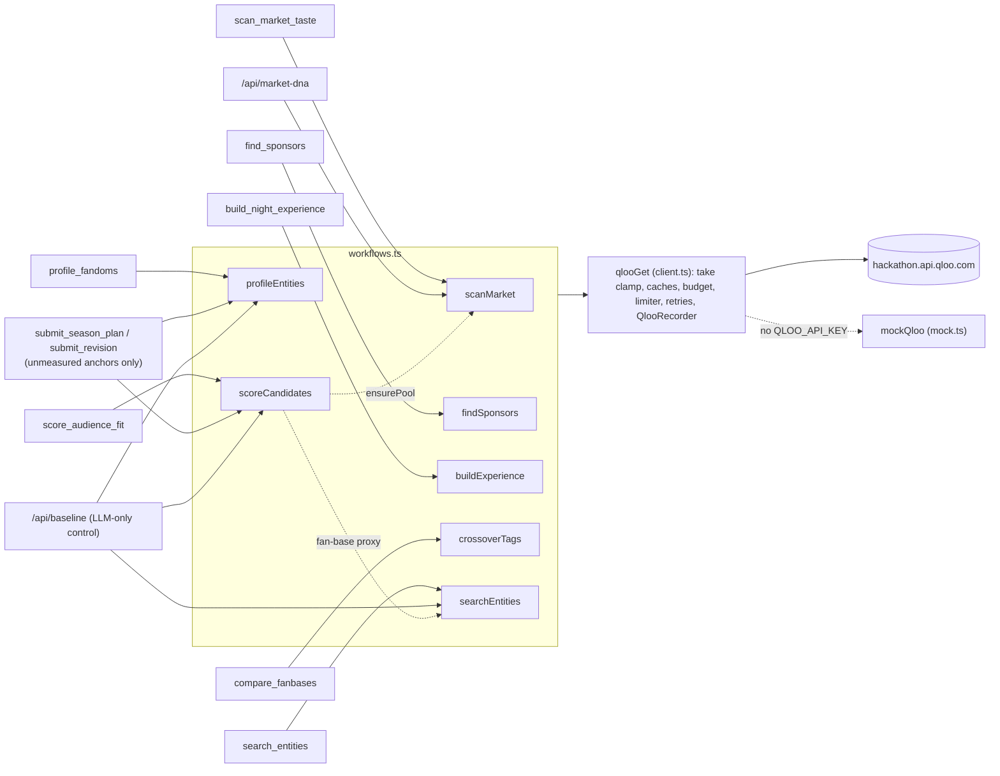

# Qloo integration reference

This document covers how Theme Night GM uses the Qloo Hackathon API. It lists every request the app can make, how each response becomes a metric, and the safeguards around both. It is written for the Qloo team and for judges scoring **Technological Implementation**.

> **Status:** The parameters below are what the code sends. Code comments marked "verified live" record API behaviour checked against the hackathon host: the `take` cap, the video-game spelling, trending coverage, heatmap size and place coordinates. Live preset runs (October 2026) made 87–103 Qloo requests each; the two runs where errors were counted had none at the pacing below ([§4](#4-requests-per-tool-call)).

- **Live demo:** https://theme-night-gm.vercel.app
- **Repo:** https://github.com/ZNLong2203/Theme-Night-GM
- **Request builders:** [src/lib/qloo/workflows.ts](../src/lib/qloo/workflows.ts). This is the only module that calls `qlooGet`.
- **Transport:** [src/lib/qloo/client.ts](../src/lib/qloo/client.ts)

## Contents

1. [At a glance](#1-at-a-glance)
2. [Request pipeline](#2-request-pipeline)
3. [Master request table](#3-master-request-table)
4. [Requests per tool call](#4-requests-per-tool-call)
5. [Parsing a Qloo entity](#5-parsing-a-qloo-entity)
6. [Derived metrics](#6-derived-metrics)
7. [Market DNA](#7-market-dna)
8. [Gotchas handled in code](#8-gotchas-handled-in-code)
9. [Provenance: receipts and copy-as-curl](#9-provenance-receipts-and-copy-as-curl)
10. [Simulated mode](#10-simulated-mode)
11. [Responsible use](#11-responsible-use)
12. [Example requests](#12-example-requests)
13. [Known gaps](#13-known-gaps)

---

## 1. At a glance

| | |
|---|---|
| Host | `https://hackathon.api.qloo.com`, overridable with `QLOO_BASE_URL` |
| Auth | `X-Api-Key: $QLOO_API_KEY`, sent only by server code (`import "server-only"`) |
| Endpoints | 7: `/v2/insights`, `/v2/trending`, `/v2/analysis/compare`, `/v2/audiences`, `/v2/tags`, `/search`, `/entities` |
| `filter.type` values on `/v2/insights` | 11 by design: `urn:entity:movie`, `tv_show`, `artist`, `videogame`, `podcast`, `book`, `brand`, `place`, plus `urn:demographics`, `urn:heatmap`, `urn:tag`. `KIND_URN` also maps `person`, which is sent only if a person entity from `/search` ends up on a shortlist. |
| Signals | `signal.location.query`, `signal.location.weight`, `signal.interests.entities`, `signal.demographics.age`, `signal.demographics.audiences`, `a.signal.interests.entities`, `b.signal.interests.entities` |
| Filters, modifiers, other params | `filter.popularity.min`, `filter.results.entities`, `filter.tags`, `filter.exclude.tags`, `operator.filter.tags`, `filter.location` (WKT `POINT`), `filter.location.radius`, `filter.start_date`, `filter.end_date`, `filter.query`, `filter.parents.types`, `bias.trends`, `feature.explainability`, `feature.semantic_search`, `take` (clamped to 1–50), `entity_ids`, `query`, `types` |
| Distinct request shapes | 18 ([§3](#3-master-request-table)) |
| Callers | All 8 agent tools in [src/lib/agent/tools.ts](../src/lib/agent/tools.ts) (`submit_season_plan` only to score and profile anchors nobody measured yet), Ask the GM's `submit_revision`, the LLM-only control, and Market DNA |

Each agent tool answers one product question by combining several Qloo calls:



---

## 2. Request pipeline

Every request goes through `qlooGet(path, params, recorder, purpose)` in [client.ts](../src/lib/qloo/client.ts):

1. **Normalize.** `normalize()` sorts parameter keys alphabetically, drops `undefined` and `""` values, clamps `take` to 1–`MAX_TAKE` (50), and turns every value into a string. Cache keys are therefore stable, and the URL is reproducible byte for byte.
2. **Cancelled?** If the run's signal has fired (client gone, or the run deadline), throw `QlooError(499)` without logging.
3. **Cache.** The key is `` `${path}?${new URLSearchParams(query)}` ``. A hit younger than 12 h in the instance's memory is returned at once. In live mode with Redis attached, a miss is looked up in the shared Redis cache (`qloo:v1:<sha256 of the key>`, 12 h, responses up to 64 KB), so every serverless instance reuses responses. Hits are logged with `cached: true, ms: 0` and cost nothing against the run's budget.
4. **Budget.** A fresh request is charged against the run's budget (plan 220, revision 120, control 100, Market DNA 15 per city). Over budget, `qlooGet` throws `QlooError(429, "This run has used its budget of N Qloo requests")` without calling Qloo. The budget protects the shared key from a runaway or prompt-injected run.
5. **Live or simulated.** `qlooIsLive()` is `Boolean(process.env.QLOO_API_KEY)`. Live mode calls `fetchWithRetry()`. Simulated mode calls `mockQloo()` ([§10](#10-simulated-mode)).
6. **Fetch.** The request sends the headers `X-Api-Key` and `Accept: application/json`, with a signal that combines the run's signal and a 20 s per-attempt timeout, and `cache: "no-store"`.
7. **Record.** Success and failure are both pushed to the run's `QlooRecorder`, with id, endpoint, params, status, latency, result count, cached and simulated flags, purpose and the issuing tool call ([§9](#9-provenance-receipts-and-copy-as-curl)). Successful live responses are written to the Redis cache in the background.

| Constant | Value | Effect |
|---|---|---|
| `TIMEOUT_MS` | `20_000` | Per-attempt timeout |
| `MAX_RETRIES` | `2` | Up to 3 attempts |
| `MAX_RETRY_AFTER_S` | `5` | `Retry-After` is honoured up to 5 s; a longer pause fails fast instead of stalling the run |
| `MAX_CONCURRENT` | `10` | Maximum requests in flight per instance |
| `MIN_INTERVAL_MS` | `200` | Minimum gap between request starts (≤ 5 starts/s). The code comment says live calls take 1–6 s each and that ~5 req/s is "the rate other hackathon teams report as safe". |
| `MAX_TAKE` | `50` | Per the code comment, `/v2/insights` rejects `take` > 50 with a 400 (verified live) |
| `CACHE_TTL_MS` | 12 h | In-memory response cache, capped at 2,000 entries (oldest inserted evicted) |
| `SHARED_CACHE_TTL_S` | 12 h | Redis response cache, live mode only, when Redis is configured |
| `SHARED_CACHE_MAX_BYTES` | 64 KB | Larger responses (heatmaps, long lists) are only cached per instance, so a 30 MB free Redis keeps room for plans |

**Limiter.** A request waits for one of 10 slots and for its start time (at least 200 ms after the previous start, and not before any 429 pause). A finished request hands its slot straight to the **oldest waiter**, so no run is starved. The slot is released when `fetch` resolves (headers received), before the body is parsed; each retry acquires a slot again.

**Retry policy** (`fetchWithRetry`):

- **Network error or timeout:** wait `400 · 2^attempt` ms (800, then 1,600). After the last attempt, throw `QlooError(status 504, retryable)`.
- **HTTP 429 or ≥ 500:** wait `Retry-After` seconds when the header is a positive number, otherwise `500 · 2^attempt` ms (1,000, then 2,000). A wait longer than 5 s is not retried. A **429 also pauses the instance's shared limiter** for the same time (capped at 5 s), so every run on the instance backs off together instead of burning its own retries.
- **Any other non-2xx (e.g. 400, 403):** no retry. Throw `QlooError` with the status and the first 200 characters of the response body. A 429 or 5xx that is still failing after the last retry throws the same way. The message holds the path and body excerpt, never the key.
- **Cancellation:** if the run's signal fires during a fetch, a retry wait or while queued, the request stops with `QlooError(499, "Run stopped …")`.

The limiter, retries and Redis cache apply only on the live path; simulated mode skips them (it is still cached in memory, budgeted and logged). The limiter and in-memory cache live at module level, so concurrent runs on the same warm instance share them. Separate serverless instances do not.

---

## 3. Master request table

Placeholders:

- `<city>` = `team.venue.city` (e.g. `Durham, North Carolina`).
- `<lon> <lat>` = venue coordinates.
- `<kind URN>` = `KIND_URN[kind]`.
- `<pool>` = this kind's candidates plus the first 15 IDs of the kind's scan results (`ctx.pools`), de-duplicated, at most 30.

Keys appear here in the order the code writes them; on the wire they are sorted alphabetically.

| # | Endpoint · type | Params, as built | Product question | Workflow → caller | Response fields used → destination | On error |
|---|---|---|---|---|---|---|
| R1 | `/v2/insights` · `urn:entity:` movie, tv_show, artist, videogame, book | `filter.type=<kind URN>`, `signal.location.query=<city>`, `filter.popularity.min=<min_popularity, default 0.8>`, `bias.trends=medium` (movie, tv_show, artist, podcast only), `take=25` (`POOL_SIZE`) | Which fandoms does this city rank highest? | `scanMarket` → `scan_market_taste` (one per domain, in parallel); `ensurePool` for a domain no scan covered (the control, or a candidate found by search); Market DNA (both cities) | `results.entities[]` → `EntityCard`. Response order → `localRank` and `localPct`; `popularity` → `nationalRank` → **Local Lift** ([§6.1](#61-local-lift-and-local-percentile)). IDs → `ctx.pools[kind]`. `query.localities.signal` → `resolvedLocality`. The top 10 per domain go to the model. | Domain reported as `unavailable` (to the model as `unavailable_domains`) |
| R2 | `/v2/insights` · `urn:demographics` | `filter.type=urn:demographics`, `signal.interests.entities=<≤20 ids without demographics yet>` | Which ages and genders over-index on each fandom? | `fetchDemographics` ← `scoreCandidates` and `profileEntities`; also the control | `results.demographics[]` keyed by `entity_id`: `query.age` (6 buckets) and `query.gender.male/female` → `ctx.demographics` → half of segment fit ([§6.3](#63-segment-fit)), demographic bars, `strongest_age_affinity`, `gender_skew` | Profile records `Demographics: Qloo request failed`; segment fit uses the rank alone |
| R3 | `/v2/trending` | `filter.type=<kind URN>`, `signal.interests.entities=<1 id>`, `filter.start_date=2025-06-08`, `filter.end_date=2025-09-28` (`TREND_END`, overridable with `QLOO_TRENDING_END`) | Is interest rising or cooling? | `trendFor` ← `profileEntities` → `profile_fandoms` (one per movie, TV, artist or podcast entity); also the control | `results.trending[].date` and `population_percentile` → `summarizeTrend` ([§6.5](#65-trend-direction-changepct-and-momentum)) | Profile records `Trend: Qloo request failed (<status>)`; momentum is estimated |
| R4 | `/v2/insights` · `urn:heatmap` | `filter.type=urn:heatmap`, `signal.interests.entities=<1 id>`, `filter.location=POINT(<lon> <lat>)`, `filter.location.radius=40000`, `take=50` | Where within 40 km of the venue do these fans concentrate? | `profileEntities` → `profile_fandoms` (one per entity); also the control | `results.heatmap[].location.latitude/longitude`, `query.affinity`, `query.popularity` → the **near-venue index** on every cell ([§6.2](#62-near-venue-index)); the strongest 300 cells → MapLibre heat layer | Profile records `Heatmap: Qloo request failed (<status>)`; near-venue is estimated |
| R5 | `/v2/insights` · `urn:tag` | `filter.type=urn:tag`, `signal.interests.entities=<1 id>`, `take=8` | Which taste tags describe this audience? | `profileEntities` → `profile_fandoms` (one per entity); also the control | `results.tags[].name` → `tasteTags`, shown in the UI and sent to the model | Skipped |
| R6 | `/entities` | `entity_ids=<ids not yet seen this run>` | Look up IDs the run hasn't seen (e.g. typed by the model) | `ensureCards` ← `profileEntities`, `scoreCandidates` | `results[]` or `results.entities[]` → `EntityCard`s, added to `TasteContext` | Throws → tool error |
| R7 | `/v2/audiences` | `filter.query=parents`, `filter.parents.types=urn:audience:life_stage`, `take=10` | Which Qloo life-stage audience is "families with kids"? | `TasteContext.familiesAudienceId` (memoized per run) ← `scoreCandidates` when `families` is requested; also the control | `results.audiences[]`, else `results.entities[]`. Prefers a name matching `/parent/` and `/young\|child\|kid/`, then `/parent/` → audience ID for R9 | Returns `null` → age fallback |
| R8 | `/v2/insights` · `urn:entity:<kind>` (local rank) | `filter.type=<kind URN>`, `signal.location.query=<city>`, `filter.results.entities=<pool>`, `take=<pool size>` | Where does a candidate the scan missed rank among this city's picks? | `rankInPool` ← `scoreCandidates` → `score_audience_fit` (one per kind, only for candidates with no local percentile yet); also the control | Response order → `pctAt()` → `ctx.localPct` | Skipped; local affinity is estimated |
| R9 | `/v2/insights` · `urn:entity:<kind>` (segment rank) | `filter.type=<kind URN>`, one segment signal ([§6.3](#63-segment-fit)), `signal.location.query=<city>`, `filter.results.entities=<pool>`, `take=<pool size>` | How does each candidate rank for this date's crowd in this city? | `rankInPool` ← `scoreCandidates` → `score_audience_fit` (one per kind × segment); also the control | Response order → rank percentile, blended 50/50 with R2 → `ctx.segmentFit[id][segment]` | Skipped (demographics alone) |
| R10 | `/search` (fan-base proxy) | `query=<FANBASE_PROXIES[sport][i]>`, `types=urn:entity:brand,urn:entity:videogame,urn:entity:tv_show`, `take=3` | Which Qloo entity stands in for this sport's existing fans? | `resolveFanbaseProxy` ← `scoreCandidates` (one shared lookup per run); also the control | The result whose name matches the query exactly (case-insensitive), else the first result → `ctx.fanbaseProxy`. Stops at the first query with any result. | Tries the next proxy name; if none resolve, overlap is skipped |
| R11 | `/v2/insights` · `urn:entity:<kind>` (fan overlap) | `filter.type=<kind URN>`, `signal.interests.entities=<proxy id>`, `filter.results.entities=<pool>`, `take=<pool size>` | Do existing sport fans already rank this fandom highly? | `rankInPool` ← `scoreCandidates` (one per kind, when a proxy resolved); also the control | Response order → rank percentile → `ctx.fanOverlap` → **new-fan reach** ([§6.4](#64-fan-base-overlap-and-new-fan-reach)) | Skipped; new-fan reach is estimated |
| R12 | `/v2/analysis/compare` | `a.signal.interests.entities=<≤5 ids>`, `b.signal.interests.entities=<≤5 ids>`, `take=12` | Which taste tags bridge two fan bases? | `crossoverTags` → `compare_fanbases` | `results.tags[].name` and `query.score` → bridging tags for activations and copy ("Shared taste" in Night kits) | Throws → tool error |
| R13 | `/v2/tags` (sponsor category) | `filter.query=<CATEGORY_QUERY[category] ?? category>`, `filter.parents.types=urn:entity:brand`, `feature.semantic_search=true`, `take=8` | Which Qloo brand tag means "Beverages", "Restaurants" and so on? | `categoryTag` ← `findSponsors` → `find_sponsors` (every selected category, up to 6). A resolved tag is memoized per server process. | `results.tags[].id` → the first ID with a `TAG_PRIORITY` prefix (`urn:tag:product_category:qloo:`, `urn:tag:industry:qloo:`, `urn:tag:product_service:qloo:`, `urn:tag:genre:brand:`), else the first tag | Category reported as unresolved (`unresolved_categories`); not memoized, so the next run retries |
| R14 | `/v2/insights` · `urn:entity:brand` (sponsors) | `filter.type=urn:entity:brand`, `signal.interests.entities=<≤3 anchor ids>`, `signal.location.query=<city>`, `signal.location.weight=low`, `feature.explainability=true`, `filter.exclude.tags=<NOT_SPONSORS>`, then `filter.tags=<category tag>` and `take=6` per resolved category (`take=4` when more than 4 resolve), or no `filter.tags` and `take=12` when none resolve | Which brands' audiences share this theme's taste, in each sales category? | `findSponsors` → `find_sponsors` (one per resolved category, else one) | Brand cards tagged with their `category`; `query.explainability["signal.interests.entities"][0].score` → `explain`. Groups are merged round-robin, de-duplicated, up to 12 kept. | Skipped (empty group) |
| R15 | `/v2/insights` · `urn:entity:artist` | `filter.type=urn:entity:artist`, `signal.interests.entities=<≤3 anchor ids>`, `signal.location.query=<city>`, `take=12` | Which artists go on the in-game playlist? | `buildExperience` → `build_night_experience` | Artist cards → `playlist` (the model sees 10) | Skipped |
| R16 | `/v2/insights` · `urn:entity:place` | `filter.type=urn:entity:place`, `signal.interests.entities=<≤3 anchor ids>`, `filter.location=POINT(<lon> <lat>)`, `filter.location.radius=6000`, `filter.tags=<PARTNER_PLACE_TAGS>`, `operator.filter.tags=union`, `take=12` | Which bars, restaurants, breweries and cafés within 6 km does this fandom over-index on? These are the local partners. | `buildExperience` → `build_night_experience` | Place cards (name, `properties.address`, coordinates) → `localPartners` (the model sees 8). Bars and breweries are later dropped from family and Gen Z nights. | Skipped |
| R17 | `/v2/insights` · `urn:entity:podcast` | `filter.type=urn:entity:podcast`, `signal.interests.entities=<≤3 anchor ids>`, `take=8` | Which podcasts does this fandom listen to? This is the media buy. | `buildExperience` → `build_night_experience` | Podcast cards → `mediaPartner` (the model sees 6) | Skipped |
| R18 | `/search` (name resolution) | `query=<text>`, `types=<URNs of requested kinds; dropped when empty>`, `take=5` (tool) or `take=1` with the LLM's `anchor_kind` (control) | Turn a name into a Qloo entity and ID | `searchEntities` → `search_entities`; `runBaseline` | `results[]` or `results.entities[]` → `EntityCard`s | Tool: throws. Control: retried once, then the pick is marked "lookup failed" and left out of the average. |

`NOT_SPONSORS` excludes `urn:tag:genre:brand:sports_organization` and `urn:tag:genre:brand:entertainment:media:sports` ("leagues, teams and sports media are partners or competitors, not sponsor prospects"). `PARTNER_PLACE_TAGS` is `urn:tag:genre:place:restaurant`, `…:restaurant:bar`, `…:brewery` and `…:restaurant:cafe`.

- **"Skipped"** means the call is wrapped in `.catch`, so the run keeps going without that evidence. Where the missing value feeds the score, that component scores a neutral 0.5 and is listed in `score.estimated` ([§6.6](#66-taste-fit-score)).
- **"Throws → tool error"** means `runTool` returns `{ error }` to the model, which can retry or change course. If the model doesn't land a valid plan before its deadline, or Gemini fails, the autopilot finishes the run on the same evidence, reusing any night kits the model already built ([src/lib/agent/run.ts](../src/lib/agent/run.ts), [src/lib/agent/autopilot.ts](../src/lib/agent/autopilot.ts)).
- **What the model sees.** Entity lists pass through `compact()`: `id`, `name`, `kind`, `local_pct` (or the raw `affinity` when no percentile exists), `popularity`, `local_lift` / `local_rank` / `national_rank`, `sponsor_category`, `sensitive_topic`, `driven_by_anchor`, `year`, `industries`, and the first 4 `tags`. `score_audience_fit` returns `local_pct`, `segment_fit`, `existing_fan_overlap` and a Taste Fit Score per segment. `scan_market_taste` adds `qloo_resolved_market`. Raw Qloo JSON never reaches the prompt.

---

## 4. Requests per tool call

| Tool | Qloo requests per call |
|---|---|
| `scan_market_taste` | 1 per domain in `kinds` (max 5) |
| `profile_fandoms` (n ≤ 6 IDs) | 0–1 `/entities` + 0–1 `urn:demographics` (IDs not fetched yet) + n heatmap + n `urn:tag` + 1 trending per movie, TV, artist or podcast entity |
| `score_audience_fit` (≤ 14 IDs; K kinds among them, brands and places excluded; S segments) | 0–1 `/entities` + 1 scan per kind with no pool yet + 0–1 `/v2/audiences` (first call with `families`) + 0–3 `/search` (proxy, first call in the run) + 0–1 `urn:demographics` + 1 local-rank query per kind that has unranked candidates + K·S segment-rank queries + K overlap queries (when a proxy resolved) |
| `find_sponsors` | 0–6 `/v2/tags` (categories not yet resolved by this server process) + 1 brand query per resolved category (max 6), or 1 when none resolved |
| `build_night_experience` | 3 (artists, places, podcasts) |
| `compare_fanbases` | 1 |
| `search_entities` | 1 |
| `submit_season_plan` / `submit_revision` | 0 when every anchor was already scored and profiled; otherwise `score_audience_fit` and `profile_fandoms` costs for the missing anchors |

**Live runs** (Qloo hackathon API, Gemini 3.8 Flash, October 2026): a 6-night preset plan made 87–103 requests (Portland 87 and 88, Nashville 97 and 98, LA 103), with 0 errors on the runs where errors were counted (Portland 87, and the Nashville production run on Vercel, 98). An Ask the GM change to one night made 53. Gemini chooses its own shortlists, so counts vary by run.

**Keyless example (simulated Qloo, autopilot, Durham preset, cold cache).** Six target nights covering 4 segments (`boomers`, `gen_z`, `young_pros`, `families`) and the preset's 3 sponsor categories produced a validated 6-night plan from **89 requests over 16 tool calls**:

| Tool | Calls | Requests | Breakdown |
|---|---|---|---|
| `scan_market_taste` | 1 | 5 | 5 domains |
| `score_audience_fit` | 1 | 30 | 1 `/v2/audiences` + 3 proxy `/search` + 1 `urn:demographics` + 5 kinds × (4 segment + 1 overlap). No local-rank queries: every candidate came from the scan. |
| `profile_fandoms` | 1 | 15 | 6 heatmap + 6 `urn:tag` + 3 trending (only the movie, TV and artist finalists qualify). Demographics were already fetched. |
| `find_sponsors` | 6 | 21 | 3 `/v2/tags` (on the first call; memoized after) + 6 × 3 brand queries, one per category |
| `build_night_experience` | 6 | 18 | 6 × 3 |
| `submit_season_plan` | 1 | 0 | All anchors already measured |

The 3 proxy searches happen because the mock catalog has neither "Major League Baseball" nor "Minor League Baseball", so the third name, "MLB The Show", is the one that resolves. The other presets made 78 (Portland), 89 (Nashville) and 91 (LA) requests the same way. The LLM-only control for Durham logged 54 requests and resolved 5 of its 6 generic picks.

A second run on the same warm instance logs the same requests but serves most of them from cache (free against the budget), and skips the `/v2/tags` lookups.

---

## 5. Parsing a Qloo entity

`toCard()` in [workflows.ts](../src/lib/qloo/workflows.ts) turns any entity-shaped object from `/v2/insights`, `/search` or `/entities` into an `EntityCard` ([src/lib/types.ts](../src/lib/types.ts)). Every input field is treated as optional and type-checked. `id`, `name` and `kind` always get a value; the rest are left `undefined` when missing:

| `EntityCard` field | Read from (first match wins) |
|---|---|
| `id` | `entity_id` → `id` → `name` → `"unknown"` |
| `name` | `name` → `"Unknown"` |
| `kind` | `subtype` → `types[0]` → `type` (only if it starts with `urn:entity:`), mapped through `URN_KIND` (both video-game spellings → `videogame`) → caller's fallback kind → `"brand"` |
| `affinity` | `query.affinity` → top-level `affinity` (rounded to 3 dp) |
| `popularity` | `popularity` (rounded to 3 dp) |
| `lat` / `lon` | top-level `location.lat`/`lon` (where places carry them, per the code comment) → `properties.lat`/`lon` → `properties.latitude`/`longitude` → `properties.geocode.lat`/`lon` |
| `explain` | `query.explainability["signal.interests.entities"][0].score` (rounded to 3 dp), shown to the model as `driven_by_anchor` |
| `image` | `properties.image.url`, only when it is an `http(s)` URL (some brand images come back as `s3://` URLs browsers can't load) |
| `owners` (IP check) | `properties.production_companies[]` + `properties.publisher` (split on commas) + `properties.developer` |
| `subtitle` | `disambiguation` → `properties.short_description` |
| `tags`, `industries`, `year`, `address` | `tags[].name` (max 6), `properties.industries` (max 4), `properties.release_year`, `properties.address` |

Workflows add `localRank`, `nationalRank`, `lift` and `localPct` (scan) and `category` (sponsors). `TasteContext.remember()` keeps the **first** `affinity` and rank fields seen for an ID, because later queries are normalized differently; a market scan (or rescan) replaces the rank fields together, so a card never mixes ranks from two result sets.

`owners` feeds `licensingFor()` ([src/lib/licensing.ts](../src/lib/licensing.ts)). It matches owners against a list of major IP holders and flags nights that need a license. This is a rules-based flag from Qloo metadata, and the UI labels it "not legal advice".

---

## 6. Derived metrics

All metrics are computed by code from Qloo responses. The model never writes them. Per the code comments, Qloo normalizes affinity per query, so the code compares **positions inside one query's result set** instead of raw affinities across queries. The building block is:

```text
pctAt(index, n) = n > 1 ? round(1 − index / (n − 1), 3) : 0.5     // 1 = first result, 0 = last
```

Most metrics feed the **Taste Fit Score** in [src/lib/scoring.ts](../src/lib/scoring.ts) ([§6.6](#66-taste-fit-score)).

### 6.1 Local Lift and local percentile

Implemented in `scanMarket` (R1):

```text
cards        = results.entities in the order Qloo returned them (city signal, popularity floor, take=25)
localRank    = index in cards + 1
nationalRank = index after sorting the same cards by `popularity` (desc) + 1
lift         = nationalRank − localRank        // > 0: the city ranks it higher than its popularity predicts
localPct     = pctAt(index, cards.length)
ctx.pools[kind] = IDs of all returned cards     // the ranking pool for R8, R9 and R11
```

**Why ranks instead of scores:** a "national" baseline from a second query without the location signal may not be on the same affinity scale. The code therefore compares two orderings of the **same result set**. The first is the order Qloo returns under the city signal, which the code treats as the local ranking (for movies, TV, artists and podcasts it also reflects `bias.trends=medium`). The second is the location-independent `popularity` field, which the code and UI call "national".

**Local affinity for candidates the scan missed.** If a candidate has no `localPct` (found by search, or a control pick outside the top 25), R8 ranks it inside `<pool>` under the city signal. Scanned candidates keep their scan percentile. A candidate with neither gets an estimated 0.5; raw affinity from another query is never used instead.

**How it's used:**

- The model sees `local_pct`, `local_lift`, `local_rank` and `national_rank` for the top 10 entities per domain, plus `qloo_resolved_market` (how Qloo resolved the city, from `query.localities.signal`).
- The Market tab lists the top 6 per domain. Bars show `localPct` ("rank within the city's top 25"), each row shows `#localRank` with the raw affinity in a tooltip, ↑lift appears when `lift > 2`, and the header says "Qloo resolved the market to …".
- The autopilot shortlists the top candidates per domain by `localPct + popularity + 0.02 × lift`, skipping sensitive topics ([§11](#11-responsible-use)).
- The autopilot's market summary names the top 3 entities with positive lift. Market DNA shows lift on every pick ([§7](#7-market-dna)).

Lift and `localPct` are relative to the up-to-25 scan results, not to Qloo's whole catalog.

### 6.2 Near-venue index

Implemented in `nearVenueIndex` and `profileEntities` (R4), with `catchmentKm = 16`. Heatmap affinity is normalized per query too, so the index uses only the ordering of cells:

```text
points = every returned heatmap cell with numeric latitude/longitude   (40 km radius; Qloo returns every cell, whatever `take` says)
if fewer than 10 points → no index ("Heatmap: too few cells to measure"; nearVenue is estimated)
near   = points whose haversine distance km() to the venue ≤ 16 km   (R = 6371 km)
if no near points → 0
hot    = the top 20% of points by affinity (at least 1)              // the fandom's metro hotspots
r      = (hot ∩ near / hot) / (near / points)                         // catchment's share of hotspots vs its share of cells
nearVenueIndex = r / (1 + r), rounded to 3 dp
```

**Reading the value:**

- **0.5:** the catchment holds its fair share of the fandom's hotspots (r = 1).
- **Above 0.5:** hotspots concentrate near the venue; r = 2 gives 0.667, and the index approaches 1 as more of them fall inside the catchment.
- **Below 0.5:** the fandom's hotspots are elsewhere in the metro; **0** means none inside the catchment.

Comparing shares means a large catchment isn't rewarded for its size alone. The index uses every cell Qloo returns (Los Angeles returned 2,741 cells live); the strongest 300 are rounded and sent to the UI, where the Fandoms tab and each night's detail draw them as a MapLibre heat layer with a dashed 16 km ring ([src/components/heat-map.tsx](../src/components/heat-map.tsx)). The index measures where the fandom's affinity concentrates, not a population count.

### 6.3 Segment fit

Implemented in `scoreCandidates` (R2 + R7 + R9). Candidates are grouped by kind because `filter.type` takes a single kind; brands and places are not ranked. For each kind × segment, R9 re-ranks `<pool>` under the segment signal plus the city signal:

| Segment | Signal sent (`SEGMENT_AGE` / families logic) | Demographic alignment uses |
|---|---|---|
| `families` | `signal.demographics.audiences=<life-stage audience ID from R7>`. If R7 finds nothing: `signal.demographics.age=30_to_34,35_to_44` | mean(`30_to_34`, `35_to_44`) ("parents of young kids skew 30–44") |
| `gen_z` | `signal.demographics.age=24_and_younger` | `24_and_younger` |
| `young_pros` | `signal.demographics.age=25_to_29,30_to_34` | mean(`25_to_29`, `30_to_34`) |
| `boomers` | `signal.demographics.age=55_and_older` | `55_and_older` |

```text
rank = pctAt(position in the R9 response, response size)
demo = clamp((v + 1) / 2, 0, 1), rounded to 3 dp     // v = the R2 age value(s) above, relative to average (−1…+1)
fit  = round(0.5 × rank + 0.5 × demo, 3)             // either one alone if the other is missing
```

The result is stored as `ctx.segmentFit[id][segment]` and feeds the 25% "Audience fit" weight. The code comment notes that `urn:demographics` values are relative to average, so they are comparable across entities. Gender is shown but never used in the score.

### 6.4 Fan-base overlap and new-fan reach

Theme nights exist to bring in people who aren't coming yet. `scoreCandidates` measures how highly the sport's **existing** fans rank each candidate, using a proxy entity:

| Sport | `FANBASE_PROXIES`, tried in order (R10, `take=3`) |
|---|---|
| baseball | `Major League Baseball`, `Minor League Baseball`, `MLB The Show` |
| basketball | `National Basketball Association`, `NBA 2K` |
| hockey | `National Hockey League`, `NHL` |
| soccer | `Major League Soccer`, `EA Sports FC` |
| football | `National Football League`, `Madden NFL` |

The first name that returns a result becomes the proxy for the whole run. The lookup is a single shared promise, so `score_audience_fit` calls running in parallel all get the same proxy. Its ID is then sent as `signal.interests.entities` against `<pool>` (R11, one query per kind, no location signal):

```text
overlap      = pctAt(position under the proxy signal, response size)   // 1 = existing fans rank it highest
newFanReach  = clamp(1 − 0.8 × overlap, 0, 1)                         // estimated 0.5 when no overlap was measured
```

So the candidate existing fans rank last in the pool gets a reach of 1.0, and the one they rank first gets 0.2. `score_audience_fit` reports the proxy name in its output (`fanbase_proxy`) and in the trace summary. **Limitation:** the proxy is a league or video-game entity, not the club's own fan base.

### 6.5 Trend direction, changePct and momentum

`trendFor` requests one 16-week window (R3) for movie, TV, artist and podcast entities only. Per the code comment, books and video games reject trending requests, and the hackathon dataset's trending series stop in late September 2025, so windows ending in 2026 return empty (both verified live). The window therefore ends on `TREND_END` (`2025-09-28` unless `QLOO_TRENDING_END` is set).

```text
if fewer than 3 points → direction "unknown", changePct 0
sort by date; third = max(1, floor(n / 3))
early = mean(population_percentile of the first third)
late  = mean(population_percentile of the last third)
changePct = (late − early) / early × 100        (0 if early ≤ 0), clamped to −100…300, rounded to 1 dp
direction = "rising" if changePct > 6, "cooling" if < −6, else "steady"
momentum  = clamp(0.5 + changePct / 40, 0, 1)   // only when direction ≠ "unknown"; saturates at ±20 %
```

Momentum is **estimated** (0.5, flagged) for books and video games, when trending returns fewer than 3 points, and when the request fails; a failure is recorded on the profile ("Trend: Qloo request failed (429)") and the UI says "Trend unavailable" instead of "not tracked". The tool output names the window (`<direction> (<±change>% in Qloo trending <start> → <end>)`), and the prompt tells the model to say "in Qloo's latest trending window", never "this month". The UI labels the chart "Qloo trending (16 weeks)" and shows "Not tracked in Qloo's trending data" when there are fewer than 2 points.

### 6.6 Taste Fit Score

`computeScore()` ([src/lib/scoring.ts](../src/lib/scoring.ts)) gives a score from 0 to 100. `scoreIn()` in [workflows.ts](../src/lib/qloo/workflows.ts) feeds it the run's measurements, and the same inputs score the agent's plan (`assemblePlan`), revised nights, `score_audience_fit` previews, the autopilot's choices and the LLM-only control.

| Weight | Component | Input | When Qloo couldn't measure it |
|---|---|---|---|
| 30% | `localAffinity` | `ctx.localPct` (R1, or R8 for unranked candidates) | 0.5, listed in `score.estimated` |
| 25% | `segmentFit` | `ctx.segmentFit[id][segment]` (R9 + R2) | 0.5, listed |
| 20% | `nearVenue` | `nearVenueIndex` (R4) | 0.5, listed |
| 15% | `momentum` | from `changePct` (R3) | 0.5, listed |
| 10% | `newFanReach` | `1 − 0.8 × overlap` (R11) | 0.5, listed |

The UI marks each estimated component **est.** on the score bars ("Qloo couldn't measure this for the fandom, so it scores a neutral 0.5"). Demographics (R2) enter the score through segment fit. Taste tags (R5) and crossover tags (R12) are shown to the user and the model, but they are **not** part of the score. The landing page shows each weight with its `SCORE_LABELS` help text.

---

## 7. Market DNA

`/market-dna` ([page](../src/app/market-dna/market-dna.tsx), [route](../src/app/api/market-dna/route.ts), [metrics](../src/lib/market-dna.ts)) puts two markets side by side, so the local differences every plan is built on are visible at a glance.

**Requests.** `GET /api/market-dna?a=<city>&b=<city>` runs R1 for five domains (movies, TV shows, artists, video games, books) for each city in parallel: **10 `/v2/insights` requests**, `take=25`, `filter.popularity.min=0.8`, `bias.trends=medium` where supported. The city string is the only location input; venue coordinates are not used. Each city has its own recorder with a budget of 15, and the second city's receipt IDs are shifted past the first's so every ID in the response is unique. Podcasts are left out because the code comment notes Qloo's local podcast signal is thin outside big metros.

**Metrics** (per domain, over each market's top 25 in local-rank order):

| Metric | Definition |
|---|---|
| Shared | Entities in both top lists, sorted by combined rank |
| Jaccard overlap | \|A ∩ B\| / \|A ∪ B\| over the two lists (0 = nothing in common, 1 = identical) |
| Only A / only B | Entities only one market ranks; the top 6 of each are shown, plus the counts |
| Leans | Shared entities that rank at least 5 places higher in one market, biggest gap first (top 6 each) |
| Overall overlap | Σ shared / Σ union across the domains both cities answered |
| Signature pick | Per market, its biggest-lift entity that the other market doesn't rank (ties broken by local rank); if there is none, the shared pick that leans hardest its way |

Only membership and rank are compared, never raw affinity, because the two cities come from two queries and Qloo normalizes affinity per query. Lift on each pick is the scan's local-vs-national rank gap ([§6.1](#61-local-lift-and-local-percentile)).

**Guards.** Both names must be 2–120 characters and different; 20 comparisons per client per 10 minutes; `maxDuration = 60`. A domain Qloo can't answer for a city is listed and left out; a city with no domains at all returns 502. Results link back to every request in a Receipts panel, and the URL (`?a=&b=`) reproduces the comparison. The page defaults to Durham vs Los Angeles, and the landing page links to that comparison.

---

## 8. Gotchas handled in code

| Gotcha | Handling | Where |
|---|---|---|
| **`take` above 50 returns 400** (verified live, per the code comment). | `normalize()` clamps every `take` to 1–50. | `normalize` |
| **Heatmaps ignore `take`** (Los Angeles returned 2,741 cells live). | The near-venue index uses every cell; only the strongest 300 are sent to the UI, which keeps a profile and a run log small. | `profileEntities` |
| **`videogame` vs `video_game`.** Per the code comment, `urn:entity:videogame` works on the hackathon host and `video_game` returns 400 (verified live). | `KIND_URN.videogame = "urn:entity:videogame"`. The parser still maps both spellings back to `videogame`. | `KIND_URN`, `URN_KIND` |
| **Books and video games don't support trending** (verified live, per the code comment). | Scans omit `bias.trends` for them (the key is `undefined`, so `normalize()` drops it), `trendFor` skips `/v2/trending`, and their momentum is flagged as estimated. | `SUPPORTS_TREND_BIAS`, `supportsTrending` |
| **Trending data ends in late September 2025** (verified live, per the code comment). | Fixed window ending `2025-09-28`, overridable with `QLOO_TRENDING_END`. The prompt and tool output name the window. | `TREND_END`, `trendFor` |
| **Affinity is normalized per query.** | Every compared value is a rank percentile inside one query (`pctAt`, `rankInPool`); the near-venue index and Market DNA use ranks only. `remember()` keeps the first affinity seen. A missing measurement is estimated at 0.5, never filled from another query's affinity. | `scanMarket`, `rankInPool`, `nearVenueIndex`, `computeScore` |
| **Long `filter.results.entities` lists are slow** (~4 s live, per the code comment). | The ranking pool is the candidates plus the top 15 scan results, at most 30 IDs. | `rankInPool` |
| **Place coordinates are top-level `location`.** | `toCard` reads `location.lat/lon` first, then the older `properties` shapes. | `toCard` |
| **Result arrays vs objects.** `/search` and `/entities` may return `results: [...]` or `results: { entities: [...] }`. | `entitiesOf()` accepts both. `countResults()` counts either an array or the first array inside a `results` object. | `entitiesOf`, `countResults` |
| **`results.audiences` vs `results.entities`.** | `/v2/audiences` parsing reads `body.results?.audiences ?? body.results?.entities ?? []`. | `familiesAudienceId` |
| **Missing or partial fields.** | `toCard()` checks every type ([§5](#5-parsing-a-qloo-entity)). Heatmap cells without numeric coordinates are dropped, and so are trending points without `date` or a numeric `population_percentile`. | `toCard`, `profileEntities`, `trendFor` |
| **A failed request looking like "no data".** | Failed trend, heatmap and demographics requests are recorded on the profile's `unavailable` list with the status; the score flags the affected components as estimated; the control reports a failed lookup as "lookup failed", not "not in Qloo". | `profileEntities`, `computeScore`, `runBaseline` |
| **Rate limits.** | 10 requests in flight with starts at least 200 ms apart, slots handed to the oldest waiter. `Retry-After` is honoured up to 5 s, and a 429 pauses the whole instance's limiter. | `acquire`, `release`, `fetchWithRetry` |
| **Transient failures.** | 2 retries with exponential backoff on network errors, 429 and 5xx. Non-retryable statuses fail fast. | `fetchWithRetry` |
| **Runaway or prompt-injected runs.** | Per-run budgets of uncached requests (plan 220, revision 120, control 100, Market DNA 15 per city), at most 10 tool calls per model turn, and a run deadline that cancels queued and in-flight requests. | `QlooRecorder.guard`, `geminiLoop`, `runDeadline` |
| **Duplicate calls across tools, runs and instances.** | A 12 h normalized-URL cache in memory and, in live mode with Redis, a 12 h cache of responses up to 64 KB shared by every instance; hits are logged and labelled `cached`. Memos: the families audience, the fan-base proxy and each domain's pool scan (per run), and resolved sponsor-category tags (per server process). | `qlooGet`, `TasteContext`, `categoryTag` |
| **Parallel scoring calls racing for the proxy.** | The fan-base proxy lookup is memoized as a promise, so concurrent calls share it. | `resolveFanbaseProxy` |
| **One domain failing a scan.** | The domain is recorded in `unavailable` (with the first 160 characters of the error) instead of failing the tool, and the model sees `unavailable_domains`. | `scanMarket` |
| **One bad call sinking a run.** | Enrichment calls are best-effort (`.catch`). Core calls return `{ error }` to the model. The autopilot is the final safety net, including after a Gemini error. | workflows, `runTool`, `runAgent` |
| **The model citing data Qloo never returned.** | `assemblePlan` accepts only IDs (or exact names) already in this run's `TasteContext`. An unknown anchor rejects the plan. Unknown sponsors, artists, places and podcasts are dropped with a warning. | [src/lib/agent/assemble.ts](../src/lib/agent/assemble.ts) |
| **Kind-specific filters.** | Candidates are grouped by kind before `filter.results.entities` queries, because `filter.type` takes one kind. | `scoreCandidates` |
| **Sponsor prospects that aren't sponsors, or categories nobody asked for.** | Leagues, teams and sports media are excluded with `filter.exclude.tags`. Every selected sales category (up to 6) becomes a brand tag via `/v2/tags` and its own `filter.tags` query; categories Qloo can't resolve are reported. | `findSponsors`, `categoryTag` |
| **Ambiguous market names.** | The first `query.localities.signal` Qloo returns is kept as `resolvedLocality` and shown to the user and the model. | `insightsEntities` |
| **WKT coordinate order.** | `filter.location` is built as `POINT(<lon> <lat>)`, longitude first. | `profileEntities`, `buildExperience` |

---

## 9. Provenance: receipts and copy-as-curl

- **IDs.** `QlooRecorder` gives each request a per-run ID (`Q1`, `Q2`, …) and logs a `QlooRequestLog`: `endpoint`, `params`, `status`, `ms`, `resultCount`, `cached`, `simulated`, `purpose` (the product question in plain English; shown in the UI, never sent to Qloo) and `callId`. An Ask the GM revision continues the plan's numbering, and its requests are appended to the plan's receipts.
- **Attribution to tool calls.** `runTool` runs each tool inside `toolCallScope.run(callId, …)`, an `AsyncLocalStorage`. `QlooRecorder.push` stamps `callId` from that store, so attribution stays correct when tool calls run in parallel (Gemini's parallel function calls, or the autopilot's concurrent `find_sponsors` and `build_night_experience`). The agent trace ([src/components/studio/agent-trace.tsx](../src/components/studio/agent-trace.tsx)) uses it to show an "N Qloo calls" badge under each tool step, which expands to the requests behind it.
- **Streaming.** In `runAgent` and `runRevision`, the recorder streams every log to the browser as a `qloo_request` SSE event ([src/app/api/agent/route.ts](../src/app/api/agent/route.ts)).
- **Evidence per claim.** Workflows call `ctx.cite(entityId, requestId)` to link each entity to the requests that returned or scored it. `assemblePlan` merges the citations of a night's anchor, sponsors, playlist, partners and media partner into `night.evidence`, sorted by request number.
- **Receipts panel.** [src/components/studio/receipts.tsx](../src/components/studio/receipts.tsx) lists every request, filterable by `all`, `cited here` (shown only inside a night, for that night's evidence) or endpoint. Each row shows the request ID, endpoint, `filter.type`, purpose, result count, a status badge when the status isn't 200, and `simulated` / `cached` badges. Expanding a row shows its params. The same panel appears in the Studio, on shared plan pages and under Market DNA results.
- **Copy as curl.** `curlFor()` in [receipts.tsx](../src/components/studio/receipts.tsx) rebuilds the query string from the logged (already sorted and clamped) params with `URLSearchParams`, the same encoding the server used. The key is never exposed; the button reads "Copy as curl (your key stays in $QLOO_API_KEY)":

  ```bash
  curl -s -H "X-Api-Key: $QLOO_API_KEY" "https://hackathon.api.qloo.com<endpoint>?<params>"
  ```

- **Export and sharing.** The season board's **JSON** download serializes the whole `SeasonPlan`, including `requests` (the full log), `mode`, any control result and any revision records. Shared plan links (`/plan/<id>`) show the same receipts.

---

## 10. Simulated mode

Without `QLOO_API_KEY`, `qlooGet` routes to `mockQloo()` ([src/lib/qloo/mock.ts](../src/lib/qloo/mock.ts)). The rest of the app runs unchanged. It exists so the app can be built, tested in CI and demoed without a key. **Its numbers are synthetic and are not Qloo data.**

**How it works:**

- Responses follow the documented Qloo envelopes per endpoint and `filter.type`, so the parsing code is the same in both modes.
- It is deterministic: an FNV-1a hash seeds all randomness, and an artificial delay of 60–199 ms is added.
- The catalog `MOCK_CATALOG` ([src/lib/qloo/mock-data.ts](../src/lib/qloo/mock-data.ts)) uses real titles and brands, with **hand-set** age, gender, trend, popularity, region and industry attributes.
- It honours `filter.popularity.min`, `filter.results.entities`, `filter.tags` and `filter.exclude.tags` (matched against mock brand industries), and `/v2/tags` resolves a category phrase to the mock industry tags, so sponsor categories resolve offline.
- Locality comes from regex region hints (`CITY_REGIONS`) for North Carolina (Durham, Raleigh, Charlotte…), Los Angeles/California, Portland/Oregon, Nashville/Tennessee, Chicago/Illinois and Pittsburgh, and responses echo a resolved locality marked "(simulated)".
- Entity IDs come from `mockId()` hashes and are **not** real Qloo IDs.
- Places are made-up names (`MOCK_PLACE_PARTS`) in a "Simulated City", 0.3–3.8 km from the point.
- Heatmaps are synthetic Gaussian blobs on a grid. Like the live API, the mock returns every cell and ignores `take`.
- Trending returns 16 weekly points ending on `filter.end_date`.
- `/v2/audiences` filters 3 hard-coded audiences by the first word of `filter.query`, so the `parents` query returns 2 ("Parents With Young Children", "Parents").

**What it ignores or lacks.**

- These parameters have no effect: `bias.trends`, `signal.location.weight`, `feature.explainability`, `feature.semantic_search`, `operator.filter.tags`, `filter.tags` on places, `filter.location.radius`, `filter.start_date` and `filter.parents.types`.
- Responses carry no explainability (no `driven_by_anchor`).
- It never returns an error, so `unavailable` domains and the retry path are exercised only by unit tests and live runs.
- The shared Redis response cache is used only in live mode.

**How the UI labels it:**

- **Header and Studio.** `ModeBadges` ([src/components/site-header.tsx](../src/components/site-header.tsx)) shows **"Qloo simulated"** (violet) with the tooltip "No Qloo key configured: deterministic simulated data", versus **"Qloo live"** (green, pulsing dot, tooltip "Calling the Qloo hackathon API"). The LLM badge shows the Gemini model name or "autopilot". The mode comes from `GET /api/status` → `runMode()`, or from the run's `run_started` event.
- **Receipts.** Every request logged in simulated mode carries a **`simulated`** badge. Market DNA shows a "simulated data" badge.
- **Saved and shared plans.** Each plan stores `mode: { qloo, llm, model, store }`; the shared plan page says "live Qloo data" or "simulated data". The control panel's footer prints the request count and the Qloo mode of its fact-check ("Control fact-check used N Qloo requests (simulated)").

---

## 11. Responsible use

This section maps each rule in the Qloo hackathon kit's [Safe use and data handling](https://github.com/qloo/qloo-hackathon-kit/blob/main/docs/SAFE_USE.md) guide (paraphrased) to what the app does.

| Kit rule | How the app complies | Gaps |
|---|---|---|
| **Results are aggregate.** Don't use them to infer a person's identity, sensitive traits, health, financial status or political views, or for high-impact eligibility decisions. | The output is which theme to program on a game date, not a decision about a person. Audience segments are limited to age buckets and one life-stage audience ([§6.3](#63-segment-fit)). `SYSTEM_PROMPT` forbids targeting or inferring ethnicity, religion, health, politics, sexuality or income, and asks the model to describe audiences only by their tastes ([src/lib/agent/prompt.ts](../src/lib/agent/prompt.ts)). Gender appears only as Qloo's aggregate affinity skew from `urn:demographics`; it is not a segment and not part of the score. In code ([src/lib/sensitivity.ts](../src/lib/sensitivity.ts), [assemble.ts](../src/lib/agent/assemble.ts)): anchors must be a movie, TV show, artist, video game or book; `sensitiveTopic()` flags political, religious, crime and tragedy titles as `sensitive_topic`, `assemblePlan` rejects them as anchors and drops them as partners, and the autopilot skips them; nights framed around identity (`identityTheme()`: pride, heritage, faith nights…, judged by the framing rather than single words) are rejected, because those are community partnerships, not taste programming; alcohol brands and bars or breweries are dropped from family and Gen Z nights by `assemblePlan` and the autopilot. | The checks are keyword regexes over names, descriptions and a subset of tags, so they can miss or over-flag. |
| **Don't send personal data** (names, emails, device or account IDs, location histories). | The app has no accounts, and `TeamSchema` ([src/lib/validation.ts](../src/lib/validation.ts)) has no personal fields. Qloo receives only: the city string, the venue's coordinates (`POINT`), Qloo entity IDs, entity or brand names for `/search`, sales-category phrases for `/v2/tags`, the literal `parents` audience query, a fixed date range, and fixed values (types, tag URNs, age buckets, radii, `take`). The team name, the promotions director's free-text `notes` and Ask the GM messages go only to Gemini, never into Qloo parameters. `purpose` strings are shown in the UI and never sent to Qloo. | `search_entities.query` and `find_sponsors.categories` are text the model writes, and a sponsor category not in `CATEGORY_QUERY` is sent as typed. The prompt asks for fandom, brand and category names, but nothing filters the strings. |
| **Present results with source and limits.** Separate Qloo results from your own interpretation. Don't describe an affinity as causal, or as a probability about an individual. Ask for clarification when an entity choice would materially change a result. | Every night lists its evidence request IDs, and every request is inspectable and reproducible ([§9](#9-provenance-receipts-and-copy-as-curl)). The Taste Fit Score is computed by code, with weights and sources shown on the landing page (`SCORE_LABELS`), and components Qloo couldn't measure are marked **est.**; the model writes only the narrative (`why`, promo copy). The prompt requires phrasing like "fans of X in this market over-index on Y", never claims about a person, and "in Qloo's latest trending window" for trend data. Demographic bars are labelled "(vs average)". The licensing flag says "not legal advice". The README's limitations note that a high score is not a ticket-sales forecast. | Name resolution picks the **first** `/search` hit (`take=1`) for control picks, and the fan-base proxy falls back to the first of 3 hits when no name matches exactly, without asking the user. The proxy name is shown, but the control table shows the LLM's name rather than the resolved Qloo entity. The season-board KPI hint labels non-cached requests "live" even in simulated mode ([§13](#13-known-gaps)). |
| **Treat model output as untrusted. Keep credentials out of prompts and logs.** | Every tool argument is validated with zod in `runTool`, and at most 10 tool calls run per turn. `assemblePlan` rejects entity IDs Qloo didn't return. API bodies are size-capped and validated. Per-run Qloo budgets cap what one run can spend. The key is read only in `client.ts` (`server-only`) and sent only as a header. It never appears in prompts, request logs, SSE events, error messages or exports; the curl helper uses `$QLOO_API_KEY`. `.gitignore` excludes `.env*` except `.env.example`. The calendar CSV neutralizes cells that would run as spreadsheet formulas. | Qloo's own error text (status plus up to 200 characters of the body) reaches the model and the trace when a tool's request fails ([§13](#13-known-gaps)). |

---

## 12. Example requests

The URLs in these commands are byte-for-byte what `qlooGet` sends (keys sorted, `take` clamped, `URLSearchParams` encoding, so spaces become `+`) and match the format of the Receipts panel's **Copy as curl**. They use the Durham preset venue (`Durham, North Carolina`, lon `-78.9045`, lat `35.9916`). Replace `ENTITY_ID…`, `ID_…` and `TAG_ID` with IDs from earlier responses.

**1. Market scan, movies (R1).** A book or video-game scan is identical minus `bias.trends`. Market DNA sends the same request for each city.

```bash
curl -s -H "X-Api-Key: $QLOO_API_KEY" "https://hackathon.api.qloo.com/v2/insights?bias.trends=medium&filter.popularity.min=0.8&filter.type=urn%3Aentity%3Amovie&signal.location.query=Durham%2C+North+Carolina&take=25"
```

**2. Rank a movie pool for Gen Z in Durham (R9)**

```bash
curl -s -H "X-Api-Key: $QLOO_API_KEY" "https://hackathon.api.qloo.com/v2/insights?filter.results.entities=ID_1%2CID_2%2CID_3&filter.type=urn%3Aentity%3Amovie&signal.demographics.age=24_and_younger&signal.location.query=Durham%2C+North+Carolina&take=3"
```

**3. Resolve the baseball fan-base proxy (R10)**

```bash
curl -s -H "X-Api-Key: $QLOO_API_KEY" "https://hackathon.api.qloo.com/search?query=Major+League+Baseball&take=3&types=urn%3Aentity%3Abrand%2Curn%3Aentity%3Avideogame%2Curn%3Aentity%3Atv_show"
```

**4. Fan heatmap within 40 km of the venue (R4)**

```bash
curl -s -H "X-Api-Key: $QLOO_API_KEY" "https://hackathon.api.qloo.com/v2/insights?filter.location=POINT%28-78.9045+35.9916%29&filter.location.radius=40000&filter.type=urn%3Aheatmap&signal.interests.entities=ENTITY_ID&take=50"
```

**5. 16-week trend in the default window (R3)**

```bash
curl -s -H "X-Api-Key: $QLOO_API_KEY" "https://hackathon.api.qloo.com/v2/trending?filter.end_date=2025-09-28&filter.start_date=2025-06-08&filter.type=urn%3Aentity%3Amovie&signal.interests.entities=ENTITY_ID"
```

**6. Resolve the "Beverages" sales category to a brand tag (R13)**

```bash
curl -s -H "X-Api-Key: $QLOO_API_KEY" "https://hackathon.api.qloo.com/v2/tags?feature.semantic_search=true&filter.parents.types=urn%3Aentity%3Abrand&filter.query=soft+drinks&take=8"
```

**7. Sponsor prospects in one category (R14)**

```bash
curl -s -H "X-Api-Key: $QLOO_API_KEY" "https://hackathon.api.qloo.com/v2/insights?feature.explainability=true&filter.exclude.tags=urn%3Atag%3Agenre%3Abrand%3Asports_organization%2Curn%3Atag%3Agenre%3Abrand%3Aentertainment%3Amedia%3Asports&filter.tags=TAG_ID&filter.type=urn%3Aentity%3Abrand&signal.interests.entities=ENTITY_ID&signal.location.query=Durham%2C+North+Carolina&signal.location.weight=low&take=6"
```

**8. Crossover tags between two fan bases (R12)**

```bash
curl -s -H "X-Api-Key: $QLOO_API_KEY" "https://hackathon.api.qloo.com/v2/analysis/compare?a.signal.interests.entities=ENTITY_ID_A&b.signal.interests.entities=ENTITY_ID_B&take=12"
```

The server's own fetch also sends `Accept: application/json`, which the curl helper leaves out.

---

## 13. Known gaps

| Item | Detail | Status |
|---|---|---|
| Explainability | R14 requests `feature.explainability`, but `toCard` reads only the first entry of `query.explainability["signal.interests.entities"]`. With up to 3 anchors, the other anchors' contributions are ignored. The mock returns no explainability. | Open: show "why this brand" per anchor |
| Percentile denominators | `localPct` from the scan ranks among ≤ 25 results; R8, R9 and R11 rank among a pool of ≤ 30 (candidates + top 15), and the denominator is however many entities Qloo returns. Scores mix these percentiles with demographic alignment. | Open |
| Trending window | Momentum reflects 2025-06-08 → 2025-09-28, not the current season, and books and video games are always estimated. | Set `QLOO_TRENDING_END` if the dataset is refreshed |
| Upstream error text | A tool's failed request returns `Qloo <status> on <path>: <first 200 characters of the body>` to the model and the trace, and a failed scan domain's reason (160 characters) reaches the UI. Run-level errors show only the status. | Open |
| Response fixtures | Live responses are kept in run logs in the store, not checked into the repo. Parsing follows the documented envelopes, the mock, and the live checks noted in code comments; tests use the mock. | Open: save one live run's responses as test fixtures |
| Entity resolution | `take=1` auto-pick for control picks, and a first-hit fallback for the fan-base proxy; the control table doesn't show the resolved entity. | Open |
| KPI wording | The season board's hint `"<n> live · <m> cached"` counts every non-cached request as "live", including simulated ones. Per-request `simulated` badges and the header badge are correct. | Open (UI copy fix in [src/components/studio/season-board.tsx](../src/components/studio/season-board.tsx)) |
| Curl host | `curlFor()` hard-codes `https://hackathon.api.qloo.com`, even if `QLOO_BASE_URL` is overridden. | Open (low impact) |
| Pacing | 10 concurrent requests and a 200 ms start gap rest on the ~5 req/s other teams reported and the 1–6 s call times noted in the code comment. The limiter is per instance, so several busy instances can exceed that together. | Live runs of 87 and 98 requests (errors counted) completed with 0 errors |
